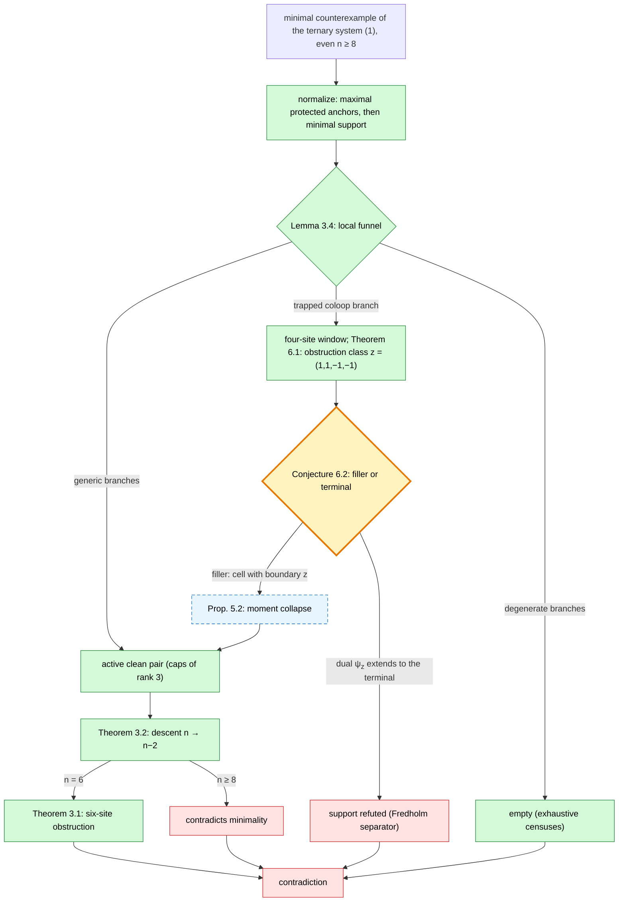

# A descent program for the Krenn–Gu conjecture

*Proof-architecture companion to the [README](README.md). Statements
are labelled **[P]** proved (exact checker and independent audit),
**[G]** generation-side (checker-backed, awaiting independent
re-audit), or **[O]** open. Full statements and certificates are in the
linked repository notes. Last synchronized: 2026-08-13.*

## 1. Introduction

Krenn, Gu, and Zeilinger [1] observed that a large class of
linear-optical experiments is faithfully encoded by edge-weighted
graphs: vertices are photon paths, an edge $uv$ is a photon-pair
source, and an $n$-photon coincidence event corresponds to a perfect
matching of $K_n$. The prepared state is the coherent superposition of
all perfect matchings, weighted multiplicatively by the edge
amplitudes. Which Greenberger–Horne–Zeilinger states are reachable in
this scheme is governed by a conjecture of Krenn and Gu ([2]; see also
[3]), which we treat in its strongest form, allowing complex
amplitudes that depend on both endpoint colours.

Let $n$ be even and $d \ge 2$. A *bicoloured weighting* of $K_n$ in
$d$ colours assigns to each edge $uv$ and each ordered colour pair
$(i,j) \in \{0,\dots,d-1\}^2$ a complex weight $w_{uv}(i,j)$; this
subsumes multigraphs, since parallel edges aggregate into a single
weight. A perfect matching $M$, with one colour pair chosen per edge,
*induces* the vertex colouring $c$ that assigns each vertex the colour
it receives from its matching edge; the amplitude of the pair $(M,c)$
is $w(M,c) = \prod_{uv \in M} w_{uv}\bigl(c(u), c(v)\bigr)$. For a
vertex colouring $c \colon V \to \{0,\dots,d-1\}$ set

$$\Phi(c) \;=\; \sum_{M \in \mathcal{M}(K_n)} w(M,c).$$

The weighting is a **GHZ weighting of dimension** $d$ if

```math
\Phi(c) = \begin{cases}
1, & c \text{ constant}, \\
0, & c \text{ non-constant}
\end{cases}
\qquad (1)
```

**Conjecture (Krenn–Gu).** For even $n \ge 6$ and $d \ge 3$, no
bicoloured complex weighting of $K_n$ satisfies $(1)$.

In the notation of [1, 2], the conjecture asserts $k_{\max}(n) = 2$
for even $n \ge 6$, while $k_{\max}(4) = 3$ via the known exceptional
weighting of $K_4$.

The known partial results frame the difficulty. For weightings whose
matchings are forced to interfere constructively — in particular
nonnegative real weights — the conjecture follows from Bogdanov's
theorem [4] that a graph on at least six vertices in which every
perfect matching is monochromatic admits at most two colours on its
edge set (equivalently: three pairwise edge-disjoint perfect matchings
of $K_n$, $n \ge 6$, always admit a further perfect matching inside
their union). Chandran and Gajjala [3] developed the graph-theoretic
framework for the weighted problem, and with Illickan [5] proved the
conjecture for all experiment graphs of vertex connectivity at most
$2$, and unconditionally for maximum degree at most $3$ — the latter
already for complex weights and bicoloured multigraphs. In the
opposite regime of many colours, the automated formal-proof system of
[6] certified the diagonal cases $n = d \in \{4, 6, 10\}$ together
with an explicit certificate family for $d = n$ at every even $n$, and
further instances with $d > n$; a solver-free argument over arbitrary
integral domains [12] yields the general bound $k_{\max}(n) \le n-2$.
A tensor-algebraic no-go theorem by Krenn, Firsching, Tsoukalas,
Gajjala, Gu, and Chaudhuri is announced as in preparation in [6]. The
smallest case left open by all of the above — here and in the
`formal-conjectures` registry [7] — is $n = 8$, $d = 3$.

**Proposition 1.1 (colour reduction) [P].** If $(1)$ has a solution for
some $d \ge 3$, then restricting to any three colours yields a solution
with $d = 3$. It therefore suffices to refute the ternary system.

Throughout, a *word* is a vertex colouring
$c \in \{0,1,2\}^n$, and we write $\Phi_c$ for $\Phi(c)$.

This document records the architecture of a proof by induction on
$n$: its proved components, the method, and the single open statement
(Conjecture 6.2) to which the program has reduced the Krenn–Gu
conjecture. Theorem 7.1 states the resulting conditional result
precisely.

## 2. Interference, gauge freedom, and sign obstructions

**Lemma 2.1 (forced interference) [P].** By Bogdanov's theorem [4], any weighting
satisfying the three monochromatic equations of $(1)$ carries
nonvanishing mixed terms: the three families of monochromatic
matchings force further perfect matchings whose induced colourings are
non-constant, so the mixed equations can never hold term by term
**[P]**. A putative GHZ weighting is therefore an exact
destructive-interference pattern among forced terms, and the program
is a theory of the obstructions to such patterns. Genuinely analytic
approaches are unavailable for a structural reason: the GHZ tensor
$\Delta = \sum_c e_c^{\otimes n}$ lies in the *closure* of the set of
matching tensors **[P]**, so no argument by dimension count, flattening
rank, or Zariski-closed condition can separate it — consistent with
the numerical observation that approach to $\Delta$ requires
amplitudes diverging polynomially in the inverse residual.

**Gauge action.** The torus $(\mathbb{C}^\times)^{n \times 3}$ acts by
$w_{uv}(i,j) \mapsto b_{u,i}\, b_{v,j}\, w_{uv}(i,j)$, rescaling all
terms of a fixed word equally, so it permutes solutions of $(1)$ up to
normalization. The gauge-invariant data of a *support* $S$ (a set of
cells $(uv, i, j)$ permitted to be nonzero) is carried by the lattice

$$L_S = \ker\bigl(\mathbb{Z}^S \to \mathbb{Z}^{V \times 3}\bigr)$$

of the unsigned cell–incidence map. In Zaslavsky's theory of signed
graphs [8], $L_S$ is the lattice of the frame (even-cycle) matroid of
the *cell graph* of $S$: its circuits are the balanced (even) closed
walks together with pairs of unbalanced (odd) cycles joined by a path.
The odd-handcuff circuits exist precisely because the cell graph is
non-bipartite, and they carry the sign phenomena below. For the full
ternary support at $n = 8$ the lattice has rank $228$ **[P]**.

**Sign obstructions.** When a mixed word $c$ retains exactly two terms
$(M, c)$ and $(M', c)$, the equation $\Phi_c = 0$ forces
$w(M,c) = -\,w(M',c)$. Recording the exponent vector
$\delta_{M,M'} = \mathbf{1}_{(M,c)} - \mathbf{1}_{(M',c)} \in
\mathbb{Z}^S$ together with the sign $-1$, and accumulating over all
two-term fibres, produces a homomorphism $\varepsilon \colon L' \to
\{\pm 1\}$ on a sublattice $L' \le L_S$ — a *partial character* in the
sense of Eisenbud and Sturmfels [9], who showed that such characters
on lattices govern the primary structure of binomial ideals; here the
character is enriched by a sign, as in the parity binomial edge ideals
of Kahle, Sarmiento, and Windisch [10], where the same
even/odd-walk dichotomy controls the primary decomposition. Two
mechanisms refute a support outright:

- **(O1)** *odd holonomy*: integers $\lambda_1, \dots, \lambda_k$ with
  $\sum_k \lambda_k \delta_k = 0$ in $\mathbb{Z}^S$ and $\sum_k
  \lambda_k$ odd; multiplying the forced relations yields
  $1 = (-1)^{\sum\lambda_k} = -1$;
- **(O2)** *singleton fibre*: a mixed word retaining exactly one term,
  whose nonzero amplitude cannot vanish.

**Lemma 2.2 (soundness and sharpness of the mechanisms) [P].** Across
the certified censuses — the six-site classification of Section 3, the $n = 8$ chart censuses ($11{,}578$ supports), and
cross-validation against an independent research program — these two
mechanisms, together with a finite list of ordinary integral
certificates, account for every refuted support **[P]**. Both are
sharp: there are supports with identical unsigned data refuted by (O1)
and (O2) respectively, so the sign enrichment is essential; and there
is an explicit satisfiable $8$-vertex configuration carrying an odd
cycle of holonomy $-1$ whose relation vectors are linearly
independent — without a lattice dependency, odd holonomy is a value,
not a contradiction **[P]**.

## 3. Descent and the base case

The global argument is an induction on the number of sites, driven
downward from a hypothetical counterexample. Its two pillars are a
base case at six sites, proved by exhaustive certification, and a
descent mechanism that removes two sites at a time. Everything
difficult in the program lives between them: showing that descent can
always be set in motion.

**Theorem 3.1 (six-site obstruction; "Theorem A") [P].** No bicoloured
complex weighting of $K_6$ satisfies the ternary system $(1)$.

*Proof (method).* On six sites there are $15$ perfect matchings and $3^6$
words, and each pair of adjacent sites carries a $3 \times 3$ matrix
of colour amplitudes. The proof classifies the possible rank and
degeneracy patterns of these matrices into $19$ types, and refutes
each type by an exact certificate — a sign identity or a singleton
fibre in the sense of Section 2, or an integral Nullstellensatz
combination — verified in exact arithmetic
([proofs/six-site-arbitrary-complex-obstruction.md](proofs/six-site-arbitrary-complex-obstruction.md)). The theorem has
been independently re-audited, and it is corroborated by a concurrent,
independent Lean 4 certificate of its normalized fiber [11], obtained
through a different decomposition (support orbits rather than rank
strata); the solver-free full-column anchor lemma of [12] subsumes the
forced-incidence step that both developments use. $\square$

**Theorem 3.2 (clean-pair descent; "Theorem B") [P].** Let $u, v$ be
adjacent sites.
The matchings of $K_n$ containing the edge $uv$ correspond exactly to
the matchings of $K_{n-2}$ on the remaining sites, so conditioning on
the colours assigned at $u$ and at $v$ organizes the system $(1)$
around two $3 \times 3$ arrays of partial amplitudes — the *caps* at
$u$ and at $v$, whose $(i,j)$ entries are the anchored matching sums
in which $u$ (respectively $v$) receives colour $i$ and its matched
partner colour $j$. Call $u, v$ an **active clean pair** if both caps
have rank $3$. In that case the pair can be contracted: eliminating
$u$ and $v$ and absorbing $w_{uv}$ and the caps into the remaining
weights produces a bicoloured weighting of $K_{n-2}$ that satisfies
the same system $(1)$. The verification is an exact computation on the
matching bijection. $\square$

Iterating Theorem 3.2 from a minimal counterexample must terminate at
$n = 6$, contradicting Theorem 3.1. The conjecture is therefore
equivalent to:

**Problem 3.3 (clean-pair existence) [O; reduced in Section 6].** Every minimal
counterexample — normalized so that the number of protected mutual
anchors is maximal and, subject to that, the occupied support is
minimal — admits an active clean pair, or is refuted directly by the
mechanisms of Section 2.

The rank condition is the crux: a cap can fail to have rank $3$ only
through degeneracies, and degeneracies are exactly what the mechanisms
of Lemma 2.2 feed on. The remaining work is thus a
dichotomy — *either enough nondegeneracy to descend, or enough
degeneracy to refute* — and the local analysis makes this dichotomy
effective.

**Lemma 3.4 (the local funnel) [P]/[G].** At a normalized minimal
counterexample,
the analysis proceeds by cases on where the support sits relative to
the anchor structure, and every case but one is closed:

1. *Degenerate branches are empty.* If all new support lies on the
   axis of the anchors, exhaustive specialization censuses (through
   one, two, and three simultaneous cells: $1{,}020$, then
   $57{,}291$, then $2{,}126{,}208$ cases) reduce every configuration
   to an invertible unit, and multiaffinity of the cubic system shows
   no deeper stratum exists **[P]**.
2. *Generic branches descend.* Off-axis support forces an active fan:
   whenever a vanishing mixed word has a nonzero balanced-cut
   determinant, it has a nonzero off-diagonal cell — proved
   exhaustively over all $3^{15}$ sign patterns of the six-site
   window **[P]** — and expanding along that cell produces the rank
   conditions of Theorem 3.2, hence a clean pair, unless one edge of
   the fan is a pure-colour coloop.
3. *Recurrent branches terminate.* The coloop configurations recur
   under exchange, but only finitely: the $5{,}141$
   cross-intersecting six-site configurations close into $446$
   saturated concepts falling into six types up to symmetry **[P]**,
   and each type is routed either back to case 2 or to the refutation
   mechanisms.

A single branch survives this analysis — the trapped pure-colour
coloop inside case 3 — and Section 6 identifies the single obstruction
class on which it hinges.

## 4. Certificates as constrained homotopies

Fix a word $c$ and regard the terms of $\Phi_c$ as *occurrences*
$(M, c)$. For an $M$-alternating cycle $C$, the exchange $M \mapsto
M \triangle C$ relates occurrences sharing their off-cycle
factor, with amplitude ratio

$$\frac{w(M \triangle C,\, c)}{w(M, c)} \;=\; \prod_{e \in C \setminus M} w_e(c) \Big/ \prod_{e \in C \cap M} w_e(c),$$

an explicit Laurent monomial in the cells. Exchanges connect the
matchings of $K_{2m}$ — the two-switch exchange graph is in fact
Hamilton-connected [13] — and every certificate produced by this
program, in particular every (O1) refutation, is a chain of exchange
binomials with tracked coefficients.

**Proposition 4.1 (vacuity of unconstrained contraction) [P].**
Homologically, the vanishing of all mixed coefficients is the
vanishing of an augmentation, and its consequences are organized by
contracting the occurrence complex. The decisive subtlety is that the
*unconstrained* contraction exists and proves nothing: under the
normalization $\Phi_{c^n} = 1$ the full matching complex is explicitly
contractible **[P]**. A certificate arises only from a contraction
whose every map is *equation-derived and label-preserving* — word,
fine multidegree, repeated-site grade, and provenance are all tracked.
This constrained transfer problem has antecedents in two literatures:
in rewriting theory, where the polygraphic resolutions of Guiraud and
Malbos [14] build contracting homotopies literally from the defining
relations — a line originating in Squier's finiteness theory, with the
gap between relation-derived and abstract homological data measured by
exact sequences of Pride–Guba–Sapir type, recently extended to
associative algebras by Steinberg [15]; and in combinatorial infeasibility,
where the linear-algebra Nullstellensatz certificates of De Loera,
Lee, Malkin, and Margulies [16] are precisely degree-bounded
nullhomotopies of a Koszul complex. Equivariant resolutions of
permanent-type ideals, the closest commutative-algebra relatives of
the matching system, appear in [17].

**Theorem 4.2 (fencing) [P].** The necessity of the constraint is
exact, through one mechanism applied uniformly: the
residual class of Section 6 is antisymmetric under a chart involution,
whereas every matching-side operation — Koszul resolutions, diagonal
all-matching contractions, group averaging, all bipartition
flattenings imposed simultaneously (each unordered cut retains an
independent $GL_3$ gauge **[P]**), and pure-target normalization — is
symmetric under it. No symmetric operation produces an antisymmetric
class.

The constrained theory is implemented as an equivariant
Cartan–Spencer calculus on the principal-parts resolution of the
source equations **[G]**, with its load-bearing identities audited: a
Ward identity $X_{\mathrm{src}}\Phi_c = \Phi_{Xc}$ for the colour-root
fields, verified termwise **[P]**; the Cartan homotopy $K = (1-s)H_w$
with $dK + Kd = (1-s)(w-1)$, annihilating the endpoint-even summand;
and a secondary-transfer computation identifying the local residue
class $-\delta = (-1, +1, +1, -1)$, which is forced and unique
**[P]**.

## 5. Uniformity in the order

**Proposition 5.1 (spectral stability of the coefficient layer) [P].**
Perfect matchings of $K_{2h}$ under $S_{2h}$ form the association
scheme graded by union cycle type, whose eigenvalue theory is
developed in Godsil and Meagher [18, Ch. 15]. The operators used by
the transfer — the two-switch adjacency $A_h$ and the endpoint-change
operator $B_h$ — act on isotypic summands indexed by even partitions
padding with $h$, with exact polynomial eigenvalues; for instance

$$A_h\big|_{[2h-2,\,2]} = h^2 - 3h + 1,$$

verified together with the five-sector spectrum of $B_h$ and the
composite transfer constant $56h^3(2h-1)$, out of sample through
$h = 12$ **[P]**. One-step transfer residuals lie in
$[2h] \oplus [2h-2,2]$ with multiplicity one at every computed order;
each composed transfer step raises the isotypic level by exactly one;
and the add-a-spectator embedding $\iota$ satisfies
$\pi A_{h+1} \iota = A_h$ exactly while itself raising the level by
one. The coefficient layer is thus finitely generated in the sense of
representation stability — the eventual-polynomiality phenomenon of
Church, Ellenberg, and Farb [19] — and uniformity in $h$ is invoked
*per composed step*: naturality along $\iota$ alone does not transport
the $[2h-2,2]$ statement **[P]**.

**Proposition 5.2 (moment collapse) [G].** Granted the family of
Conjecture 6.2, the two window primitives descend to a carrier
$\Gamma$ with $d\Gamma = r - 2q$, and a Rodrigues-type moment identity
annihilates the full tower of higher-moment conditions, producing the
clean pair at every order.

## 6. The remaining statement

The surviving branch of Lemma 3.4 localizes to a four-site residual
window. Its three channels are products of the window's local edge
amplitudes ($D$ and $q_{01}$ on the doubled channel, the port and
shore amplitudes $p_i$ and $s_i$ on the others, in the notation of the
master note
[notes/uniform-balanced-chart-square-master-obstruction.md](notes/uniform-balanced-chart-square-master-obstruction.md))
and a common tail factor $H$:

$$A = D\,q_{01}\,H, \qquad B = p_0\,s_1\,H, \qquad C = p_1\,s_0\,H,$$

where the doubled channel $A$ carries its two endpoint orderings
(*charts*) $A_{[a|b]}$ and $A_{[b|a]}$. The equation-derived relations
among the channels are the four *primitive mate rows*

$$A_{[a|b]} + B, \qquad A_{[b|a]} + C, \qquad A_{[a|b]} + C, \qquad A_{[b|a]} + B,$$

of rank $3$ in the chart space with ordered basis
$\bigl(A_{[a|b]}, A_{[b|a]}, B, C\bigr)$.

**Theorem 6.1 (identification of the obstruction class) [P].** The
unique annihilator of the mate rows is

$$z \;=\; (1,\,1,\,-1,\,-1) \;=\; (1,-1)_{\text{chart}} \otimes (1,1)_{\text{matching}},$$

antisymmetric in the chart involution and symmetric on the matching
side — the source of Theorem 4.2. Moreover three a priori distinct
obstructions coincide with $z$: the direction charge
of the trapped-coloop branch, the missing direction of the balanced
recurrent $K_{2,2}$ companion square, and the chart-sign class of the
all-order Bianchi comparison. $\square$

Gauging by the shore sign
$\mathrm{diag}(1,1,-1,-1)$ carries the four columns to oriented
incidence columns and $z$ to $(1,1,1,1)$; as the oriented incidence
image is exactly the kernel of the vertex augmentation, the local
problem is to exhibit a single equation-derived column of nonzero
augmentation.

**Conjecture 6.2 (balanced chart-square saturation) [O].** In every
physical
fixed-tail occurrence of the window, construct a source-valid relative
cell with boundary $z \otimes (\text{local } C_4 \text{ tail})$,
natural under restriction, reinsertion, and chart overlap and
preserving the protected readouts — the auxiliary linear functionals
(target, $q$, anchor, $W$, residue, ridge) that the calculus tracks
alongside the boundary — or prove that the normalized dual
$\psi_z = \tfrac14(1,1,-1,-1)$, which annihilates every presently
constructed physical column **[P]**, extends to the accepted physical
terminal $q = \sum_{j=1}^{6} m_j - \mathrm{ainc}$ (the difference of
the six matching-aggregate readouts and the anchor-incidence readout),
itself proved to
annihilate the complete $8{,}580$-column operator block and all $288$
repeated columns **[P]**.

Either branch completes the proof. A filler closes the trapped branch,
the $K_{2,2}$ square, and the Bianchi class at every order
simultaneously, and the clean pair follows by Proposition 5.2. A terminal
extension of $\psi_z$ is a Fredholm-type separator — a covector
certified against the system and nonzero on a class the
counterexample requires to be a boundary — refuting the support
directly, in the same logical shape as an (O1) refutation one level
up. Exact counterguards **[P]** exclude the known shortcuts: pure
normalization has $du = 0$; the $171$-column $q$-Jacobian admits no
restriction face into the square; and internal $K_{2,2}$ components
can be perfectly centered, so the required coupling must come from
global routing rather than local normalization.

## 7. Assembly

The shape of the proof (green: proved **[P]**; dashed: generation-side
**[G]**; amber: the single open statement **[O]**; red: terminal
contradictions):



The mechanisms of Section 2 power every red refutation node, and the
fencing results of Theorem 4.2 are what force the trapped branch
through the amber alternative rather than around it.

**Theorem 7.1 (conditional main theorem).** Assume Conjecture 6.2 (in
either branch), with its family natural in the order as in
Proposition 5.2. Then the Krenn–Gu conjecture holds: for even
$n \ge 6$ and $d \ge 3$, no bicoloured complex weighting of $K_n$
satisfies $(1)$, and $k_{\max}(n) = 2$.

*Proof.* By Proposition 1.1 it suffices to refute the ternary system.
Suppose a counterexample exists and choose one minimal in $n$,
normalized as in Problem 3.3. By Lemma 3.4 it yields an active clean
pair directly, or reaches the window of Section 6. In the latter case
Conjecture 6.2 applies: the filler branch produces the clean pair via
Proposition 5.2, while the terminal branch refutes the support
directly, contradicting existence. Given a clean pair, Theorem 3.2
produces a counterexample at $n - 2$, contradicting minimality when
$n \ge 8$ and Theorem 3.1 when $n = 6$. Hence no counterexample
exists. The value $k_{\max}(n) = 2$ follows from the known $d = 2$
constructions, and the remaining cases of the general conjecture from
the bound of [12] and the $n = 4$ exceptional analysis. $\square$

| open item | status |
|---|---|
| Conjecture 6.2 (balanced chart-square saturation) | **[O]** — both branches under active attack |
| remaining window faces and placement maps | **[G]**; mechanical constructions in progress |
| per-step uniformity argument (Section 5) | coefficient half **[P]**; physical half rides on Conjecture 6.2 |
| independent re-audit of the newest layer | in progress (`computations/unaudited-*`) |

**Summary.** By proved descent (Theorem 3.2) to a proved base case
(Theorem 3.1), through the proved funnel (Lemma 3.4) and fencing
(Theorem 4.2), the Krenn–Gu conjecture reduces to a single alternative
concerning a single sign class on one four-site window: either
$z = (1,1,-1,-1)$ bounds an equation-derived cell, or its dual extends
to the certified terminal covector. Either resolution, made uniform in
the order as in Section 5, completes the proof.

## References

[1] M. Krenn, X. Gu, A. Zeilinger, *Quantum experiments and graphs:
Multiparty states as coherent superpositions of perfect matchings*,
Phys. Rev. Lett. **119**, 240403 (2017).

[2] M. Krenn, *A prized graph-theory question inspired by quantum
physics*, problem page:
[mariokrenn.wordpress.com/graph-theory-question](https://mariokrenn.wordpress.com/graph-theory-question/).

[3] L. S. Chandran, R. Gajjala, *Graph-theoretic insights on the
constructability of complex entangled states*, arXiv:2202.05562.

[4] I. Bogdanov, *Graphs with only monochromatic perfect matchings*,
MathOverflow (2017); see the account and extensions in [3].

[5] L. S. Chandran, R. Gajjala, A. M. Illickan, *The Krenn–Gu
conjecture for sparse graphs*, MFCS 2024; arXiv:2407.00303.

[6] G. Tsoukalas et al., *Advancing mathematics research with
AI-driven formal proof search*, arXiv:2605.22763 (2026).

[7] Google DeepMind, `formal-conjectures`,
`FormalConjectures/Paper/MonochromaticQuantumGraph.lean`
([github.com/google-deepmind/formal-conjectures](https://github.com/google-deepmind/formal-conjectures)).

[8] T. Zaslavsky, *Signed graphs*, Discrete Appl. Math. **4** (1982),
47–74.

[9] D. Eisenbud, B. Sturmfels, *Binomial ideals*, Duke Math. J.
**84** (1996), 1–45.

[10] T. Kahle, C. Sarmiento, T. Windisch, *Parity binomial edge
ideals*, J. Algebraic Combin. (2016); arXiv:1503.00584.

[11] Lean 4 certificate of the normalized six-site fiber
(`eqSystem6_no_solution_d3` over $\mathbb{C}$), formal-conjectures
pull request #4610 (2026); developed independently and concurrently.

[12] Formal-conjectures pull request #4661 (2026): the bound
$k_{\max}(n) \le n - 2$ over arbitrary integral domains, via a
solver-free full-column anchor lemma.

[13] Brenner et al., *Hamilton connectivity of the matching flip
graphs of $K_{2n}$*, arXiv:2607.04687.

[14] Y. Guiraud, P. Malbos, *Higher-dimensional normalisation
strategies for acyclicity*, Adv. Math. **231** (2012), 2294–2351;
arXiv:1011.0558.

[15] B. Steinberg, *A Pride–Guba–Sapir exact sequence for the relation
bimodule of an associative algebra*, arXiv:2407.11879 (2024); with
Y. Kobayashi, F. Otto, J. Pure Appl. Algebra (2003) for the monoid
case originating in C. Squier's finiteness theory.

[16] J. A. De Loera, J. Lee, P. N. Malkin, S. Margulies, *Hilbert's
Nullstellensatz and an algorithm for proving combinatorial
infeasibility*, ISSAC 2008.

[17] F. Gesmundo, H. Huang, H. Schenck, J. Weyman, *Bernstein–
Gelfand–Gelfand meets geometric complexity theory: resolving the
$2 \times 2$ permanents of a $2 \times n$ matrix*, Trans. Amer. Math.
Soc. **378** (2025); arXiv:2312.12247.

[18] C. Godsil, K. Meagher, *Erdős–Ko–Rado Theorems: Algebraic
Approaches*, Cambridge Univ. Press (2016), Ch. 15.

[19] T. Church, J. S. Ellenberg, B. Farb, *FI-modules and stability
for representations of symmetric groups*, Duke Math. J. **164**
(2015), 1833–1910; arXiv:1204.4533.
