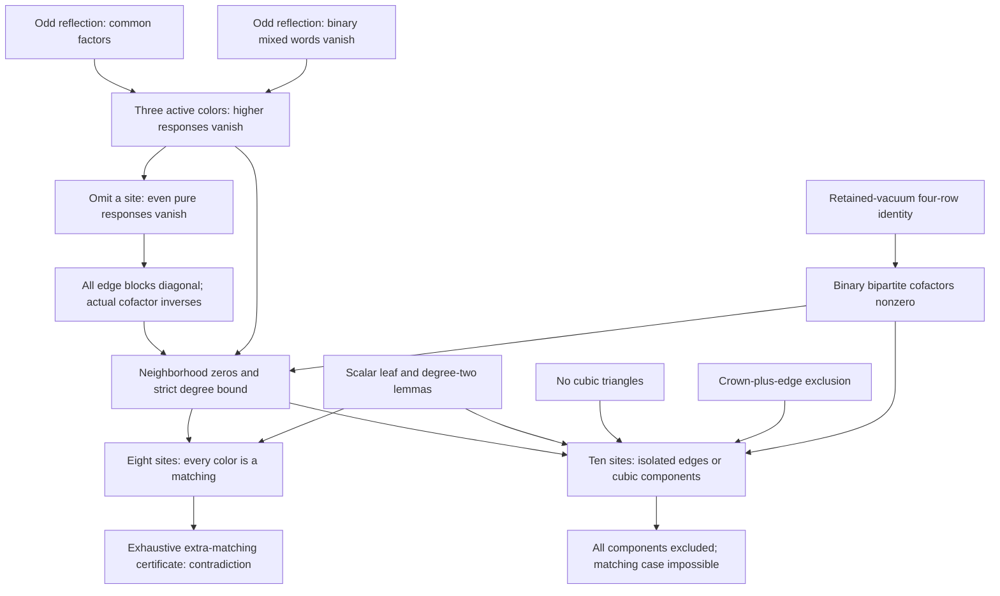

# Stronger-results certification package — 26 September 2026

The underlying mathematical sources have the independent audits included
here. This package adds portable snapshots, exact replay, and an explicit
eight-site terminal certificate. Final repository admission is governed by
[the supersession ledger](../SUPERSESSIONS.md), which binds the payload manifest
and independent package review. A checker PASS alone is not admission.

The proposed results are global diagonal reduction, the strict color-degree
bound, and impossibility for general complex sources on eight and ten sites.
Read [THEOREMS.md](THEOREMS.md) for precise hypotheses, the proof outline, and
the complete scoped dependency map.



Run with Python 3.10 or later, using only the standard library:

```sh
python3 certification/stronger-results-2026-09-26/verify.py
python3 -O certification/stronger-results-2026-09-26/verify.py
python3 -I -S certification/stronger-results-2026-09-26/verify.py
```

The directory is portable. After copying or extracting it elsewhere, run
`python3 verify.py` from inside it. No Git checkout, network, solver, `/tmp`
research file, or package installation is needed. `--output PATH` writes a
new JSON receipt and refuses to overwrite an existing file.

The replay performs three different jobs:

* **Integrity:** SHA-256 checks for every declared artifact; a closed, acyclic
  12-node dependency graph; surviving original freezes; audit hash anchors.
* **Finite proof:** exhaustive coverage of the eight-site terminal matching
  lemma, with a unique nonzero mixed-word witness for every normalized case.
* **Convention and scope checks:** exact reflection, covariance, retained-vacuum,
  cofactor, triangle, and boundary computations. These bounded computations
  support inspection of the analytic proofs; they do not prove all orders.

Four deliberate faults must be rejected: a missing matching case, a pure
witness substituted for a mixed witness, a corrupt hash, and an incorrect
rotation identity. Three historical checkers are preserved byte for byte.
Because they use `assert`, the wrapper explicitly compiles them with
`optimize=0`; the rotation mutation verifies those checks remain active under
`python -O`. New wrapper checks use explicit exceptions.

The certificate generator is separate from the verifier and uses edge-subset
enumeration instead of the verifier's least-vertex recurrence. To reproduce
its bytes without overwriting the supplied certificate:

```sh
python3 -c 'import json, build_matching_certificate as g; print(json.dumps(g.generate(), separators=(",", ":")))' > regenerated.json
cmp matching8.json regenerated.json
```

The all-order arguments are ordinary written mathematical proofs audited by
other research agents. They are **not Lean-checked**. The review records are
not human peer-review reports. A `PASS` from `verify.py` means the stated
replay checks passed; certification additionally relies on those mathematical
proofs and independent reviews.

Historical source headers and links are preserved verbatim. Some say “pending”
or “outside the certified spine” because they describe their original date;
some historical links point outside this directory. Use the local dependency
table in [THEOREMS.md](THEOREMS.md) to read every load-bearing proof and audit.
The scope excludes unrelated corollaries linked by those historical files.

[nodes.json](nodes.json) records all canonical paths, scopes, and hashes.
[provenance.json](provenance.json) records additional audit, checker, and receipt
copies. Five original proof freezes survive (NB, SD, TR, CR, H10). Their
integration changes are review status, links, and provenance text; the
mathematical arguments agree. Earlier temporary originals are not claimed
to have been recovered. The independent [foundation re-audit](audits/FOUNDATION.md)
instead identifies the current CF, BM, HP, EV, GD, and RV texts directly by
hash and reconstructs the load-bearing arguments. BC's current hash is also
pinned by the later [H10 audit](audits/H10.md).

The manifest is an integrity inventory, not a proof of truth or authorship.
Its SHA-256 is bound by the replay receipt and, on admission, the repository
supersession record. Neither file hashes nor historical PASS labels replace
reading the mathematical arguments.
