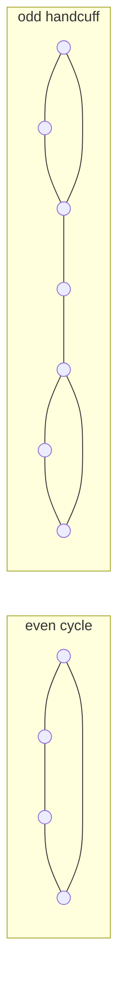
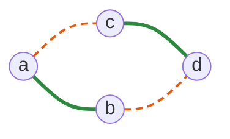
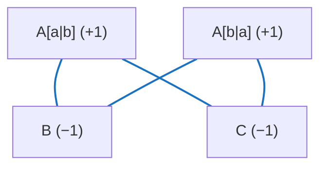
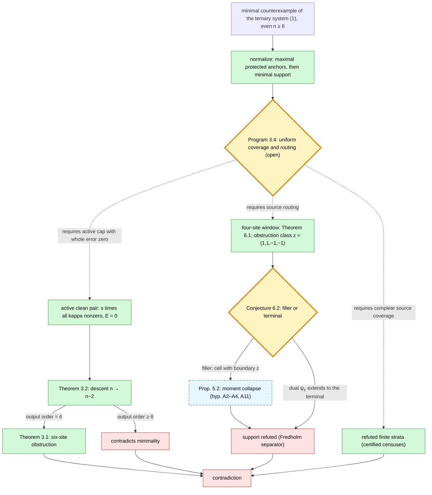

# Proof progress on the Krenn–Gu conjecture

**Read the paper:** [PDF with references](proofs/krenn-gu-all-orders-paper.pdf) · [LaTeX source](proofs/krenn-gu-all-orders-paper.tex) · [Reading and build guide](proofs/PRESENTATION.md).
**Initial Lean formalization:** [checked lemmas and remaining work](formal/all-orders/README.md) · [DeepMind draft PR #6627](https://github.com/google-deepmind/formal-conjectures/pull/6627).

**Complete all-orders research proof, 2026-09-26.**
The [self-contained proof](proofs/krenn-gu-all-orders-two-replica-proof.md)
has passed two independent complete analytic audits and root review.
Finite two-replica orthogonal covariance forces
`haf(B)=B_pq haf(B[V without p,q])` at every supported edge. Each color
therefore has degree one at every vertex; the standard three-matching
obstruction excludes all even orders greater than four. The proof includes
the earlier reduction from arbitrary complex endpoint-color blocks and
preserves the allowed K4 boundary. See the
[acceptance and audit record](notes/all-orders-two-replica-review-2026-09-26.md).
This is an internally reviewed written proof, without external peer review
or complete Lean verification. Earlier entries below are historical and
retain the open problems as they stood when written.

**Cofactor-support triples and the four-far shell, 2026-09-25.**
For a FULL original ordinary diagonal ternary source on even n>=6 with
all three pure amplitudes nonzero, the [new theorem](computations/unaudited-codex-diagonal-continuation-2026-09-20/COFACTOR-SUPPORT-THREE-FORCES-PHYSICAL-INDEPENDENCE-AND-FOUR-FAR-SHELL-NEW-SOURCE.md)
makes the support of EVERY actual global hafnian cofactor row with
exactly three nonzero entries independent in ALL three physical colors.
If p is nonmatching in BOTH B,C and F_H(p)={q,r,s,t} has size four,
label the cofactor supports {q,s,t} in B and {r,s,t} in C. Then B,C
vanish on the ENTIRE four-set; only H[q,r] can remain. Every H neighbor
of s,t lies at H distance exactly two from p, and s,t have distance
exactly three. H is spanning connected, or has one component on V\{q,r}
and the isolated private H edge q-r. This conditional structure has a
complete independent analytic audit; four-far equality and general n=12
are not excluded. The general conjecture remains OPEN; formal
certification is unchanged.

**Four-far equality, two-anchor escape, and cofactor iteration, 2026-09-23.**
These accepted results sharpen local constraints but leave the general
conjecture OPEN for even n>=12; formal certification is unchanged.

The [four-far equality theorem](computations/unaudited-codex-diagonal-continuation-2026-09-20/FOUR-FAR-EQUALITY-AND-UNIQUE-ACTIVE-COFACTOR-INTERSECTION-NEW-SOURCE.md)
applies when p is nonmatching in BOTH B,C and has exactly four H-far
sites. Their labels q,r,s,t give actual cofactor-row supports
K_B[p,*]={q,s,t}, K_C[p,*]={r,s,t}; only B[p,q] and C[p,r] meet
nonzero own cofactors, with products tau_B,tau_C. The two support
triples are independent in B,C respectively, and s,t are farther
than two from p in all three color graphs. Exact exterior cofactor
self-pairings are nonzero. Whether a scalar cofactor row of degree
three can have just one active original edge remains unproved;
four-far equality and general n=12 are not excluded.

The [two-anchor deletion theorem](computations/unaudited-codex-diagonal-continuation-2026-09-20/TWO-COLOR-ANCHOR-ODD-CORE-DELETION-ESCAPE-NEW-SOURCE.md)
assumes isolated B edge p-q and isolated C edge p-r. On the odd
exterior E=V\{p,q,r}, the WHOLE B/C deletion tensor at s vanishes
whenever s is an H neighbor of q or r. At least two sites escape both
H neighborhoods with nonzero whole deletion tensors; at least four
do if r is nonmatching in B or q is nonmatching in C. Neither a
two-anchor root nor enough H-neighborhood coverage is forced.

The [cofactor-iteration guard](computations/unaudited-codex-diagonal-continuation-2026-09-20/ACTUAL-COFACTOR-ITERATION-FAILS-SCALAR-SCOPE-GUARD-NEW-SOURCE.md)
is an exact ten-site bipartite SCALAR matrix M with haf(M)=3 and
M C_M=3I, while haf(C_M)=21 but C_M C_(C_M) differs from 21I.
Thus the scalar inverse and row-degree arguments cannot simply be
reapplied to an actual cofactor matrix. It is not a ternary source.

**Cofactor-row and distance-three restrictions, 2026-09-23.**
These additions have complete independent analytic audits and root
mathematical acceptances. The general conjecture remains OPEN for even
n>=12; formal certification is unchanged.

The [distance-three private-edge theorem](computations/unaudited-codex-diagonal-continuation-2026-09-20/DISTANCE-THREE-PRIVATE-EDGES-AND-TWELVE-SITE-GIRTH-FIVE-EXCLUSION-NEW-SOURCE.md)
shows that every vertex p, for every color H, has at least two sites
outside its closed H-distance-two ball. Distinct cofactor-active private
edges of the other two colors reach those sites. If exactly two sites
are far, p belongs to isolated edges of both other colors, and their
pair-color union has a two-vertex cut. At a vertex on no H triangle or
four-cycle, the sum of the H degrees of its H neighbors is at most
n-3. The bound improves under complementary pair connectivity below;
none of these statements makes every other-color edge H-distant.

The [actual-cofactor dual-degree theorem](computations/unaudited-codex-diagonal-continuation-2026-09-20/ACTUAL-COFACTOR-DUAL-DEGREE-AND-FOUR-FAR-SITE-THEOREM-NEW-SOURCE.md)
proves that an actual scalar hafnian cofactor row under M C_M=tau I
has either one nonzero entry, exactly when its vertex lies in an
isolated M edge, or at least three. Consequently a vertex in a
nonmatching B or C component has at least FOUR H-far sites. This holds
at every vertex when the B/C support union is 3-vertex-connected;
connected spanning support of either B or C suffices. In every H graph
at least six vertices have four H-far sites, giving at least n+6
unordered H-far pairs. If p has isolated B and C edges to q and r,
respectively, the full mixed four-site equation also makes q,r
nonadjacent in all three colors at n>=6.

For a vertex on no H triangle or four-cycle, the H-neighbor degree sum
is at most n-5 when it is nonmatching in B or C, or when the B/C union
is 3-connected. Together with one-matching-color exclusion, the
four-far bound forces n>=delta^2+5 for a nonmatching H component
of minimum degree delta>=3 and girth at least five, rounded up
to even n; in particular delta=4 requires n>=22. At n=12 every
nonmatching color component has a triangle or four-cycle. If the
complementary pair union is 3-connected, every vertex of every cubic
H component lies on at least TWO distinct H four-cycles. General
n=12 sources with short cycles or disconnected complementary colors
remain unresolved; no existential weighted four-deletion witness is
established by these local bounds.

**Odd routing and four-site full-color coupling, 2026-09-22.**
The results in this update have complete independent analytic audits and
root mathematical acceptances. The general conjecture remains OPEN for
even n>=12; formal certification is unchanged.

The [odd-routing theorem](computations/unaudited-codex-diagonal-continuation-2026-09-20/ZERO-BINARY-PAIR-COFACTOR-ODD-ROUTING-IDENTITY-AND-ALTERNATING-CYCLE-WITNESS-NEW-SOURCE.md)
applies to EVERY present h edge uv. Its deleted-pair b/c tensor is
identically zero, and an exact pairing forces an odd partition I,J of
the remaining vertices with four nonzero opposite-root b/c hafnians.
The four reversed routing hafnians vanish. Supported b and c perfect
matchings therefore contain a simple alternating cycle through u,v,
with both u-v arcs even; the h edge is a chord. This is a selected
support witness, not an induced cycle or a separator: the actual
cofactor expansions retain uncontrolled crossing matching sums.

The [four-site routing rectangle theorem](computations/unaudited-codex-diagonal-continuation-2026-09-20/THIRD-COLOR-EDGE-ODD-ROUTING-FOUR-SITE-RANK-RECTANGLE-NEW-SOURCE.md)
uses the FULL three-color mixed coefficients. The same routing
partition supplies nonempty sets X={x in I:haf(B[I\x])!=0} and
Y={y in J:haf(C[J\y])!=0}. For every x in X,y in Y, the entire
h four-site hafnian on {u,v,x,y} is zero, so H[X,Y] is the negative
sum of two outer products divided by H_uv and has rank at most two.
A second nonempty rectangle comes from the routes based at v. If b
and c share a balanced bipartition, h lies within its shores and both
rectangles vanish entrywise. No argument forces an h perfect matching
to use an edge in either selected zero rectangle. Proving a compatible
nonzero mixed coefficient, or a weighted coverage theorem forcing one,
is the remaining step on this ternary-specific route.

The [one-binary-top routing guard](computations/unaudited-codex-diagonal-continuation-2026-09-20/ODD-ROUTING-RECTANGLES-WITH-ONE-BINARY-TOP-UNIFORM-SCOPE-GUARD-NEW-SOURCE.md)
passes every displayed odd-routing rank rectangle and one exact binary
pair top at all even orders in its family, but fails another binary
pair top and an explicit full ternary mixed word. The rectangles alone
therefore do not replace the missing cross-pair coefficient equations.

The [component-exterior inverse theorem](computations/unaudited-codex-diagonal-continuation-2026-09-20/ARBITRARY-COMPONENT-PAIR-EXTERIOR-INVERSE-ZERO-AND-COMPLEMENTARY-RANK-NEW-SOURCE.md)
applies to ANY proper union S of h components and any pair u,v in S
with nonzero actual local h cofactor. With E=V\S and J_u,J_v their
joint b/c exterior neighborhoods, it gives
H[E]^-1[J_u,J_v]=0, |J_u|+|J_v|<=|E|, and an exact rank
|E|-|J_u|-|J_v| for H[E][E\J_v,E\J_u]. A determinant cover of the
actual local cofactor matrix also bounds the total number of physical
b/c support edges across S,E by |S||E|/2. In the common-balanced case,
this inverse zero block concerns opposite-root neighborhoods, whereas
the four-site zero adjacency blocks concern same-root residual sets.
Their overlap is not yet forced, and a spanning h component has no
proper exterior to which this theorem applies.

The [private cofactor-active edge theorem](computations/unaudited-codex-diagonal-continuation-2026-09-20/PRIVATE-COFACTOR-ACTIVE-EDGES-AND-STRICT-COMPONENT-BOUNDARY-DENSITY-NEW-SOURCE.md)
shows that every vertex has, in each color, an incident edge with
nonzero actual own-color cofactor and no other color on that pair.
Hence the physical support degree is three or at least five. For a
proper h-component union S whose two other-color GLOBAL cofactor
blocks vanish on S, those other-color private edges cross to E=V\S.
The preceding incidence theorem then sharpens to
sum_{u in S} max(d_b^E(u),d_c^E(u)) <= |S|(|E|/2-1).
Every proper diameter-two h component has the required cofactor-zero blocks,
even with arbitrary exterior. When b and c share balanced shores of
size r, each shore satisfies the bound with E the other shore. This
excludes that subclass at n=12 and forces r>=8, or n>=16, for any
remaining common-balanced source. It does not exclude general n=12.

The [all-pair four-deletion guard](computations/unaudited-codex-diagonal-continuation-2026-09-20/ALL-PAIR-BINARY-TOPS-SELECTED-FOUR-DELETION-ZERO-AND-RETAINED-CORRECTION-GUARD-NEW-SOURCE.md)
has actual scalar inverses and all three exact binary tops, yet one
selected paired four-deletion of the remaining b/c tensor is zero.
The four-root retained-vacuum identity there has a nonzero correction
term. This paired-deletion route needs a global choice or sum over
H-edge pairs, or additional full three-color equations; nonvanishing
at every selected pair is false. The example is not a full ternary
source and does not refute the existential paired-deletion target.

The [balanced determinant analogue](computations/unaudited-codex-diagonal-continuation-2026-09-20/BALANCED-BINOMIAL-DETERMINANT-RIGIDITY-AND-PERMANENT-TRANSFER-SCOPE-NEW-SOURCE.md)
is rigid: its binomial identity forces two monomial matrices forming
one alternating Hamilton cycle. Actual binary cofactor inverses transfer
only the first and last proper permanent degrees to determinant degrees.
Transferring every middle coefficient would be equivalent to unresolved
common-balanced binary rigidity. The [scalar parallel-gluing theorem](computations/unaudited-codex-diagonal-continuation-2026-09-20/SCALAR-PARALLEL-TWO-TERMINAL-GLUING-AND-INDUCED-COFACTOR-NULLITY-AMPLIFICATION-NEW-SOURCE.md)
shows that one singular induced cofactor block, if it exists, amplifies
to arbitrarily large nullity under scalar gluing. It does not preserve
a full binary or ternary source. These diagnostics do not supply the
missing global mixed-coefficient contradiction.

**Joint-neighbor continuation and restricted acyclicity, 2026-09-20.**
The following results have complete independent analytic audits and
root mathematical acceptances. The general conjecture remains OPEN
for even n>=12; formal certification is unchanged.

The [joint-neighbor cofactor theorem](computations/unaudited-codex-diagonal-continuation-2026-09-20/ORIGINAL-COFACTOR-JOINT-NEIGHBOR-RECTANGLE-AND-ACTUAL-ESCAPE-NEW-SOURCE.md)
applies to ANY original nonzero h pair cofactor. In the actual core
obtained by deleting that pair, the h cofactor matrix vanishes between
the two vertices' JOINT other-color neighborhoods. Hafnian expansion
then gives a nonzero h edge times an actual four-site-deletion cofactor
outside the opposing neighborhood; an intersection vertex has such a
continuation outside their union. The result uses the third-color words
as well as the earlier equal-color-corner argument. It does not supply
a nonzero original cofactor at the next pair, an induced inverse,
a neighborhood cardinality bound, or an iterable cycle construction.

The [one-active acyclicity characterization](computations/unaudited-codex-diagonal-continuation-2026-09-20/ONE-ACTIVE-BALANCED-COFACTOR-COMPLETE-COMPONENT-ACYCLICITY-NEW-SOURCE.md)
assumes BOTH matrices cross a common balanced bipartition and EVERY
opposite-shore cofactor inside each active component is nonzero.
Under those explicit premises, the whole one-active top is equivalent
to an acyclic inactive component digraph, and no supported colored
perfect matching can use an inactive edge. This includes a converse
to the adapted component-cycle argument. Cancelled actual cofactors
and within-shore inactive edges remain outside this characterization.

**Component localization and H4 boundary allocation, 2026-09-20.**
The following additions have complete independent analytic audits and
root mathematical acceptances. The general conjecture remains OPEN for
even n>=12; formal certification is unchanged.

The [component-union localization theorem](computations/unaudited-codex-diagonal-continuation-2026-09-20/COMPONENT-UNION-LOCALIZATION-AND-INACTIVE-COFACTOR-ANNIHILATION-NEW-SOURCE.md)
proves that every nonempty proper union of h components has a whole
induced top containing only the nonzero h target. Original-root higher
responses on either h,k palette localize through the actual exterior
h hafnian. A one-active-target covariance argument then proves
P C(P)=0 for each other color's induced matrix P, with ACTUAL LOCAL
cofactors. The connected H4 control satisfies all localized higher
responses while retaining nonzero inactive entries and P H^(-1) P.
The exact global cofactor expansion still contains crossing terms.

For ONE scaled/permuted H4 color component with arbitrary exterior,
the [internal-support and shore-allocation theorem](computations/unaudited-codex-diagonal-continuation-2026-09-20/H4-COMPONENT-INTERNAL-SUPPORT-AND-SHORE-BOUNDARY-ALLOCATION-NEW-SOURCE.md)
finds a common four-site shore on which EACH other color has at most
one internal edge. Neither other color therefore has a supported
perfect matching inside the component. Every nonzero grouped contribution
to either global pure hafnian exports at least two vertices from EACH
shore; if that color has no edge on the sparse shore, it exports all
four vertices there. These are constraints on nonzero grouped sums,
not on every supported matching. Arbitrary H4 components and their
collections are not excluded, and no general order bound is improved.

**Scalar cancellation and arbitrary-component responses, 2026-09-20.**
The general conjecture remains OPEN for even n>=12; formal certification
is unchanged. The following results have complete independent analytic
reviews and root mathematical acceptances.

The [scalar bipartite support theorem](computations/unaudited-codex-diagonal-continuation-2026-09-20/SCALAR-BIPARTITE-MATCHING-COVERAGE-AND-ACTUAL-COFACTOR-CANCELLATION-NEW-SOURCE.md)
proves strict Hall expansion inside each connected bipartite color
component and supported perfect matchings after EVERY opposite-shore
pair deletion. Every edge there extends to a supported perfect matching.
A zero ACTUAL opposite-shore cofactor therefore requires cancellation;
actual nonzero cofactors at all present edges are not established.
The theorem uses only actual scalar cofactor inversion, so the other
components and colors need not be bipartite.

The [scalar separator theorem](computations/unaudited-codex-diagonal-continuation-2026-09-20/SCALAR-TWO-VERTEX-SEPARATORS-HAVE-NONZERO-ACTUAL-COFACTORS-NEW-SOURCE.md)
shows that deleting any pair from a connected scalar component leaves
only even pieces. At every genuine two-vertex separator ALL piece
hafnians, and hence its actual pair cofactor, are nonzero. Thus any
zero actual cofactor at distinct vertices is a nonseparating pair.
In a full source, every other-color edge within that component also
joins a nonseparating pair. Even two-cuts remain possible; individual
color components are not asserted to be 3-vertex-connected.

The [all-even-subset component identities](computations/unaudited-codex-diagonal-continuation-2026-09-20/ARBITRARY-BIPARTITE-COLOR-COMPONENT-ALL-EVEN-REPLACEMENT-IDENTITIES-NEW-SOURCE.md)
apply to ONE bipartite color component with an arbitrary exterior and
arbitrary other-color entries. For each nonempty even shore subset S
and each original root p on that shore, the other-color hafnian on S
times the permanent obtained by replacing every S row by row p is zero.
The transpose statement holds too. An even-sized shore with a fully
nonzero opposite-shore row consequently has zero other-color hafnian,
even with exterior couplings. These are actual summed zeros, not
absence of supported matchings or exclusion of the component.
The [conditional shared-shore interface](computations/unaudited-codex-diagonal-continuation-2026-09-20/THIRD-COLOR-INTERFACE-ALL-EVEN-SUBSET-ROW-COLUMN-REPLACEMENT-NEW-SOURCE.md)
records simultaneous constraints for two crossing colors and paired
adaptive flags; those flags still do not supply a nonzero mixed word.

The [same-H4 exchange guard](computations/unaudited-codex-diagonal-continuation-2026-09-20/SCALAR-INVERSE-H4-HAFNIAN-SUPPORT-FAILS-SYMMETRIC-EXCHANGE-RESEARCH-NOTE.md)
shows that ACTUAL scalar inversion does not make nonzero principal
hafnian subsets satisfy symmetric exchange. Thus a matroid exchange
argument cannot be imported from that scalar premise. The control has no
asserted full binary or ternary source equation. The remaining global task
is to force a nonzero mixed coefficient or settle the 3-connected binary
case using its full coefficient equations; none of these additions
asserts general closure.

**Current all-order synthesis, 2026-09-20.** The [status and remaining closure target](computations/unaudited-codex-diagonal-continuation-2026-09-20/ALL-ORDER-STATUS-AND-STRATEGY-2026-09-20.md) separates universal results from conditional family coverage and includes the reviewed separator constructions that preserve whole binary cubic identities. The general conjecture remains open; formal certification is unchanged.

**Joint cuts, topology and bounded-defect scope, 2026-09-20.**
The general conjecture remains OPEN; the remaining general research
orders are even n>=12. Formal certification is unchanged. This newest
update governs the current scope; older dated frontier and branch
comments retained below are historical.

The new [universal topology theorem](computations/unaudited-codex-higher-common-power-bridge-2026-09-05/UNIFORM-PAIR-COLOR-AND-COFACTOR-ZERO-CONNECTIVITY.md)
says that every pair-color support union and the graph of distinct-site
zeros of each ACTUAL GLOBAL cofactor matrix are 2-vertex-connected.
Thus a spanning color component cannot have complete multipartite
nonzero cofactor support, without any diameter or cubic condition.
This does not assert connectivity of a proper component's local zero graph.

The [joint component-cut theorem](computations/unaudited-codex-higher-common-power-bridge-2026-09-05/UNIFORM-JOINT-COMPONENT-CUT-AND-HALF-SIZE-EXCLUSION.md)
applies to any proper union of one color's components at n>=6.
When the two actual pair cofactors on opposite sides are nonzero,
two disjoint crossing edges from the other colors are impossible,
whether they have the same color or different colors. Its arbitrary-
exterior boundary formulas retain the unassigned exterior group.

The same theorem excludes EVERY exactly-half-size color component
whose support has diameter at most two and whose ACTUAL local cofactor
support is complete multipartite. No local cubic nonvanishing or
component bipartiteness is required. This includes all cofactor-complete
K_(r,r) components at that boundary, for every r with n>=6.
The earlier [half-size packing and exterior split](computations/unaudited-codex-higher-common-power-bridge-2026-09-05/UNIFORM-HALF-SIZE-COFACTOR-PACKING-AND-EXTERIOR-SPLIT.md)
remains a valid precursor: its even-r alternative for cofactor-complete
K_(r,r) is now excluded altogether. Its diameter-two packing conclusion
still applies without complete multipartite cofactor support.

The [crown-four theorem](computations/unaudited-codex-higher-common-power-bridge-2026-09-05/UNIFORM-CROWN-FOUR-INTERNAL-PAIR-AND-EXTERIOR-BOUND.md)
limits the union of both other colors' internal crown edges to one
missing pair and forces at least eight exterior vertices. Thus a source
containing that component must have n>=16; this is a component bound,
NOT a change of the general n>=12 frontier.

The [affine H4 guard](computations/unaudited-codex-higher-common-power-bridge-2026-09-05/SCOPE-AFFINE-HADAMARD-LOCAL-IDENTITIES.md)
satisfies actual scalar inverses, closed-neighborhood isotropy, same-
color and joint cut rectangles, all WHOLE higher odd root responses,
and all PURE positive-even omission responses, but violates the full top.
The [bounded-defect extension](computations/unaudited-codex-higher-common-power-bridge-2026-09-05/SCOPE-AFFINE-HADAMARD-BOUNDED-DEFECT-CHECKS.md)
proves that for EVERY fixed integer K>=1 there are arbitrarily large
such controls in which every mixed word with at most 2K defects from
ANY pure color word vanishes, while an explicit longer mixed coefficient
is nonzero. Thus no fixed defect radius plus those listed identities
forces the whole source equation. These are not conjecture counterexamples.

The accepted common-balanced component-cycle theorem ALREADY excludes
these controls from full-source status. The guard does not limit
symbolic proofs handling cycles of arbitrary length. Full mixed-partition
equations and such global cycle arguments remain the supported route;
universal coverage of arbitrary cofactor patterns and exteriors is missing.


**General component coverage and exact limits, 2026-09-20.** The new
[component criterion](computations/unaudited-codex-higher-common-power-bridge-2026-09-05/UNIFORM-MULTIPARTITE-COFACTOR-COMPONENT-CRITERION.md)
uses the ACTUAL local cofactor support: its nonzero entries form a
complete multipartite graph, and each pair within one zero class has
a nonzero specified original cubic factor. It needs no bipartition.
For any proper union of qualifying components of one color, neither
other color has a supported perfect matching entirely within that union.
The same matching exclusion holds on the whole vertex set if any
component is larger than an edge; the all-edge case was already excluded.
Every unselected h component and all exterior couplings are retained
without restriction.

A new universal necessity follows from the [audited corollary](computations/unaudited-codex-higher-common-power-bridge-2026-09-05/../unaudited-codex-diagonal-continuation-2026-09-20/GENERAL-TERNARY-MULTIPARTITE-COFACTOR-COMPONENT-CRITERION-NEW-SOURCE-AUDIT.md#7-additional-immediate-corollaries-audited-here):
EVERY color has a connected non-edge component containing a zero actual
local deleted-pair cofactor at distinct vertices. This is an internal
zero, beyond the automatic global zeros between components and the
defined zero diagonal. It need not occur in every component.

The [triple-row criterion](computations/unaudited-codex-higher-common-power-bridge-2026-09-05/UNIFORM-TRIPLE-ROW-COMPONENT-CRITERION-AND-ODD-PRIME-FOURIER-EXCLUSION.md)
gives an unbounded dense family: every scaled and independently permuted
Fourier block of odd-prime size qualifies. Arbitrary mixtures of those
blocks and isolated edges obey the same subset obstruction, with an
arbitrary exterior. An entire color cannot consist only of
that mixture. This does not classify arbitrary weighted dense components.

The [original-row pencil identity](computations/unaudited-codex-higher-common-power-bridge-2026-09-05/UNIFORM-ORIGINAL-ROW-PENCIL-ISOTROPY-AND-K33-INTERNAL-EXCLUSION.md)
holds for the actual polynomial cofactor matrix at every root. On a
K3,3 color component it forces both same-shore pencil cofactor blocks
to vanish, and both other-color adjacency matrices vanish internally.
The [odd-star theorem](computations/unaudited-codex-higher-common-power-bridge-2026-09-05/UNIFORM-ODD-COLOR-STAR-DELETION-AND-COMPONENT-CONSEQUENCES.md)
says that deleting an exact odd color star of degree at least three
leaves an actual core whose surviving words use both other colors.
Consequently no color component of order at least four has a universal vertex.

The separate [two-component packing theorem](computations/unaudited-codex-higher-common-power-bridge-2026-09-05/UNIFORM-TWO-COMPONENT-COFACTOR-PACKING-AND-DENSE-BLOCK-EXCLUSION.md)
applies when an entire color has exactly two components of diameter at
most two. They must have equal sizes, and every supported other-color
matching makes their actual local cofactor supports edge-disjoint.
This excludes two complete-bipartite cofactor-complete blocks, including
two scaled H4 blocks. It permits NO uncontrolled exterior. General H4
components with arbitrary exterior remain outside the established coverage:
their triple-row factors vanish, so the Fourier criterion does not apply.

The [even-response scope note](computations/unaudited-codex-higher-common-power-bridge-2026-09-05/EVEN-STAR-AND-TWO-ROOT-MIXED-RESPONSE-SCOPE.md)
proves pure near-perfect cofactor zeros after even-star deletion. The
accepted even omission theorem does not give whole mixed responses;
two-root odd slices retain an additional term, and a mixed even-even
identity across different root frames has not been proved.

General closure remains OPEN for even n>=12. Neither multipartite
cofactor support nor the required local cubic nonvanishing is forced
for every remaining component. The next gap is general coverage or
another full mixed-coefficient contradiction with actual matching sums.
These are independently reviewed research results; formal certification
and the general conjecture's unresolved status are unchanged.


**Component normal forms and the cancellation gap, 2026-09-20.** The [normal-form lemmas](computations/unaudited-codex-higher-common-power-bridge-2026-09-05/UNIFORM-CUBIC-COMPONENT-NORMAL-FORMS-AND-BINARY-EXCLUSION.md)
force every scalar-inverse weighted K_(3,3) block into Fourier form and
every weighted four-by-four crown block into conference form, by explicit
nonzero row and column scalings. The audit also checks their application
to individual bipartite color components of ANY full ternary source;
other colors and exterior components need not be bipartite. This is a
necessary weight normalization, not a general component exclusion.

For full binary sources on a COMMON BALANCED bipartition, the [support-cycle theorem](computations/unaudited-codex-higher-common-power-bridge-2026-09-05/UNIFORM-BALANCED-BINARY-COFACTOR-SUPPORT-CYCLES-AND-CONFERENCE-EXCLUSION.md)
and these normal forms exclude every nonmatching component when one
color consists of cofactor-complete blocks and arbitrary weighted crowns.
The other color may connect the blocks arbitrarily. In particular, if
one color has only isolated edges and cubic components of at most eight
vertices, both colors must be matchings. This is an all-total-order
family result; the component and common-shore hypotheses are not forced.
The [binary response deduction](computations/unaudited-codex-higher-common-power-bridge-2026-09-05/UNIFORM-BINARY-CUBIC-OMISSION-AND-BALANCED-COMPONENT-CRITERION.md)
also obtains actual scalar inversion from the whole cubic response alone.

The [exact scalar guard](computations/unaudited-codex-higher-common-power-bridge-2026-09-05/SCALAR-COFACTOR-COMPLEMENT-NONVANISHING-COUNTEREXAMPLE.md)
refutes universal complementary-permanent nonvanishing even when the
selected actual cofactor block is a literal matching and scalar inversion
holds. Its signed Q4 complement has permanent zero and determinant 16.
Nevertheless [full pair coupling excludes every partner of that fixed Q4 matrix](computations/unaudited-codex-higher-common-power-bridge-2026-09-05/FIXED-Q4-FULL-BINARY-PARTNER-EXCLUSION.md)
by using other mixed coefficients and then a whole component. This is a
diagnostic for one fixed matrix, not a new physical-order exclusion.

General closure still requires a nonzero mixed coefficient or valid
descent for every remaining three-color source. Certificate selection
must retain actual matching sums and may need the full color coupling.
General binary rigidity and nonbipartite coverage remain open. The
ternary frontier remains even n>=12; formal certification is unchanged.

**Further all-order pair restrictions, 2026-09-20.** The [original pair-cofactor theorem](computations/unaudited-codex-higher-common-power-bridge-2026-09-05/UNIFORM-ORIGINAL-PAIR-COFACTOR-ZERO-BINARY-EXCLUSION-AND-PURE-ANCHORS.md)
proves that every WHOLE original deleted-pair tensor is nonzero and
cannot consist of exactly two nonzero pure target words. It is a single
pure h target if and only if the pair is already a sole mutual h anchor;
its entire direct block is then the one hh cell. These conclusions need
neither entry nor order minimality. They supersede the old original-pair
zero/binary branches and the need to normalize a pure original cofactor.
A binary projection of a genuinely mixed tensor is not excluded; an
exact three-target pure cofactor instead supplies a smaller full source.

The [strict exterior-row theorem](computations/unaudited-codex-higher-common-power-bridge-2026-09-05/UNIFORM-ALL-PAIR-STRICT-EXTERIOR-ROW-INDEPENDENCE.md)
proves that the two exterior rows of ANY original pair in ANY one color
are either both zero (an isolated color edge) or linearly independent.
Its finite recurrence uses the full positive-even omission tower, down
from its top-degree endpoint. Thus the two endpoint exterior spans are
always disjoint: their combined rank is exactly FOUR at an anchor pair
and SIX otherwise. The one-dimensional common line and five-dimensional
sum still allowed by the earlier transversality theorem are now excluded,
without sparsity, minimality, or a whole-pure-cofactor assumption.

Neither theorem forces an anchor, a useful cut, or a general reduction.
The general conjecture remains OPEN at even n>=12. The unresolved task
is to contradict the three coupled weighted color matrices, especially
when every color has nonmatching components. These are independently
audited research deductions; formal certification status is unchanged.
Older text below is superseded only in these precise scopes.

**Newest all-order update, 2026-09-20.** The [one-matching-color theorem](computations/unaudited-codex-higher-common-power-bridge-2026-09-05/UNIFORM-ONE-MATCHING-COLOR-EXCLUSION.md)
now excludes a full ternary source whenever ANY one color graph is a
perfect matching, at every even n>=6. Its binary rigidity argument uses
the whole mixed cubic response to force the other color into a matching.
Thus every color in a hypothetical source has a nonmatching component;
the degree and cubic-triangle lemmas put at least six vertices in such
components for EACH color. The new [articulation theorem](computations/unaudited-codex-higher-common-power-bridge-2026-09-05/UNIFORM-SCALAR-EVEN-LOBE-AND-ARTICULATION-EXCLUSION.md)
also makes every nonmatching color component 2-vertex-connected, with
minimum degree at least three. General component coverage remains open.

The [partial-anchor theorem](computations/unaudited-codex-higher-common-power-bridge-2026-09-05/UNIFORM-PARTIAL-ANCHOR-SUPPORTED-MATCHING-EXCLUSION.md)
extends the cycle argument while retaining an arbitrary dense exterior:
no nonempty union of a proper family of isolated color-h edges admits
even a supported perfect matching of either other color. Every full
supported matching of another color, together with those anchors,
consists of paths with endpoints in the actual exterior. This is a
termwise exclusion, but neither a quotient-forest claim nor an argument
that isolated edges must exist.

The [original-core rigidity theorem](computations/unaudited-codex-higher-common-power-bridge-2026-09-05/UNIFORM-ORIGINAL-ODD-CORE-INJECTIVITY-AND-ROW-SPAN-RIGIDITY.md)
proves entire row-map injectivity on every original deleted-root odd
core. Its diagonal preimages are exactly the original root-row span.
No NONZERO quadratic generated by products of those rows can admit any
reconstructed full ternary frame, even with arbitrary replacement rows
and changed nonzero amplitudes. Earlier suggestions to find extra
original-core preimages or repair that quadratic family are now closed
negatively. Other cores, multiple-root changes, and corrections outside
that span retain their separate unresolved scopes.

The [balanced-binary theorem](computations/unaudited-codex-higher-common-power-bridge-2026-09-05/UNIFORM-BALANCED-BINARY-GLOBAL-DIAGONALITY.md)
proves original active-axis diagonality for full balanced bipartite
two-target sources in arbitrary finite local dimensions. On an actual
odd bipartite core with TWO SEPARATE larger-shore pure lifts, the entire
larger-shore row map is injective; its full-domain kernel consists exactly
of smaller-shore rows. This closes earlier kernel questions under those
premises. One two-active row on an arbitrary nondiagonal core does not
supply the two separate lifts.

The [exterior matching identities and control](computations/unaudited-codex-higher-common-power-bridge-2026-09-05/UNIFORM-EXTERIOR-MATCHING-RECTANGLES-AND-HIGHER-RESPONSE-GUARD.md)
retain whole induced tops and cofactor-rectangle restrictions for arbitrary
matching exteriors. The binary control passes its full two-color source,
inverse, neighborhood, and pure-response tests but has a nonzero mixed
cubic response. It does not have a third active target.

The general conjecture remains OPEN at even n>=12. The best-supported
route is a uniform incompatibility of the three actual weighted color
matrices, retaining whole mixed responses and exterior terms. Forcing
just ONE color to be a matching would now suffice; no such forcing theorem
is established. These are independently audited research additions,
not formal-registry promotions. Older dated discussions below retain
their historical context and are superseded only in the scopes above.

*Proof-architecture companion to the [README](README.md). Statements
are labelled **[P]** proved (exact checker and independent audit),
**[G]** generation-side (checker-backed, awaiting independent
re-audit), or **[O]** open. Full statements and certificates are in the
linked repository notes. Certified-status baseline: 2026-08-20;
logical-scope corrections: 2026-09-10.*

**Current review.** The conjecture remains unresolved. The newer
[research synthesis](computations/unaudited-codex-higher-common-power-bridge-2026-09-05/PROOF-IMPACT-AND-NEXT-REDUCTIONS.md)
contains a proposed general eight-site obstruction, the independently
audited general ten-site exclusion, and further uniform source restrictions. These have not been promoted into
the certified dependency spine summarized here. The new all-order edge
theorem reduces every source to complex weighted diagonal blocks. The
global missing step is a uniform contradiction or descent for that
remaining system; finite support exclusions do not establish it.
The [all-order review](computations/unaudited-codex-higher-common-power-bridge-2026-09-05/ALL-ORDER-RESULTS-AND-CLOSURE-ROUTES.md)
summarizes the uniform results and the alternative sufficient routes.

**Newest research update, 2026-09-20.** The [ten-vertex proof](computations/unaudited-codex-higher-common-power-bridge-2026-09-05/TEN-VERTEX-DIAGONAL-OBSTRUCTION-FROM-UNIFORM-IDENTITIES.md)
now excludes EVERY ordinary complex ternary source at n=10, with a
complete independent audit and parent mathematical acceptance. It uses
the uniform identities without a graph census or H6/H8 induction input.
At n=6,8 the degree bound and scalar degree-two exclusion force all color
graphs to be matchings. Their physical union has degree at most three,
contradicting the [two-high-vertices theorem](computations/unaudited-codex-higher-common-power-bridge-2026-09-05/UNIFORM-TWO-HIGH-VERTICES-NECESSARY.md).
Thus the reviewed uniform chain covers n=6,8,10 without using the older
H6/H8 assemblies as induction inputs. The remaining general frontier is
the even orders n>=12. Certified H6 and the separately reviewed proposed
general H8 assembly retain their existing, distinct formal statuses;
no formal registry or certification status is changed.

The new uniform inputs are separate from that finite-order application.
The [scalar triangle theorem](computations/unaudited-codex-higher-common-power-bridge-2026-09-05/UNIFORM-CUBIC-SCALAR-TRIANGLE-EXCLUSION.md)
excludes triangles whose three vertices are cubic. The
[rank-two support theorem](computations/unaudited-codex-higher-common-power-bridge-2026-09-05/UNIFORM-EXTREMAL-RANK-TWO-SUPPORT-COUPLING.md)
extends the complementary hafnian zeros to every even subset of a closed
color neighborhood. At extremal color degree, each other-color rank-two
block has at least two induced isolates, and their nonisolated supports
cannot contain one another. This extremal branch does not cover sources
whose maximum color degree is smaller, and compatible bipartitions are
not forced. The [component boundary theorem](computations/unaudited-codex-higher-common-power-bridge-2026-09-05/UNIFORM-BIPARTITE-COMPONENT-BOUNDARY-AND-CROWN-EXCLUSION.md)
retains exact exterior rank and Schur terms for bipartite components
whose same-shore pairs share a neighbor. It also excludes a crown
K_(r,r) minus one perfect matching plus one isolated edge for every r>=3.

The THREE coupled weighted matrices and their exterior compatibility
conditions are the best-supported current route. General closure still
requires structural coverage and a contradiction or descent for arbitrary
sources at larger orders; the supplied component hypotheses are not
universal.
Older dated finite-order comments below record the frontier when written;
statements that n=10 remained open are historical. Their stated finite
certificate scopes and formal-registry distinctions remain unchanged.

The [global edge theorem](computations/unaudited-codex-higher-common-power-bridge-2026-09-05/UNIFORM-GLOBAL-EDGE-MONOCHROMATICITY-AND-COFACTOR-INVERSE.md) now proves that EVERY
original edge block of a full ordinary ternary source on even n>=4
is diagonal in the fixed target bases. With M_h the scalar same-color
adjacency and C_h its actual deleted-pair hafnian cofactor matrix,
zero on the diagonal, the exact all-order identity is

    M_h C_h=tau_h I,       C_h=tau_h M_h^(-1).

The positive-even omission identity gives the off-diagonal matrix
entries; the original whole one-defect words give its diagonal.
Thus every original off-color cell is zero. No useful configuration,
entry minimum, sparsity or new basis is needed for this reduction.
Every full-source branch requiring an off-diagonal cell, including
the directed noncoordinate mixed cycle, is consequently empty.

The remaining existence problem is EXACTLY the complex weighted
diagonal system: haf(M_h)=tau_h!=0 for all three colors, while
product_h haf(M_h[S_h])=0 for every nonconstant color partition of V.
Empty parts have hafnian one; odd parts have hafnian zero. Cancellations
inside each hafnian remain. A uniform contradiction for these equations
would close the general conjecture. The independently audited H10
research argument now excludes n=10. The remaining general research
frontier is the larger even orders n>=12, with formal registry and
certification statuses unchanged.

**All-order update, 2026-09-20.** The [closed-neighborhood theorem](computations/unaudited-codex-higher-common-power-bridge-2026-09-05/UNIFORM-CLOSED-NEIGHBORHOOD-ISOTROPY-AND-COLOR-DEGREE-BOUND.md)
now gives 1<=deg_h(p)<=n/2-2 for EVERY vertex and color at n>=6.
The two other inverse-cofactor forms vanish on each closed h-neighborhood.
If the upper degree bound is attained, both other-color matrices on its
complement have rank exactly two, hence factorized complete-bipartite
support plus isolated sites. Their bipartitions need not agree.

The [scalar pencil theorem](computations/unaudited-codex-higher-common-power-bridge-2026-09-05/UNIFORM-SCALAR-PENCIL-STAR-INVARIANCE-AND-DEGREE-STRUCTURE.md)
also proves that a single-color leaf belongs to an isolated matching edge
and a single-color degree-two vertex is impossible. Any hypothetical
n=10 source would therefore have only isolated edges and cubic components
in each color graph.
For L=M_a+D M_b D, every higher rooted odd scalar response vanishes,
diag(L C(L) L)=0, and haf(L+t (L e_p)(L e_p)^T)=haf(L).
The last identity is a scalar identity, not a full-source operation.
Exact binary controls satisfy the older pencil and individual inverse
identities while violating this stronger condition: coupling the original
three active colors is essential. The separately linked H10 composition
now closes the ten-vertex case.

The [diagonal half-shore theorem](computations/unaudited-codex-higher-common-power-bridge-2026-09-05/UNIFORM-DIAGONAL-HALF-SHORE-ONE-AXIS-OBSTRUCTION.md)
closes the old installed two-active-row branch in EVERY full source at
n>=6: for an independent set W of size n/2-1 and an outside root p,
the entire diagonal response image supported on the remaining shore is
zero or one fixed color axis. Existence of a useful W is not forced.
The general auxiliary problem allowing off-color binary edge cells is
separate. Historical conditional routes below retain their stated scopes;
the former two-active full-source half-shore gap is now closed.

These are independently audited research results. The universal missing
step remains a contradiction or descent for the THREE coupled complex
weighted diagonal matrices at larger orders. The scalar identities and
exact exterior compatibility conditions are the current primary route;
no universal contradiction, descent, or optimality claim is supplied.

The [all-pair row theorem](computations/unaudited-codex-higher-common-power-bridge-2026-09-05/UNIFORM-ALL-PAIR-EXTERIOR-ROW-TRANSVERSALITY.md) also excludes equality of
the two exterior row spans at ANY original pair. Each has rank at least
two; their intersection is zero or one matching-color line, and it is
zero if either map has rank two. Its
[audited cap consequence](computations/unaudited-codex-higher-common-power-bridge-2026-09-05/UNIFORM-ALL-PAIR-EXTERIOR-ROW-TRANSVERSALITY-AUDIT.md#8-additional-checked-consequence-every-three-target-product-cap)
forces all-three-target product caps to have two nonzero independent
literal exterior rows, regardless of the direct scalar. These conclusions
close the old coincident-span and proportional-cap families. Auxiliary
binary cores still require their own stated hypotheses; a full ternary
source premise cannot be supplied by a two-target response alone.

The [zero-even-core theorem](computations/unaudited-codex-higher-common-power-bridge-2026-09-05/UNIFORM-ZERO-EVEN-CORE-THREE-COLOR-RESPONSE-OBSTRUCTION.md) adds an unconditional
all-order restriction: EVERY whole deleted-pair cofactor of any full
ordinary ternary source is nonzero, including the empty unit at n=2.
More generally, one three-active diagonal row on an odd core forces
every whole omission cofactor to be nonzero. This excludes even ONE
three-active larger-shore response on ANY bipartite core with shores
(w,w+1), w>=1, at every density and in arbitrary finite local dimensions.
No minimum-source premise or K4-minor restriction remains for this
auxiliary exclusion. A particular pure cofactor coefficient need not
be nonzero; useful source coverage and error correction remain open.

The [forced-matching transfer](computations/unaudited-codex-higher-common-power-bridge-2026-09-05/UNIFORM-FORCED-MATCHING-COFACTOR-NONVANISHING.md) propagates this whole
nonvanishing through any forced matching after deleting an original
pair. In particular the actual induced core behind EVERY physical
degree-three vertex has nonzero whole top, at every source order.
The [retained-vacuum pairing identity](computations/unaudited-codex-higher-common-power-bridge-2026-09-05/UNIFORM-RETAINED-VACUUM-PAIRING-AND-CUBIC-PALETTE-COFACTORS.md) further makes
ALL THREE binary palette projections of that same cubic core nonzero.
The identity itself applies to arbitrary actual even cores, with
their full vacuum and fourth-order responses retained. Nonzero
individual pure coefficients and a successful cubic correction
do not follow.

The [two-active rectangular-cofactor theorem](computations/unaudited-codex-higher-common-power-bridge-2026-09-05/UNIFORM-BIPARTITE-TWO-ACTIVE-RECTANGULAR-COFACTOR-NONVANISHING.md) applies
at EVERY density to an actual bipartite core with shores W(w),
T(w+1), w>=1. ONE T-supported row with two nonzero pure targets
forces every larger-shore deletion cofactor to have nonzero whole
active-plane projection, under EVERY local projection fixing the
two axes. Separate pure row preimages are unnecessary. It also
gives nonzero active-plane cofactors after every opposite-shore
pair deletion in a balanced binary source. Pure coefficients need
not be nonzero, and smaller-shore singleton rows remain occupancy
kernels for a purely bipartite core.

The [kernel projection theorem](computations/unaudited-codex-higher-common-power-bridge-2026-09-05/UNIFORM-BIPARTITE-KERNEL-ACTIVE-PLANE-COMPONENTS-AND-FAITHFUL-PROJECTION.md) consequently forces
every nonzero T-supported kernel row to have at least TWO nonzero
local vectors wholly in the active planes. Any outside-plane
kernel therefore needs at least three receiving sites. EVERY
fixed-axis local projection is injective on the entire kernel;
every nonzero kernel subspace has at least two fixed sites with
nonzero whole receiving images inside those planes. These images
need not be axes. Arbitrary T--T edges preserve these statements
on the larger-shore row domain by occupancy. Binary-direction
two-site kernels and general dense injectivity remain open.

The [scalar cap-coordinate theorem](computations/unaudited-codex-higher-common-power-bridge-2026-09-05/UNIFORM-BIPARTITE-KERNEL-SCALAR-CAP-COORDINATES-AND-NULLITY-BOUND.md) now bounds
the dimension of the kernel on ONE such actual bipartite core:
with shores W(w), T(w+1), w>=1, ONE two-active T-supported
response implies dim ker Phi_P<=w-1 at every density. Generic
local caps encode each whole kernel injectively by one scalar
per receiving site; the capped cofactor columns have rank at least
two. Arbitrary T--T edges preserve this restricted map. At nine
auxiliary sites the bound is three; this is not dense injectivity
or a ten-site exclusion. The third-target construction supplies
rows in DIFFERENT deletion kernels, so using the bound still
requires a common-core transfer or another genuine coupling
argument. A nonzero permanent does not supply linear independence.

The [inactive cofactor theorem](computations/unaudited-codex-higher-common-power-bridge-2026-09-05/UNIFORM-BALANCED-BINARY-INACTIVE-PENULTIMATE-PERMANENT-VANISHING.md) proves
that every size-(r-1) inactive permanent of an actual balanced
binary source on shores r,r is zero, for r>=2, at every density.
Equivalently every opposite-shore deleted cofactor has zero
projection to the product of all inactive local quotients.
It uses two SAME-shore deletions and the whole two-target grid
on one zero even core. In the installed-row construction r=w+1,
this kills every w-minor of H and removes the entire supported
row contribution to the PURE-c coefficient. The original third
equation is now tau_c=sum z_x e_st K_(x;st): one nonzero term
requires an actual Z_c component, E_cc cell and the SAME nonzero
(w-1)-minor. This earlier argument alone left smaller minors open.
The diagonal half-shore theorem now excludes this entire two-active
installed-row branch in a full source for w>=2; general auxiliary
binary cores with off-color cells remain a separate problem.

The [arbitrary-receiving zero-core theorem](computations/unaudited-codex-higher-common-power-bridge-2026-09-05/UNIFORM-ZERO-EVEN-CORE-ARBITRARY-RECEIVING-TWO-REPAIR-OBSTRUCTION.md) extends the
[error-cycle identity](computations/unaudited-codex-higher-common-power-bridge-2026-09-05/UNIFORM-ZERO-EVEN-CORE-ERROR-CYCLES-AND-TWO-REPAIR-OBSTRUCTION.md) to the entire
opposite-axis two-repair packet with arbitrary ternary receivers.
The repeated-left six-row identity first removes both direct
pure-a diagonal errors; the retained-vacuum identity then excludes
all full-support and singleton cases. Its original-source application
needs only ONE normalized pure anchor, at every even n>=6.

The [single-anchor opposite-axis descent](computations/unaudited-codex-higher-common-power-bridge-2026-09-05/UNIFORM-SINGLE-ANCHOR-OPPOSITE-AXES-TWO-REPAIR-DESCENT.md) also handles
the nonzero core, arbitrary original direct binary block, and
arbitrary ternary receiving vectors. The original exceptional rows
must occupy ONE COMMON site. Their literal square-zero insertion
gives an exact n-to-n-2 ordinary source with all three amplitudes
nonzero. Thus this supplied family is excluded at minimum forbidden
n>=8; n=6 descends to allowed n=4. No common anchor matching on
retained sites or distinct-mate condition is required. A useful
configuration in every original source is still not forced.

The [single-anchor same-line normalization](computations/unaudited-codex-higher-common-power-bridge-2026-09-05/UNIFORM-SINGLE-ANCHOR-SAME-LINE-TWO-REPAIR-NORMALIZATION.md) likewise needs
only ONE normalized pure anchor. It forces the original exceptional
rows to be pure missing-color singletons at DISTINCT repair sites.
The other direct binary entries vanish while D_bb may remain.
The exact normalization preserves all nine pair equations, adds no
scalar cell, and produces two sole mutual missing-color anchors.
If those anchors and endpoint zeros already exist, the operation
can be the identity. This normalized same-line family remains open.

The [full-span fixed-core rigidity theorem](computations/unaudited-codex-higher-common-power-bridge-2026-09-05/UNIFORM-NORMALIZED-SAME-LINE-FULL-SPAN-FIXED-CORE-RIGIDITY.md) now
classifies ALL three new rows at both endpoints within the span
of all four original rows in that normalized family, with
an arbitrary direct-block reset and the retained quadratic fixed.
Only reciprocal scalings and total endpoint interchange preserve
the source. A new operation must change that core or use additional
preimages, or act on another core after reselection. At any pure
cofactor pair the complementary same-endpoint mixed responses
have an exactly nonzero pairing; reselection does not make this
pairing vanish. This is no same-line exclusion or coverage theorem.

The [repair-block rigidity extension](computations/unaudited-codex-higher-common-power-bridge-2026-09-05/UNIFORM-NORMALIZED-SAME-LINE-REPAIR-BLOCK-AND-FULL-SPAN-RIGIDITY.md) also
allows ALL nine cells on the actual repair pair to change, all
six new endpoint rows in the old four-row span, and an arbitrary
direct block. At n>=6 the repair change is forced to be zero;
only the same reciprocal row scalings or full endpoint exchange
survive. At n=4 an additional reciprocal scaling of the two old
a-matching edges survives and gives no progress. No anchor
preservation or zero new a rows is assumed. An operation must
therefore change other core blocks, use extra preimages, or act
on another core. The normalized same-line family itself remains open.

The [anchor-union localization](computations/unaudited-codex-higher-common-power-bridge-2026-09-05/UNIFORM-ANCHOR-UNION-WHOLE-PALETTE-EVEN-RESPONSE-LOCALIZATION.md) supplies a stronger
whole-palette identity after deleting any nonempty union of sole
same-color anchors. Every positive even response from ONE deleted
root family has zero projection to each binary palette containing
the anchor color. With a common anchor matching, exterior rows at
the two ends of any anchor have disjoint physical support COLOR BY
COLOR. In a supplied same-line region, intact receiving anchor pairs
also partition between those endpoints, at n>=6. These conclusions
do not make cross-root products zero or supply a further descent.

The [directed-cycle exterior theorem](computations/unaudited-codex-higher-common-power-bridge-2026-09-05/UNIFORM-DIRECTED-MIXED-CYCLE-FULL-RANK-EXTERIOR-VERTEX.md) gives
a further restriction on a supplied cycle of original rank-one
mixed-cofactor blocks with noncoordinate departures and coordinate
destinations. At least ONE cycle vertex has rank three in its
literal exterior row map after its two cycle neighbors are removed.
Every change of destination color already forces rank three there.
A literal row kernel cannot propagate around the entire cycle:
the equal-color alternative would force a nonzero forbidden mixed
matching coefficient. The full-rank vertex retains the whole
cross-family cubic and third direct-block terms. This does not
exclude the cycle or the scalar coordinate-cell alternative.

The [all-even omission theorem](computations/unaudited-codex-higher-common-power-bridge-2026-09-05/UNIFORM-ALL-EVEN-OMISSION-PURE-RESPONSE-VANISHING.md) holds on ANY actual
odd diagonal-response row space with all three target functions
active and joint rank at least two. After deleting ANY site, all
positive even products of the restricted rows have zero pure
coefficients. Every physical quadratic generated by that ONE
restricted row space therefore preserves all three pure cofactor
coefficients. A full source supplies this separately for each
original endpoint family on every deleted-pair core, at n>=4.
Mixed products between the two endpoint families and mixed top
coefficients remain uncontrolled; this is not itself an operation.

The [all-odd common-factor theorem](computations/unaudited-codex-higher-common-power-bridge-2026-09-05/UNIFORM-ALL-ODD-DIAGONAL-RESPONSE-FACTORS-AND-NULL-PAIR-TRANSFER.md)
controls every higher odd pure response whenever the diagonal target image
has rank at least two. Its cubic specialization gives the
[transverse cofactor pairing identity](computations/unaudited-codex-higher-common-power-bridge-2026-09-05/UNIFORM-TRANSVERSE-PURE-COFACTOR-KERNEL-PAIR-RATIO.md),
with no density or whole-pair-purity restriction.

The stronger [higher pure-response vanishing theorem](computations/unaudited-codex-higher-common-power-bridge-2026-09-05/UNIFORM-THREE-ACTIVE-COLOR-HIGHER-PURE-RESPONSE-VANISHING.md)
forces ALL positive-degree common factors to be identically zero when
all THREE target colors are active and the target rank is at least two.
Every full ternary source supplies these premises at every root.
Together with [binary mixed vanishing](computations/unaudited-codex-higher-common-power-bridge-2026-09-05/UNIFORM-ALL-ODD-TWO-COLOR-MIXED-VANISHING-AND-KERNEL-PENCIL.md),
this leaves only words using ALL THREE colors in every higher odd
product of diagonal-response rows. The proof is uniform in order,
density and complex weights; it needs no anchor, sparse support or kernel.

Consequently, for the original diagonal-response space D, ANY physical
quadratic S generated by products of rows in D has the exact response

    C (R+S)^[m] = Phi(C) + E_S(C),       C in D,

where E_S uses only all-three-color words. Every original pure amplitude
is unchanged at every insertion order; the former scalar p(t) is exactly
one. At full target rank three put K=ker(Phi|D). The
[audited full-frame criterion](computations/unaudited-codex-higher-common-power-bridge-2026-09-05/UNIFORM-THREE-ACTIVE-COLOR-HIGHER-PURE-RESPONSE-VANISHING-AUDIT.md#7-additional-checked-consequence-the-exact-full-frame-criterion)
recovers all three targets WITHIN D exactly when E_S(D)=E_S(K).
If K=0 this requires E_S=0 on ALL D. No useful nonzero physical S,
anchor preservation, strict progress, or coverage of new preimages outside
D follows automatically. The allowed four-site source has nonzero mixed
corrections, so these identities alone are not the conjecture.

The new theorem sets a null-pair extension's common pair matrix equal
to its direct block J when the LOWER core itself has three active target
colors and target rank at least two. The upper source's third target
alone does not supply this premise. A coordinate binary lower frame
retains the older common-factor theorem. With LOWER target rank at least
two, a pure lift with a diagonal lower response forces a nonzero pure
lower response in that color; with the other two pure lower responses
this supplies a smaller source, with the allowed four-site endpoint
guarded. A nonzero mixed lower response remains open.

The [binary four-site obstruction](computations/unaudited-codex-higher-common-power-bridge-2026-09-05/UNIFORM-BINARY-FOUR-SITE-TWO-PURE-LOWER-COFACTOR-OBSTRUCTION.md)
excludes the entire specified private/shared two-row packet when BOTH
lower omission tensors are nonzero pure tensors of their respective
colors. No purity of the other errors or source minimality is needed.
The [rank-two shared-pair restriction](computations/unaudited-codex-higher-common-power-bridge-2026-09-05/UNIFORM-RANK-TWO-SHARED-PAIR-LOWER-PALETTE-VANISHING.md)
goes further without lower purity: every lower K_x word must contain b,
and every lower K_y word must contain a, at an exterior site. With the
protected coordinates already deleted, each nonzero lower cofactor must
be MIXED; no nonzero pure lower cofactor of any color remains in that
rank-two branch. These packet hypotheses and a useful operation are not
forced for every source.

Under the same three-active-color and target-rank-at-least-two premises,
any subspace H of D has further exact palette restrictions. For EVEN
receiving support d>=4, the [one-hole classification](computations/unaudited-codex-higher-common-power-bridge-2026-09-05/UNIFORM-EVEN-PALETTE-SUPPORT-COFACTOR-CLASSIFICATION.md)
makes the complementary cofactor zero at rank-two receiving maps;
rank-one maps retain only their receiving line, with separate tensor
cancellations among proportional scalar-form classes. For ODD support
d>=5, the [two-hole rigidity theorem](computations/unaudited-codex-higher-common-power-bridge-2026-09-05/UNIFORM-ODD-PALETTE-TWO-HOLE-COFACTOR-RIGIDITY.md)
makes a pair cofactor zero when its two rank-two maps have distinct
kernels. Equal kernels permit one alternating tensor line; rank-one
cases retain the stated larger spaces. These are actual shared-core
identities, not a complete simultaneous classification or a forced operation.

The one-hole theorem also gives an unconditional bound for any full
ordinary ternary source at n>=6: its graph of INVERTIBLE physical blocks
has maximum degree at most n-5. Each vertex therefore has at least four
singular or absent incident blocks; absent blocks count as rank zero.
This improves the earlier three-witness rank bound. It is NOT a bound
on physical degree or a new counterexample-order exclusion. The bound
alone does not force an operation for every source.

For exact binary receiving support T with a nonempty omitted set W,
put d=|T| and w=|W|. The [general boundary theorem](computations/unaudited-codex-higher-common-power-bridge-2026-09-05/UNIFORM-LARGE-PROPER-PALETTE-SUPPORT-DOUBLE-AXIS-WITNESSES.md)
forces at least TWO distinct whole receiving-axis witnesses for EACH
active palette color whenever d>=w+3. Applied to any subspace H of
an actual ternary diagonal-response space, the ambient space must have
all three target functions nonzero and joint rank at least two; only
the counted target must remain active on H. Retained target functions
need not be independent. With both palette colors active, at least
FOUR supported receiving maps therefore have rank one.

The proof combines the WHOLE original response with every needed
higher odd identity. Fixed caps first kill complete complementary
cofactors, then a triangular decomposition into actual crossing
sectors kills the entire remaining cofactor. All internal edges and
crossing terms are retained on the SAME quadratic. This works for
arbitrarily many omitted sites under d>=w+3, without converting a
contracted tensor into a smaller quadratic power or inferring edge
alignment from cofactor alignment.

With EXACTLY TWO holes, odd d>=5 and BOTH palette targets active,
this now requires r>=4 supported rank-one receiving maps. The former r=3
family is excluded, including its nonzero alternating-pair case.

At r=4 the maps are exactly two whole axes of each receiving color.
The [zero-family theorem](computations/unaudited-codex-higher-common-power-bridge-2026-09-05/UNIFORM-TWO-HOLE-FOUR-RECEIVER-ZERO-FAMILY-SCALAR-OBSTRUCTIONS.md),
[opposite-endpoint factorization](computations/unaudited-codex-higher-common-power-bridge-2026-09-05/UNIFORM-TWO-HOLE-FOUR-AXIS-OPPOSITE-ENDPOINT-FACTORIZATION.md)
and [two-class consequence](computations/unaudited-codex-higher-common-power-bridge-2026-09-05/UNIFORM-TWO-HOLE-FOUR-AXIS-AT-MOST-TWO-SCALAR-CLASSES.md)
jointly force their scalar forms to span at most TWO dimensions,
with a proportionality class shared across the two receiving colors.
If one hole-to-I attachment family vanishes, both vanish. If both
are nonzero, their ORIGINAL I blocks have opposite endpoint colors
and the same nonempty support of size at most two. Remaining mixed
classes are not excluded; these results do NOT establish r>=5.

The older [two-private assembly](computations/unaudited-codex-higher-common-power-bridge-2026-09-05/UNIFORM-TWO-HOLE-THREE-RANK-ONE-RECEIVERS-NECESSARY.md)
and [actual four-shore completion](computations/unaudited-codex-higher-common-power-bridge-2026-09-05/UNIFORM-FOUR-SHORE-ACTUAL-COMPLETION-AND-PROPORTIONAL-GADGET-OBSTRUCTION.md)
retain their proved scopes and provide earlier reusable mechanisms.
The [zero-family boundary theorem](computations/unaudited-codex-higher-common-power-bridge-2026-09-05/UNIFORM-TWO-HOLE-ZERO-ATTACHMENT-BOUNDARY-WITNESS-MULTIPLICITY.md)
still gives the stronger r>=5 when an I-attachment family and its
polynomial M_S vanish. With EXACTLY ONE hole and even d>=4, the
[one-hole theorem](computations/unaudited-codex-higher-common-power-bridge-2026-09-05/UNIFORM-ONE-HOLE-FIVE-RANK-ONE-RECEIVERS-AND-COMPLETE-STAR-BOUND.md)
requires r>=5 whenever both palette targets are active, including
an empty rank-two receiving set I.

The one-hole five-receiver frontier is now CLOSED. At odd core size
N>=7 with exactly one receiving hole and BOTH palette targets active,
at least SIX supported receiving maps have rank one, under the ambient
three-active-color and target-rank-at-least-two premises above.
The [triple/singleton](computations/unaudited-codex-higher-common-power-bridge-2026-09-05/UNIFORM-ONE-HOLE-THREE-SITE-CLASS-WITH-SINGLETON-REMAINDER-OBSTRUCTION.md)
and [two-double/singleton](computations/unaudited-codex-higher-common-power-bridge-2026-09-05/UNIFORM-ONE-HOLE-TWO-DOUBLE-CLASSES-WITH-SINGLETON-REMAINDER-OBSTRUCTION.md)
proofs excluded (3,1,1) and (2,2,1). The new [four-site class](computations/unaudited-codex-higher-common-power-bridge-2026-09-05/UNIFORM-ONE-HOLE-FOUR-SITE-CLASS-AND-SINGLETON-OBSTRUCTION.md),
[single five-site class](computations/unaudited-codex-higher-common-power-bridge-2026-09-05/UNIFORM-ONE-HOLE-SINGLE-FIVE-SITE-CLASS-OBSTRUCTION.md)
and [triple-plus-double class](computations/unaudited-codex-higher-common-power-bridge-2026-09-05/UNIFORM-ONE-HOLE-TRIPLE-AND-DOUBLE-CLASS-OBSTRUCTION.md)
proofs exclude (4,1), (5) and (3,2), respectively, with arbitrary
rank-two remainder and possibly proportional retained target functions.
The (5) proof uses the N-6 higher identity only for N>=9; at N=7 it
retains the original cofactor and uses the remaining rank-two receiving
map. No degree-one zero is imported at that endpoint.

The [attachment-union restriction](computations/unaudited-codex-higher-common-power-bridge-2026-09-05/UNIFORM-TWO-HOLE-ATTACHMENT-UNION-FOUR-SITE-LOWER-BOUND.md)
counts neighbors on ALL supported sites, while the [class-moment identities](computations/unaudited-codex-higher-common-power-bridge-2026-09-05/UNIFORM-ZERO-ATTACHMENT-CLASS-MATRIX-MOMENTS-AND-EXTRA-HOLES.md)
constrain proportional-form classes and their restrictions. Annihilating
a class adds holes on the SAME core; receiving ranks and active targets
must be recomputed. Enough-witness configurations and the support range
d<=w+1 remain open. The threshold control has only ONE active binary
target; it is not a two-active-target example or a full ternary source.

The [six-exception theorem](computations/unaudited-codex-higher-common-power-bridge-2026-09-05/UNIFORM-SIX-RECEIVING-PROJECTION-EXCEPTIONS-NECESSARY.md)
now applies at EVERY root of every full ordinary ternary source at even
n>=10, INCLUDING absent blocks. At least SIX incident blocks fail rank
two in some two-color RECEIVING projection, with all three departure
coordinates retained. Thus at most n-7 blocks are good from a root,
and the undirected INVERTIBLE whole-block graph has maximum degree
at most n-7. This is an oriented receiving condition, not a principal submatrix
rank test. The prior [every-root five-exception bound](computations/unaudited-codex-higher-common-power-bridge-2026-09-05/UNIFORM-FIVE-RECEIVING-EXCEPTIONS-AND-FOUR-EXCEPTION-OBSTRUCTION.md)
at n>=8 and the complete-physical-star six-exception bound at n>=6
remain valid with their respective scopes. No physical-degree bound
or new forbidden-order certificate follows.

The [three-axis/three-line obstruction](computations/unaudited-codex-higher-common-power-bridge-2026-09-05/UNIFORM-THREE-AXIS-AND-THREE-BINARY-LINE-STAR-OBSTRUCTION.md)
also excludes one exact six-block pattern at every even n>=8: one
nonzero whole receiving-axis block per color, one noncoordinate
rank-one receiving line on each of the pairs ab, ac and bc, and
every other block good in all three receiving projections. It forces
the three mixed receiving lines to share a departure form, then
reaches the excluded (3,1,1) palette. This does not classify all
six-exception stars or strengthen the general exception count.
For an exact six-axis star at n>=8 (two nonzero whole receiving-axis
blocks per color, every other incident block good), the three palettes
each have exactly two holes and four private axes. Their six departure
forms must lie in ONE plane of dimension exactly two. Its annihilator
gives ONE nonzero actual diagonal-response row supported within the
good set I, of size n-7. This is not a target frame, a target plane,
or a forced normalization; its support is not uniformly small.
The own-departure-form subfamily is excluded, but the general six-axis
pattern and other exception distributions remain open.

The [independent-shore reduction](computations/unaudited-codex-higher-common-power-bridge-2026-09-05/UNIFORM-INDEPENDENT-OMITTED-SHORE-BIPARTITE-REDUCTION-AND-THIRD-ROW-LOCALIZATION.md)
uses a physical support hypothesis: an odd core R=P+E has an independent
shore W of size w>=2 and complementary T of size w+1, with P crossing
and E inside T. The new [exact pair descent](computations/unaudited-codex-higher-common-power-bridge-2026-09-05/UNIFORM-INDEPENDENT-SHORE-THREE-ACTIVE-RESPONSE-PAIR-DESCENT.md)
works with ANY T-supported row Y and ANY cap alpha at x in W. If P_x
deletes x and U_x(alpha) is its actual contracted departure row, set

    Q=P_x+Y U_x(alpha),
    Q^[w]=alpha_x contracted into (Y P^[w]).

The new i--j block inside T is Y_i tensor U_j+U_i tensor Y_j, with
coefficient one. Zero inserted T--T edges overfill W minus x; two or
more overfill T. Exactly one survives in the whole top. For the original
R, YR^[w]=YP^[w], but Q DISCARDS E, avoiding its uncontrolled extra term.
This is an actual ordinary quadratic with every mixed coefficient retained.

Choose alpha to take value one on a_x,b_x,c_x. At MINIMUM original
forbidden n>=8, the displayed construction turns one three-active
T-supported response into a full ordinary source on n-2>=6 sites.
The stronger [zero-even-core obstruction](computations/unaudited-codex-higher-common-power-bridge-2026-09-05/UNIFORM-ZERO-EVEN-CORE-THREE-COLOR-RESPONSE-OBSTRUCTION.md) now excludes
that auxiliary response at ALL orders w>=1 and ALL densities,
without source minimality. The entire supported target image B_T
therefore lies in one fixed coordinate plane. Dimension two gives
both pure coordinate preimages; dimensions zero and one need not.
The existence of a useful independent shore remains unproved.

The [full quadratic-completion map](computations/unaudited-codex-higher-common-power-bridge-2026-09-05/UNIFORM-INDEPENDENT-SHORE-QUADRATIC-COMPLETION-IMAGE-AND-DESCENT.md)
enlarges the operation to EVERY physical T--T quadratic F. For a
complementary root p, write L=V minus W, T=L minus p and B_p=B_T:

    Xi_x(F)=F P_x^[w-1],       (P_x+F)^[w]=Xi_x(F).

The whole top is linear in F, by the same one-internal-edge occupancy.
For the ENTIRE image B_(p,x) of rows Y=Y_T+Y_x supported on T union {x},
the actual cap identity is

    alpha_x contracted into (Y R_p^[w])
       =Xi_x(Y_T U_x(alpha)+alpha(Y_x) E).

Let A_(p,x) be the entire diagonal target image of Xi_x. Then

    hull_coord(B_p) subset hull_coord(B_(p,x)) subset A_(p,x).

Here hull_coord means the span of every active coordinate axis.
At minimum n>=8, each A_(p,x) lies in a fixed coordinate plane;
a three-active image gives an actual n-2 source. One TWO-ACTIVE LINE
in B_(p,x) already gives both pure completion quadratics. It need not
give pure ROW preimages, an installed binary source, or rank C_p=1.
No common plane across different p,x, or strict image enlargement,
is asserted. In this same supplied-shore setting every p in L has
at least TWO physical W-neighbors, already implied by
[even-component descent, Section 7](computations/unaudited-codex-higher-common-power-bridge-2026-09-05/GENERAL-EVEN-COMPONENT-DESCENT.md#7-every-half-sized-vertex-set-has-at-least-two-physical-edges):
every half-sized set, including W union {p}, induces at least two
physical edges. The completion map recovers this: otherwise some C_p
projected to W minus x is zero and B_(p,x)=C^3 gives descent.

With that two-active line on a,b, choose F_a,F_b with pure images
tau_a a^S,tau_b b^S. Retain the whole ORIGINAL c-row C=C_T+Z. Let
Z^(x) omit x, z_(x,c) be the c_x coefficient of Z_x, and U_c the
actual c_x row of the x star. With all W receiving directions retained,

    D_x=C_T U_c+z_(x,c) E,
    M_x=Z^(x) U_c E P_x^[w-2],
    tau_c c^S=Xi_x(D_x)+M_x,       S=(W minus x) union T.

Then M_x in im Xi_x is NECESSARY AND SUFFICIENT for a full three-target
completion with this fixed P_x. If Xi_x(G_x)=M_x, the literal output
is P_x+F_a+F_b+D_x+G_x, with all mixed coefficients retained. No useful
membership is forced. An actual nonzero inactive minor fixes the pure
coefficients at some x, but does not cancel mixed words or place that
minor at an arbitrarily prescribed qualifying x. A two-active B_p line
qualifies every x; a lone B_(p,x) line need not do so. New T--T pairs
are allowed, and this order descent need not preserve anchors.

The [actual separator control](computations/unaudited-codex-higher-common-power-bridge-2026-09-05/UNIFORM-QUADRATIC-COMPLETION-DUAL-SEPARATOR-CONTROL.md)
has two pure completion images, a nonzero inactive minor and a whole
pure-c row, yet its mixed error lies outside the completion image.
It lacks BOTH the original whole a,b equations and a qualifying
two-active supported line. It refutes that weakened packet, not
the full-source completion bridge.

The [crossing-rank normalization](computations/unaudited-codex-higher-common-power-bridge-2026-09-05/UNIFORM-INDEPENDENT-SHORE-CROSSING-RANK-SATURATION.md)
uses the WHOLE p-to-W departure map C_p and the entire supported image
B_p on L minus p, where L=V minus W. Always ker C_p subset B_p.
Supported basis lifts attain C'_p=C_p pi_p and ker C'_p=B_p on the
unchanged core. Every other C_q stays identical, although B_q may
change. Strict decrease of sum_p rank C_p yields simultaneous
B_p=ker C_p on ONE final source for any fixed partition.

The [anchor-preserving successor](computations/unaudited-codex-higher-common-power-bridge-2026-09-05/UNIFORM-ANCHOR-PRESERVING-PARTITION-RANK-SATURATION.md)
chooses a basis adapted to every anchored root color, retains each
original anchored singleton, and prunes all internal anchor ports
from the other supported lifts. The whole cofactor equation protects
the old receiving ports. These choices retain EVERY old anchor and
exact weight while attaining the same fixed-core rank optimum.
At most 3|L| strict steps suffice for ANY partition, and anchor
maximality is now compatible with this specified normalization.
The older arbitrary lifts may lose anchors. W--W blocks remain fixed
and crossing pairs are never added; L--L pairs or scalar cells may
be added. Global or secondary entry minima and fixed-support
compatibility are still unproved.

If W is independent and B_p=C^3, the same operation makes C'_p=0
and actually enlarges W by p while retaining all anchors. Therefore
one may first maximize anchor count, then maximize independence
number WITHIN that class, choose a maximum W of size s, and saturate.
Both prioritized maxima persist. Every C_p stays nonzero and at most
2|L| strict steps suffice. This does not interchange the two maxima
or make them compatible with a separately chosen entry minimum.

When this source is minimum forbidden n>=8 and s=n/2-1, pair
descent puts every B_p in a coordinate plane. Rank C_p=1 then gives
two pure supported ROW preimages; rank two gives a one- or two-color
line, and rank three gives zero image. The shore size and rank one
remain unforced. Rank one is optional for the larger quadratic
completion route: a two-active line already supplies its two targets.

The [all-root extension](computations/unaudited-codex-higher-common-power-bridge-2026-09-05/UNIFORM-ALL-ROOT-COMMON-SUPPORT-RANK-SATURATION.md)
works at n>=6 for ONE fixed partition V=J union T. Let C_p^J be
the whole map into J minus p and B_p^T the entire T minus p
supported diagonal image. With r_J and r_T the sums of rank C_p^J
over roots in J and T, strict decrease of (3|T|+1)r_J+r_T gives
B_p^T=ker C_p^J at EVERY root of one final source. Every anchor and
every original J--J absence survives. The J-only procedure fixes
A restricted to T; allowing T updates need not. This normalizes
one chosen partition, not all partitions simultaneously, and forces
neither useful ranks nor an independent J. Entry and whole-support
compatibility remain unproved.

The [arbitrary-partition completion](computations/unaudited-codex-higher-common-power-bridge-2026-09-05/UNIFORM-ARBITRARY-PARTITION-LINEAR-COMPLETION.md)
starts with ANY J of size m-1 in an n=2m full source A=K+C+E,
where K is internal to J, C crosses to T, and E is internal to T.
The whole top Theta_C(F)=F C^[m-1]=(C+F)^[m] is linear in the
T--T quadratic F. Writing M_J=Delta_tau-Theta_C(E) retains ALL
internal-J matching sectors; M_J in im Theta_C is equivalent to
an exact-target completion with the same C and J independent.
A three-active exact diagonal image already suffices after target
rescaling. The completion may lose old anchors, and the rescaling may
change C. A GLOBAL independence
maximum over the full target fiber is distinct from the anchor-first
maximum above. Averaging over partitions does not force any one
successful completion. A useful shore or active image and the
subsequent exact mixed-error membership remain unforced.

If the two supported targets are the pure a,b lines, the third row C=C_T+Z_W requires
Z_W E P^[w-1] to be nonzero modulo the entire T-row response image.
This coupling can have mixed terms. The earlier [two-receiver descent](computations/unaudited-codex-higher-common-power-bridge-2026-09-05/UNIFORM-INDEPENDENT-SHORE-TWO-NONCOORDINATE-RECEIVERS-DESCENT.md)
constructs an actual source on n-2 sites when Z_W has exactly two
receiving sites, both with noncoordinate vectors. At minimum n>=8 this is impossible;
at n=6 the construction reaches the allowed four-site endpoint.
Support at most one is covered by the prior deficiency/bipartite
descents. Thus at minimum n>=8, Z_W has at least two receiving sites,
and if exactly two, at least one vector is a designated coordinate
axis.

The [whole-block extension](computations/unaudited-codex-higher-common-power-bridge-2026-09-05/UNIFORM-INDEPENDENT-SHORE-TWO-AXIS-AVOIDING-BLOCKS-DESCENT.md)
assumes only a supplied independent W of size n/2-1 and EXACTLY
two physical W-neighbors u,v of p. If each WHOLE receiving image
im(V_p^* -> V_q), q=u,v, contains NONE of the three designated axes,
annihilator caps give an actual n-2 full source. This includes
rank-two images and arbitrary departure directions; no pure ROW
frame is needed. Thus at minimum n>=8 at least one image contains
an axis, which need not make it a line or a rank-one block. This
broadens the earlier operation; a useful shore and qualifying
images are not forced.

The [crossed-pair fold](computations/unaudited-codex-higher-common-power-bridge-2026-09-05/UNIFORM-INDEPENDENT-SHORE-CROSSED-PAIR-FOLD-AND-COORDINATE-GATES.md)
adds exact conditional descents for the earlier installed-row coordinate-receiver cases.
It deletes the root and one receiver, retaining the ENTIRE error as
a row response on one actual smaller odd core. A zero response gives
descent; a pure error on the retained receiver's axis can also suffice.
For a receiving color different from departure color c, a free scalar
prevents target erasure. On the c axis the explicit amplitude condition
tau_c ell_c-lambda mu!=0 must hold; ell_c itself may be zero.
A noncoordinate retained receiver instead supplies an actual smaller
rank-two response plane with all three target functions active. Its
three-color cubic terms remain uncontrolled, and it supplies no third
pure preimage. A successful fold is not forced.

The [actual bipartite kernel reduction](computations/unaudited-codex-higher-common-power-bridge-2026-09-05/UNIFORM-INDEPENDENT-SHORE-ACTUAL-BIPARTITE-TWO-TARGET-KERNEL.md)
now covers this ENTIRE independent-shore branch with two T-supported
coordinate pure targets, for w>=2 and arbitrary third-row support or
receiving directions. Deletions of ONE actual balanced binary source
have two whole pure larger-shore preimages and nonzero kernel rows
with receiving-c coordinates. The [inactive-minor identity](computations/unaudited-codex-higher-common-power-bridge-2026-09-05/UNIFORM-INDEPENDENT-SHORE-INACTIVE-PERMANENTAL-MINOR.md)
forces a nonzero (w-1)-permanent of the original c-c crossing matrix,
coupling at least w-1 distinct such deletion cores. This is not a
nullity claim for one map or a bound on ordinary matrix rank.

The [smaller-shore articulation transfer](computations/unaudited-codex-higher-common-power-bridge-2026-09-05/UNIFORM-BIPARTITE-SMALLER-SHORE-ARTICULATION-TRANSFER.md)
and [larger-shore articulation transfer](computations/unaudited-codex-higher-common-power-bridge-2026-09-05/UNIFORM-BIPARTITE-LARGER-SHORE-ARTICULATION-TRANSFER-AND-CACTUS-INJECTIVITY.md)
fit actual two-target frames on induced cores and decompose the ENTIRE
larger-shore kernel. Outside-palette kernel existence is preserved.
These exact transfers prove injectivity for ALL physical cactus graphs,
with arbitrary whole complex blocks and extra receiving coordinates.

The [two-site, three-component theorem](computations/unaudited-codex-higher-common-power-bridge-2026-09-05/UNIFORM-BIPARTITE-TWO-VERTEX-THREE-COMPONENT-KERNEL-TRANSFER.md)
gives exact kernel and pure-frame transfer when deleting two smaller-
shore sites leaves three components, with arbitrary internal density.
Its auxiliary five-site quadratic uses whole component tensor spaces;
it is not a physical ternary-source fold. The [audited cycle-rank consequence](computations/unaudited-codex-higher-common-power-bridge-2026-09-05/UNIFORM-BIPARTITE-TWO-VERTEX-THREE-COMPONENT-KERNEL-TRANSFER-AUDIT.md#7-additional-proved-consequence-all-supports-of-cycle-rank-at-most-two)
proves injectivity for EVERY support of cycle rank beta<=2, where
beta=|E|-|V|+1 on the connected physical graph. This earlier bound remains valid.
The [K4-minor-free injectivity theorem](computations/unaudited-codex-higher-common-power-bridge-2026-09-05/UNIFORM-BIPARTITE-K4-MINOR-FREE-TWO-TARGET-INJECTIVITY.md)
now proves ENTIRE larger-shore row-map injectivity whenever the physical
support has treewidth<=2, with two WHOLE pure targets, arbitrary finite
local dimensions, and no cycle-count bound. Any remaining kernel failure
has a K4 minor (treewidth>=3); articulation transfer still reduces it to
an actual biconnected core. A K4 minor is only a necessary condition for
failure, not an example of a tensor kernel.

For k deleted smaller-shore sites, equality in the k+1-component bound
still gives an exact composition and inherited pure frames. A smallest
failure of FULL injectivity over ALL finite local dimensions must have
at most k components whenever 1<=k<w. Auxiliary injectivity for general
k>=3 is not otherwise proved. This minimality argument is not a theorem
for fixed ternary local dimension or for the weaker outside-palette
kernel problem after arbitrary component grouping.

The [degree-two transfer](computations/unaudited-codex-higher-common-power-bridge-2026-09-05/UNIFORM-BIPARTITE-DEGREE-TWO-OUTSIDE-PALETTE-KERNEL-TRANSFER.md)
replaces a degree-two smaller-shore site and its two neighbors by one
complete tensor-product site. Its exact map J is injective and preserves
every outside-palette row. Together with articulation transfer, it makes
a smallest outside-palette-kernel failure over ALL finite local dimensions
biconnected with smaller-shore degree>=3. This is an auxiliary reduction,
not an ordinary ternary-source fold.

The [full-support witness theorem](computations/unaudited-codex-higher-common-power-bridge-2026-09-05/UNIFORM-FULL-SUPPORT-DIAGONAL-RESPONSE-DOUBLE-AXIS-WITNESSES.md)
applies at every w>=2 to ONE larger-shore row with d>=2 active diagonal
coefficients and nonzero row components at EVERY receiving site. Each
active color needs at least two row-axis witnesses. For a linear
diagonal-preimage space H whose receiving maps are all nonzero, these
are two WHOLE receiving-map axes per active color, even if the target
image has rank one. Both w>=2 and full receiving support are essential.
Consequently, [|T|<2d forces a common missing receiver on the entire H](computations/unaudited-codex-higher-common-power-bridge-2026-09-05/UNIFORM-FULL-SUPPORT-DIAGONAL-RESPONSE-DOUBLE-AXIS-WITNESSES-AUDIT.md#6-additional-checked-consequence-small-receiving-sets-have-a-common-hole),
not a different missing site for each row. This includes three-active
spaces with four or five receiving sites, without a graph-density bound.

The [seven-site theorem](computations/unaudited-codex-higher-common-power-bridge-2026-09-05/FINITE-SEVEN-SITE-BIPARTITE-MISSING-RECEIVER-AND-OUTSIDE-PALETTE-INJECTIVITY.md)
now treats every actual 3+4 bipartite core with two whole pure targets
and arbitrary finite local dimensions. If the ENTIRE diagonal-preimage
space H has a common missing receiver, the FULL larger-shore row map
is injective. Otherwise the four whole receiving maps are two a axes
and two b axes, so all kernel rows are palette-contained. Thus all four
w=3 supports K_(3,4) minus a matching of size 0,1,2, or 3 are closed for
OUTSIDE-PALETTE kernels. Possible palette kernels in the full-support-H
branch remain unexcluded. A smallest weak failure now has w>=4, hence
at least nine AUXILIARY sites. This does not exclude an n=10 source:
its existing independent-shore construction has nine-site auxiliary cores.

The [binary six-site argument](computations/unaudited-codex-higher-common-power-bridge-2026-09-05/FINITE-SEVEN-SITE-BIPARTITE-MISSING-RECEIVER-AND-OUTSIDE-PALETTE-INJECTIVITY.md#3-every-balanced-binary-six-site-source-is-an-alternating-cell-c6)
also makes every actual balanced binary 3+3 source an alternating aa/bb-cell
C6; [five-site bipartite two-target cores have P5 support](computations/unaudited-codex-higher-common-power-bridge-2026-09-05/UNIFORM-FULL-SUPPORT-DIAGONAL-RESPONSE-DOUBLE-AXIS-WITNESSES-AUDIT.md#7-additional-checked-consequence-binary-six-site-bipartite-sources-are-cycles).
These are FINITE classifications, not an all-order binary graph theorem.

Separately, [one whole three-active response of a T-supported row](computations/unaudited-codex-higher-common-power-bridge-2026-09-05/UNIFORM-THREE-ACTIVE-SUPPORTED-RESPONSE-BIPARTITE-SEPARATOR-DESCENT.md)
on an actual bipartite P with shores |W|=w, |T|=w+1 forces strict Hall,
connectedness, and no W articulation. Its [audited degree consequence](computations/unaudited-codex-higher-common-power-bridge-2026-09-05/UNIFORM-THREE-ACTIVE-SUPPORTED-RESPONSE-BIPARTITE-SEPARATOR-DESCENT-AUDIT.md#8-additional-unconditional-crossing-degree-consequence)
gives every W degree>=3 UNCONDITIONALLY, without minimum order or a
local-dimension upper bound. No separate pure frame or higher identity
is assumed. An oblique supported plane, or even a line, qualifies when
all three coordinate target functionals are nonzero on it.

At a T articulation, actual exterior caps fit all three pure preimages
on each unchanged branch. If P is the crossing part of the deleted-root
core R=P+E of a least-forbidden-order full ternary source, n>=6, these
branches give smaller ordinary sources or an impossible four-site
bipartite source. Thus T articulations and maximal proper W cuts are
excluded: components(P-S)<=|S| for 1<=|S|<w. THESE exclusions retain the
minimum-source premise. Arbitrary original T--T blocks E are allowed;
their absence from T-supported responses follows by actual matching counts.

The earlier [five-site base](computations/unaudited-codex-higher-common-power-bridge-2026-09-05/FINITE-FIVE-SITE-BIPARTITE-SINGLE-THREE-ACTIVE-RESPONSE-OBSTRUCTION.md)
and [K4-minor-free theorem](computations/unaudited-codex-higher-common-power-bridge-2026-09-05/UNIFORM-K4-MINOR-FREE-BIPARTITE-SINGLE-THREE-ACTIVE-RESPONSE-OBSTRUCTION.md)
remain valid special cases. The new
[all-density obstruction](computations/unaudited-codex-higher-common-power-bridge-2026-09-05/UNIFORM-ZERO-EVEN-CORE-THREE-COLOR-RESPONSE-OBSTRUCTION.md) excludes one whole
three-active larger-shore response on EVERY actual bipartite core
with shores (w,w+1), w>=1. It needs neither a separate pure frame
nor source minimality; the one-site case w=0 remains an exception.

Consequently the entire larger-shore diagonal target image lies
in one fixed coordinate target plane. If its dimension is two,
it has both coordinate pure preimages; dimensions zero and one
need not supply such a pair. For an actual R=P+E with W independent
and E confined to T--T pairs, every T-supported row satisfies
YR^[w]=YP^[w], so the conclusion applies at every density.
This does not extend weak injectivity beyond its proved families,
or force a useful shore in an arbitrary original source.

The w=2 coordinate-plane family remains excluded by the earlier five-site
two-target theorem. General biconnected kernel problems on supports
CONTAINING a K4 minor, even the weaker outside-palette-kernel problem,
remain OPEN. The inactive-minor upper bound and installed pure-row
third-row coupling also remain OPEN. The larger linear completion
route can start from a two-active supported LINE and does not require
rank C_p=1 or a pure row frame. Its useful target image and exact mixed
error membership remain unforced, as does a useful independent shore.
These descents retain the original minimum-source and shore premises;
they do not close oblique responses in arbitrary non-shore cores.
The crossed-pair lower oblique plane has different shore sizes and
an internal quadratic, so its cubic-error question remains open.
Neither universal improvement nor a new n=10 source exclusion follows.
Possible palette-contained seven-site kernels also remain unexcluded.

The [anchor-port pruning and frame transfer](computations/unaudited-codex-higher-common-power-bridge-2026-09-05/UNIFORM-DIAGONAL-RESPONSE-ANCHOR-PRUNING-AND-FRAME-TRANSFER.md)
allows arbitrary pure preimages of the same odd core to be assembled
into a new root star while preserving every old anchor and its weight.
Only ROW components with zero whole response are pruned at internal
anchor ports; old anchored departure rows retain their original
singletons, and the core stays fixed during assembly.
If an actually anchorless root at n>=8 has all three pure preimages
supported on a common set of at most five sites, assembly followed
by the established low-degree operations gives strict ANCHOR-COUNT
progress. Scalar entries and root physical pairs may increase.
Consequently, at an anchor-maximal or transfer-saturated source, an
actually anchorless root at n>=8 has no full target image B_S=C^3 on any
set S of at most five sites. This is an all-preimage extension of
the degree-five closure, with its own progress measure; it does not
apply to arbitrary entry minima or force a useful support set.

The [affine sparse-response normalization](computations/unaudited-codex-higher-common-power-bridge-2026-09-05/UNIFORM-AFFINE-SPARSE-RESPONSE-NORMALIZATION.md)
now permits ANY row with an actual diagonal response on the same core,
including a row outside the original three-row span. If its support
uses at most as many sites as active target colors, a finite operation
preserves every target and old anchor, and is either the identity or
strictly decreases scalar entries while gaining an anchor.
At an anchorless root saturated under these operations and the earlier
overlap rule, a triple projection of nullity three forces the
UNPROJECTED odd-core row map to be injective. Otherwise an actual kernel
row supplies the sparse response and an exact improvement. This is a
conditional restriction, distinct from whole graded row recovery.

The [affine two-color theorem](computations/unaudited-codex-higher-common-power-bridge-2026-09-05/UNIFORM-AFFINE-TWO-COLOR-THREE-SITE-NORMALIZATION.md)
normalizes arbitrary pure preimages of TWO unanchored colors whose
combined support uses at most three sites; the third original row can
be arbitrarily dense or already anchored. The
[affine four-site plane theorem](computations/unaudited-codex-higher-common-power-bridge-2026-09-05/UNIFORM-AFFINE-FOUR-SITE-TARGET-PLANE-NORMALIZATION.md)
handles a noncoordinate target plane with a common four-site lift at
an actually anchorless root. Both retain all three full equations and
all old anchor weights, with strict entry decrease. These broader
operations MAY introduce root physical pairs, so fixed-support
minimization needs their explicit original-neighbor guards.

Consequently, at an anchorless representative saturated under these
affine operations, the target image of ALL diagonal-response rows
supported on three sites has dimension at most one. On four sites
that image has dimension at most one or is a two-color coordinate
plane; on two sites it is at most a coordinate line, and on one site
it is zero. These are restrictions on all preimages of the same Q,
not just original caps. The surviving four-site coordinate planes,
distributed responses, and arbitrary-source coverage remain open.

The new [finite saturation theorem](computations/unaudited-codex-higher-common-power-bridge-2026-09-05/UNIFORM-ANCHOR-PRESERVING-FINITE-SATURATION.md)
preserves every old anchor while applying available pure-cofactor resets
and small-support caps at the same order. Each nontrivial step adds an
anchor and decreases scalar entries, giving a finite normal form at
n>=6. The [two-row overlap theorem](computations/unaudited-codex-higher-common-power-bridge-2026-09-05/UNIFORM-TWO-COLOR-TWO-SITE-OVERLAP-NORMALIZATION.md)
adds an exact two-anchor normalization whenever two color rows each
use two neighbors and their supports intersect, with an arbitrary
third row. The full target and all old anchors are retained.
The [support-separation theorem](computations/unaudited-codex-higher-common-power-bridge-2026-09-05/UNIFORM-THREE-SITE-SUPPORT-AND-TWO-SHARED-NEIGHBOR-NORMALIZATION.md)
implies that, after cap/overlap saturation, two unanchored original rows
have union support at least four. The
[private-color permutation closure](computations/unaudited-codex-higher-common-power-bridge-2026-09-05/UNIFORM-CYCLIC-PRIVATE-ROOTS-TWO-SHARED-NORMALIZATION.md)
covers every ordering of three private colors with two shared neighbors.
More generally, three whole single-cell blocks receiving a,b,c at an
anchorless root of degree at most five suffice for anchor improvement.
The new [four-site cap-plane theorem](computations/unaudited-codex-higher-common-power-bridge-2026-09-05/UNIFORM-FOUR-SITE-CAP-PLANE-NORMALIZATION.md)
normalizes an original two-dimensional cap space with noncoordinate
normal on at most four sites at an anchorless root of any degree,
for n>=6. It preserves all targets and old anchors with strict entry
decrease. Combined with the all-coordinate operation, it gives an exact
improvement at EVERY actually anchorless degree-five root at n>=8.
After expanded saturation, at an ANCHORLESS root four-site original
cap spaces have dimension at most one or are original two-color
coordinate planes with row union exactly four. This does not exclude degree-five vertices with anchors,
force an anchorless root, or give a general minimum-degree-six bound.
The [sharpened projected gate](computations/unaudited-codex-higher-common-power-bridge-2026-09-05/UNIFORM-PROJECTED-ZERO-COFACTOR-KERNEL-AMPLIFICATION.md)
constructs a small cap whenever a triple-coordinate projection has
nullity at most two. At an anchorless root saturated under caps and
overlap, rank-two packets require nullity at least four or six, according
to their type; at
[nullity three](computations/unaudited-codex-higher-common-power-bridge-2026-09-05/UNIFORM-NULLITY-THREE-PROJECTED-COFACTOR-NONVANISHING.md) every actual projected
omitted cofactor is nonzero and the original-row packet has rank three.
The [shared-inactive-row theorem](computations/unaudited-codex-higher-common-power-bridge-2026-09-05/UNIFORM-BINARY-CAP-SHARED-INACTIVE-ROW-NORMALIZATION.md)
adds an unconditional operation for a binary cap and inactive original
row with the stated common extra neighbor. Intersecting their actual
cofactor ideals preserves all three targets and every old anchor,
with at least two new anchors and two fewer scalar entries. Arbitrary
additional common support may cancel in the binary cap.
The [binary repair](computations/unaudited-codex-higher-common-power-bridge-2026-09-05/UNIFORM-BINARY-THREE-ROOT-DIAGONAL-ERROR-NORMALIZATION.md)
preserves the whole third target when both transverse errors are
diagonal. It preserves all old anchors and adds one, but can increase
scalar entries. Its hypothesis is not forced generally.
For [three disjoint two-site rows](computations/unaudited-codex-higher-common-power-bridge-2026-09-05/UNIFORM-SIX-DISJOINT-NEIGHBOR-PROJECTION-CRITERION.md),
the stronger nine-kernel condition has an exact projected-core control;
the finite subset-projection test still requires an unresolved cofactor
vanishing condition. These independently audited research results do
not yet force the excluded anchor family or a smaller ordinary source
for every remaining general source.

The latest [uniform frontier](computations/unaudited-codex-higher-common-power-bridge-2026-09-05/CURRENT-UNIFORM-FRONTIER.md)
selects a coordinate-cell mixed block or a directed mixed cycle with
additional incident mixed edges at every vertex. Hyperplane companions
and anchor reductions further constrain these objects. Actual quadratic
insertions with zero retained top response are forced there; this does
not establish a whole response-kernel identity or control the higher
terms needed for descent.
The subsequent [two-high-vertex theorem](computations/unaudited-codex-higher-common-power-bridge-2026-09-05/UNIFORM-TWO-HIGH-VERTICES-NECESSARY.md)
requires at least two vertices of degree at least five at every even
order at least six. Taking the six/eight-site exclusions as inputs,
the [current ten-site synthesis](computations/unaudited-codex-ten-site-search-assessment-2026-09-09/TEN-SITE-UPDATE.md)
requires at least TWENTY-ONE physical edges. The
[anchor-leaf argument](computations/unaudited-codex-higher-common-power-bridge-2026-09-05/TEN-SITE-CUBIC-ANCHOR-LEAF-OBSTRUCTION.md)
and [private-anchor-pair argument](computations/unaudited-codex-higher-common-power-bridge-2026-09-05/TEN-SITE-THREE-CUBIC-PRIVATE-ANCHOR-PAIR-OBSTRUCTION.md)
exclude both three-cubic twenty-edge profiles. The new
[two-cubic argument](computations/unaudited-codex-higher-common-power-bridge-2026-09-05/TEN-SITE-TWO-CUBIC-TWENTY-EDGE-OBSTRUCTION.md)
excludes the last profile: entry minimization preserves its physical
support, and the resulting nonanchor graph requires three common
quartic neighbors of the highs, but whole-block anchor exposures permit
at most two. The former 22/25 core-coefficient bounds concern these
excluded twenty-edge supports and do not apply at twenty-one edges.
The [twenty-one-edge profile refinement](computations/unaudited-codex-higher-common-power-bridge-2026-09-05/TEN-SITE-TWENTY-ONE-EDGE-PROFILES.md)
first leaves nine degree sequences. The
[no-cubic exclusion](computations/unaudited-codex-higher-common-power-bridge-2026-09-05/TEN-SITE-NO-CUBIC-TWENTY-ONE-EDGE-OBSTRUCTION.md)
removes (4^8,5^2), and the
[one-branch core bound](computations/unaudited-codex-higher-common-power-bridge-2026-09-05/TEN-SITE-ONE-BRANCH-ANCHOR-CORE-ROOT-BOUND.md)
removes (3,4^7,5,6). A selected nine-core of degrees (3,2^7,1),
without anchor triangles or four-cycles, forces its
exterior root to have at most four neighbors;
the proof allows an anchored root and retains every original block.
The remaining one-cubic row (3,4^6,5^3) permits only high anchor counts
(1,0,0) or (1,1,1) at a fixed-support entry minimum.
The audited [two-high boundary obstruction](computations/unaudited-codex-higher-common-power-bridge-2026-09-05/TEN-SITE-TWO-HIGH-TWENTY-ONE-EDGE-OBSTRUCTION.md)
now excludes (3^2,4^6,5,7) and (3^2,4^6,6^2). The complete two-hole
response identities and earlier core bounds force one anchor at each high in
that representative. Matching residual deletion forces three even
paths in its actual nonanchor graph. Six quartics then require at
least three common high neighbors, whereas whole-block exposures
allow at most two. Every original residual is retained in those
identities; no target-preserving deletion is asserted.
These earlier arguments left five necessary degree profiles at exactly
twenty-one edges. The new independently audited
[complete three-cubic exclusion](computations/unaudited-codex-higher-common-power-bridge-2026-09-05/TEN-SITE-THREE-CUBIC-COMPLETE-OBSTRUCTION.md)
now gives at most TWO cubic vertices at every ten-site density, leaving
THREE profiles: (3,4^6,5^3), (3^2,4^5,5^2,6), and (3^2,4^4,5^4).
In P3 incidence, a nonzero pure four-site top with two non-pure pair
blocks has injective whole row response. The actual cofactor equations
then force an adjacent cubic pair and an exact eight-site descent;
equal missing colors are already excluded by the single-omission lemma.
In K3 incidence, ten whole four-site equations give a three-binary-site
pair-response packet that is algebraically impossible, including every
zero-block case. No entry minimum or edge-count premise is used in these
two arguments. The remaining profiles are necessary degree sequences,
not realizations; denser sources without cubics remain open.
The independently audited [three-high necessity theorem](computations/unaudited-codex-higher-common-power-bridge-2026-09-05/TEN-SITE-THREE-HIGH-VERTICES-NECESSARY.md)
now requires three high vertices at EVERY ten-site density. Its entry
minimum may shrink the physical support; its proof used the earlier
cubic bound and considered zero through three cubics. All four cases are
excluded using the actual core and exposure identities. The two-cubic
case uses the independently established edge floor and its equality
exclusion, so the older derivation of e>=21 remains a prerequisite.
The H6/proposed-H8 inputs and the edge floor retain their status. The
separate three-cubic exclusion leaves the three boundary profiles above.
Independent cubic slicing remains an exact reformulation at larger
edge counts, with degree 5-t for t independent cubic sites at n=10.
A separate [uniform odd-core theorem](computations/unaudited-codex-higher-common-power-bridge-2026-09-05/UNIFORM-FACTOR-CRITICAL-ANCHOR-CORE-OBSTRUCTION.md)
excludes factor-critical selected odd anchor cores of degree two or three.
The [sharper core bound](computations/unaudited-codex-higher-common-power-bridge-2026-09-05/UNIFORM-SEVEN-DEGREE-TWO-ANCHOR-CORE-BOUND.md)
requires at least seven degree-two sites without smaller-order inputs.
At ten sites, the [complete nine-core exclusion](computations/unaudited-codex-higher-common-power-bridge-2026-09-05/TEN-SITE-NINE-CORE-ANCHOR-OBSTRUCTION.md)
removes every such nine-site core, using the six/eight-site inputs.
The [nine-exposure argument](computations/unaudited-codex-higher-common-power-bridge-2026-09-05/UNIFORM-NINE-ANCHOR-EXPOSURES-OBSTRUCTION.md)
uses the complete response of a common odd exterior and diagonal
partition rank to exclude certain root-isolation patterns at every order.
Its [even-cycle consequences](computations/unaudited-codex-higher-common-power-bridge-2026-09-05/UNIFORM-EVEN-ANCHOR-CYCLE-OBSTRUCTION.md)
forbid anchor four-cycles uniformly and restrict six-cycle complements.
The [two-color exposure refinement](computations/unaudited-codex-higher-common-power-bridge-2026-09-05/UNIFORM-TWO-COLOR-EXPOSURE-ROOT-OBSTRUCTION.md)
uses a two-by-two grid and complete common odd-exterior responses. It
extends the complement restriction to every anchor C8 and excludes
anchor C8 at ten sites without smaller-order inputs.
The audited [H6-only iteration](computations/unaudited-codex-higher-common-power-bridge-2026-09-05/UNIFORM-TWO-NEAR-COLOR-ITERATION-OBSTRUCTION.md)
now excludes the ENTIRE two-singleton missing-color odd-core family at
every order n>=8. On a core Q=V minus one root, each singleton missing
set gives a selected color matching with (n-2)/2 globally sole anchors.
The theorem therefore applies regardless of additional core anchors or
root rows. The following notes record the earlier restrictions and
conditional order bounds; this family is no longer an open branch.

For two singleton missing-color classes, the
[all-odd path case](computations/unaudited-codex-higher-common-power-bridge-2026-09-05/UNIFORM-ALL-ODD-TWO-SINGLETON-ANCHOR-CORE-OBSTRUCTION.md)
is excluded at arbitrary size by an exact root-row deletion. The
[active-root refinement](computations/unaudited-codex-higher-common-power-bridge-2026-09-05/UNIFORM-TWO-SINGLETON-ACTIVE-ROOT-REDUCTIONS.md)
excludes a single active root and gives one safe singleton-row deletion
in the two-odd case, while retaining a nonzero interval response. The
[minimum-core structure theorem](computations/unaudited-codex-higher-common-power-bridge-2026-09-05/UNIFORM-TWO-SINGLETON-MINIMAL-CORE-STRUCTURE.md)
then descends that branch through an adjacent cubic pair. At minimum
order it leaves exactly two even endpoint c-chords. The stronger
[cap and root-span theorem](computations/unaudited-codex-higher-common-power-bridge-2026-09-05/UNIFORM-ANCHORED-CORE-NONCOORDINATE-ROOT-DESCENT.md)
forces three independent active root vectors and initially n>=16.
The [three-active-root normal form](computations/unaudited-codex-higher-common-power-bridge-2026-09-05/UNIFORM-THREE-ACTIVE-ROOT-NORMAL-FORM.md)
and [sixteen-site obstruction](computations/unaudited-codex-higher-common-power-bridge-2026-09-05/UNIFORM-SIXTEEN-SITE-TWO-SINGLETON-OBSTRUCTION.md)
exclude equality. The newer
[uniform crossing and bridge identities](computations/unaudited-codex-higher-common-power-bridge-2026-09-05/UNIFORM-UNIQUE-C-ROOT-BRIDGE-CONSTRAINTS.md)
forbid an even-even residual edge crossing any active odd root and
force both singleton rows to vanish across a nonzero odd-odd bridge.
The [whole pure-c factorization](computations/unaudited-codex-higher-common-power-bridge-2026-09-05/UNIFORM-TWO-SINGLETON-PURE-C-FACTORIZATION-BOUND.md)
then splits that coefficient into nonzero even-set hafnians. Their
parities give n>=2N+14+2(j-i), with N active roots and i,j the indices
of the first and last c-active roots. Multiple c-active roots require
N>=4; a unique c-active root gives the stronger n>=2N+18. Thus n>=24
for the entire supplied two-singleton configuration at minimum order.
That was a conditional bound for this family. The iteration theorem
now excludes the whole family, including equality; it gives no global order bound.
The [closed-factor repair descent](computations/unaudited-codex-higher-common-power-bridge-2026-09-05/UNIFORM-CLOSED-EVEN-FACTOR-REPAIR-DESCENT.md)
eliminates a consecutive cc leaf by an exact correction whose square
is zero. It excludes internal gaps of four and strengthens the
multiple-c-active branch to n>=28; the earlier overall bound was 24.
These factor-signature restrictions remain valid, but no further factor
replacement is needed to close this supplied family.
The [binary projection guard](computations/unaudited-codex-higher-common-power-bridge-2026-09-05/UNIFORM-BINARY-THREE-ROOT-CAP-PROJECTION-GAP.md)
retains the additional full-source obligation: removing an extra
receiving-c root can preserve a binary cap while erasing the entire
third output, even though binary root activity alone presents no
obstruction to an exact three-root binary source.
The cap theorem also gives an exact H-preserving descent for a supplied
odd anchor core of degree two or three when a torus cap has at most
three roots. These operations retain
the complete source equations, with no internal residual rank assumption.
The [general odd-shore exposure theorem](computations/unaudited-codex-higher-common-power-bridge-2026-09-05/UNIFORM-PURE-COFACTOR-ODD-SHORE-EXPOSURES.md)
starts from a supplied mutual-sole h-anchor xy and its whole pure-h
cofactor. The audited
[two-unexposed assembly](computations/unaudited-codex-higher-common-power-bridge-2026-09-05/UNIFORM-TWO-UNEXPOSED-ODD-SHORE-DESCENT.md)
shows that a minimum forbidden source of order at least eight needs
at least THREE unexposed sites in total, provided both odd shores
have size at least three and their possible all-h exception is absent.
One unexposed site on each side is handled by a pure even top and
forced-color slices that kill every opposite exceptional-site block,
leaving an actual three-vertex boundary. For two opposite none,
Tutte's criterion leaves three factor-critical components or an
isolated anchor pair beside one factor-critical component. The first
gives actual block zeros and a three-boundary or zero-top four-boundary
construction. The [isolated-anchor form](computations/unaudited-codex-higher-common-power-bridge-2026-09-05/UNIFORM-ISOLATED-ANCHOR-ODD-SHORES-DESCENT.md)
forces three whole pure cofactors and reconstructs a full source from
one shore's original row responses. Retained factor-critical anchors
exclude large shores; preserved triangle folds reduce small cases
to certified H6 without an H8 input or original minimality.

The audited [exposed-row criterion](computations/unaudited-codex-higher-common-power-bridge-2026-09-05/UNIFORM-EXPOSED-ROW-INJECTIVITY-DESCENT.md)
extends reconstruction to physically disconnected odd shores without
requiring shore anchors. Two boundary anchors suffice if response maps
are injective on spaces containing the actual boundary rows. Compatible
kernels are supported only at unexposed sites; one such site with
nonzero WHOLE complementary top gives injectivity. A retained shore
of size at least five then yields a smaller full source of order
at least six. Global star irredundancy does not supply this hypothesis.

The audited [pure-h exception descent](computations/unaudited-codex-higher-common-power-bridge-2026-09-05/UNIFORM-PURE-COFACTOR-EXCEPTION-ODD-SHORE-DESCENT.md)
closes the supplied one-unexposed-EACH pattern also when the exceptional
hh pair is present, for a mutual-sole h-anchor xy and original n>=10.
Whole pure factors, mixed-slice row confinement and the injective-row
criterion give an exact ordinary source between six and n-2 sites,
without an original minimum or H6/H8 input to its construction.
Its explicit small n=8 landing remains separate. Thus at minimum
forbidden order n>=10 this pattern is excluded regardless of the
exception. The audited [fully exposed descent](computations/unaudited-codex-higher-common-power-bridge-2026-09-05/UNIFORM-FULLY-EXPOSED-ODD-SHORE-DESCENT.md)
and [one-unexposed exception descent](computations/unaudited-codex-higher-common-power-bridge-2026-09-05/UNIFORM-ONE-UNEXPOSED-PURE-EXCEPTION-DESCENT.md)
also exclude zero-on-both and one-opposite-none, including the pure-h
exception. With both odd shores of size at least three, they give
finite full sources between six and n-2 for every n>=8, without an
original minimum or smaller-order input to the construction.

The [low-unexposed assembly](computations/unaudited-codex-higher-common-power-bridge-2026-09-05/UNIFORM-LOW-UNEXPOSED-PURE-EXCEPTION-REDUCTION.md)
left two forms of the (2,0) pure exception. The
[isolated-pair reconstruction](computations/unaudited-codex-higher-common-power-bridge-2026-09-05/UNIFORM-ISOLATED-ANCHOR-PURE-EXCEPTION-DESCENT.md)
and now the audited [three-component descent](computations/unaudited-codex-higher-common-power-bridge-2026-09-05/UNIFORM-THREE-COMPONENT-PURE-EXCEPTION-DESCENT.md)
close both by exact finite ordinary constructions. In the latter,
nonzero compatible root responses confine actual component blocks.
A forced anchor then proves a whole even top zero and kills its
physical intercomponent blocks. Three physically separated odd
regions remain, so every error in a five-boundary contraction has a
zero original cofactor. The singleton alternative reconstructs three
pure row images directly. All cases, including the original triangle
fold, land between six and n-2 without an original minimum or H6/H8.

At minimum forbidden order n>=10, every supplied mutual-sole xy
anchor and selected odd-shore partition with both shores of size at
least three has at least THREE selected-unexposed sites in total,
WITH OR WITHOUT the all-h exception. The previous conditional
n>=12 three-component family is now excluded. The older n=8 one-on-each
boundary is not promoted; applying minimum order at ten sites retains
the certified H6 and independently audited proposed-H8 inputs.

The audited [arbitrary-boundary matching-deficiency theorem](computations/unaudited-codex-higher-common-power-bridge-2026-09-05/UNIFORM-MATCHING-DEFICIENCY-FUNCTIONAL-DESCENT.md)
provides another uniform exact operation. Given physical E--D zeros,
a nonzero whole top on nonempty even E, b>=3 boundary sites and retained order
at least six, every higher insertion error vanishes if its original
complementary cofactor is zero. Matching deficiency delta(D)>=b-2
is sufficient: a cofactor with at most b-4 exterior sites cannot
match D. The expansion includes ALL higher insertion sizes; weighted
cancellation can also supply the zeros at lower physical deficiency.
At minimum order these supplied cuts must have delta(D)<=b-4.

The audited [general barrier theorem](computations/unaudited-codex-higher-common-power-bridge-2026-09-05/UNIFORM-ALL-RECEIVING-BARRIER-PURE-EXCEPTION-DESCENT.md)
proves the needed physical separation for a further supplied family.
In the all-h exception, take both odd shores of size at least three
and R fully exposed. Let the other selected shore have t Gallai--Edmonds barrier vertices and no
even matched remainder. If each barrier vertex has a nonzero actual
row into R, forced anchor paths and whole cofactor equations isolate
t+1 odd regions behind t+3 boundary vertices. This is precisely the
arbitrary-boundary deficiency threshold. For |R|>=5, a singleton hole
component has a direct row reconstruction; |R|=3 uses the original
triangle fold. Zero or one receiving barrier vertex
has a separate descent by the earlier three-boundary or one-sided
isolated-exception theorem. Every output is ordinary of order six
through n-2, without an original minimum or H6/H8 construction input.
The audited [small-inactive-class descent](computations/unaudited-codex-higher-common-power-bridge-2026-09-05/UNIFORM-SMALL-INACTIVE-CLUSTER-PURE-EXCEPTION-DESCENT.md)
now covers mixed receiving sets whose canonical inactive classes each
contain at most two exposed components. Tight-neighborhood matching
extensions and whole four/six-site identities give actual odd-region
separation, including all blocks between absorbed inactive roots. The
same deficiency construction or compatible R-row reconstruction gives
order six through n-2, without minimum or H6/H8 construction inputs.
The larger inactive classes left by this earlier theorem are now covered
by the general visibility and physical refinement argument below.
The independently audited [inactive-packet identities](computations/unaudited-codex-higher-common-power-bridge-2026-09-05/UNIFORM-INACTIVE-PACKET-PURE-PUNCTURES.md)
force whole pure-h punctures for arbitrary inactive subsets, scalar
h-anchor blocks, all paired residual tops zero, own-component row
confinement and whole reverse-path zeros. These identities remain valid
independently of the new construction. They do not further reduce the
three remaining ten-site boundary profiles.

The audited [deficiency-two visibility theorem](computations/unaudited-codex-higher-common-power-bridge-2026-09-05/UNIFORM-DEFICIENCY-TWO-ANCHOR-VISIBILITY.md)
now proves that a whole zero tensor means PHYSICAL nonmatchability if
the supplied spanning sole-anchor graph has deficiency two and empty GE
even remainder. For any perfect matching maximizing its anchor-edge count,
a residual alternating cycle would contradict exposed-pair parity after
an enlargement preserving matching number. Thus its anchor part has a
unique physical completion, whose complete original block product is
nonzero. There is no bound on residual count and no GHZ or minimum input.
Appending an isolated selected site proves the unrestricted compatible
odd-row kernel lemma. A whole zero joint tensor of any two odd W-empty
near-perfect cores similarly means physical nonmatchability, retaining
all crossing sectors; individual unusable cross edges may remain.

The audited [physical class-refinement bridge](computations/unaudited-codex-higher-common-power-bridge-2026-09-05/UNIFORM-DEFICIENCY-TWO-CLASS-REFINEMENT-BRIDGE.md)
removes the class-size condition from the earlier fixed-free image theorem,
still requiring at least two supported rows for that image conclusion.
For the supplied nonzero pure-h exception with xy sole, both odd shores
of size at least three, selected all-h near-perfect matchings, R fully
exposed and selected L remainder empty, it also gives a finite ordinary
descent for EVERY activity count and arbitrary inactive classes. Delete
only h_i to expose whole pair-class zeros without losing selected anchors.
Visibility and each class's PHYSICAL GE decomposition separate the actual
odd regions. Restoring h_i changes only the boundary. The original h
matching proves the even piece's whole top nonzero when nonempty; the
region deficiency kills every higher functional insertion error. An empty
even piece uses direct R-row reconstruction, and R=3 uses its original
triangle fold. All outputs lie between six and n-2 without an original
minimum or H6/H8 construction input. This entire supplied geometry is
therefore excluded at minimum forbidden order.

The new [two-site even-remainder descent](computations/unaudited-codex-higher-common-power-bridge-2026-09-05/UNIFORM-TWO-SITE-EVEN-REMAINDER-PURE-EXCEPTION-DESCENT.md)
closes the same supplied geometry when the selected L remainder is
W={u,v}, with arbitrary active and inactive barriers. Physical class
refinement and the original h matching assign the surviving barriers
to distinct odd regions. At either non-h color, the full cap has only
one or three crossings into R. Every barrier subset supplies a zero
one-row packet. Separating its directed paths from cycles makes the
entire three-crossing polynomial vanish, with no division by cycle
weights and no discarded direct blocks. Explicit rows reconstruct the
unchanged R on R plus one site; R=3 uses its original triangle fold.
This also covers an empty even piece and needs no H6/H8 construction
input. It bypasses the quartic functional correction in this geometry.

The [four-site even-remainder descent](computations/unaudited-codex-higher-common-power-bridge-2026-09-05/UNIFORM-FOUR-SITE-EVEN-REMAINDER-PURE-EXCEPTION-DESCENT.md)
also closes |W|=4 at arbitrary barrier count. After projecting h_i only
for zero-cofactor arguments, each physically refined region inherits a
selected anchor core giving compatible row injectivity and bilateral path
identities with every other region and barrier slot free. These cancel
triple-region terms; complete matching caps and joined-path identities
cancel the direct-edge sector. All three- and five-R contributions
vanish before contraction. Original one-row coefficients reconstruct
R plus one with the same amplitudes; the original triangle handles R=3.
The construction again needs no minimum or H6/H8 input.

The audited [arbitrary-pair chain theorem](computations/unaudited-codex-higher-common-power-bridge-2026-09-05/UNIFORM-ARBITRARY-PAIR-TWO-SHORE-CHAIN-DESCENT.md)
now closes the ENTIRE supplied pure-exception family with fully exposed
R, for every selected W and barrier pattern. Move all original h pairs
on L minus i into the boundary and retain the singleton C={i}. Its
projected row response is injective. Whole proper-subset identities kill
the raw bilateral chain packets, retaining all boundary slots and direct
blocks; every higher crossing sector contains a zero proper packet.
The original one-row coefficients then reconstruct R plus one, with
the original triangle fold for R=3. No physical class refinement is needed.
Its broader criterion needs only an injective odd core and a same-color
anchor pair cover of all but one exterior site, including a single pair.
For selected factor-critical R of size at least five, the reconstructed
source contradicts the uniform factor-critical core theorem directly,
without an original minimum or H6/H8.

The audited [near-perfect color-matching hole theorem](computations/unaudited-codex-higher-common-power-bridge-2026-09-05/UNIFORM-NEAR-PERFECT-COLOR-ANCHOR-HOLE-OBSTRUCTION.md)
then says that if a supplied selected H has an h matching leaving i,j,
the GE exposed component of j in H minus i has size one or three in
any source n>=8. At minimum forbidden order it is a singleton; the
three-site alternative folds an original anchor triangle. The symmetric
statement holds for i. These are selected-graph restrictions, not physical
isolation. At ten sites the one-pair criterion also makes the three-site
complement of every selected factor-critical seven-site anchor core,
including C7, anchor-free, without minimum or H6/H8.

The audited [arbitrary-color pair-cover theorem](computations/unaudited-codex-higher-common-power-bridge-2026-09-05/UNIFORM-ARBITRARY-COLOR-PAIR-COVER-CORE-OBSTRUCTION.md)
removes the same-color premise on the supplied exterior matching.
Mixed pairs force the entire singleton-to-R row zero by injectivity.
For each target color d, force its d-colored pairs and project the
singleton onto d. All retained pairs have other colors, so their
proper-subset whole tensors vanish and the raw-chain proof applies.
Restoring the forced weights reconstructs the original three amplitudes.
Every selected factor-critical R of size at least five must consequently
have complement anchor-matching deficiency at least three. This excludes
two odd internally factor-critical anchor sets partitioning V at n>=8,
without requiring physical separation, minimum or H6/H8. The hole-size
theorem also extends to arbitrary-colored near-perfect matchings; its
old nonzero hh block formula remains monochromatic only. No arbitrary
source is asserted to supply the needed core or pair cover.

The audited [matchable-anchor leaf theorem](computations/unaudited-codex-higher-common-power-bridge-2026-09-05/UNIFORM-MATCHABLE-ANCHOR-LEAVES-AND-FOUR-ODD-CYCLES.md)
gives at least two selected leaves in EVERY connected component of a
spanning anchor graph with a perfect matching, at minimum forbidden
order n>=8. For the complete actual anchor graph these are vertices
with exactly one actual anchor. Thus at least two actual anchors at
every vertex precludes an anchor perfect matching, even with anchor
degree-three vertices. If a spanning selected graph is exactly
two-regular, the core-complement obstruction requires at least FOUR
odd cycles, each of length at least five. This closes the former two
odd cycles plus any even components branch and gives n>=20 ONLY for
the supplied cycle configuration; it supplies no general order bound.

The audited [ten-site low-anchor theorem](computations/unaudited-codex-higher-common-power-bridge-2026-09-05/TEN-SITE-LOW-ANCHOR-VERTEX-NECESSARY.md)
also excludes minimum actual anchor degree two at n=10, at every
physical density and without entry minimization. The at-most-two-cubic
bound leaves only cycles or a theta/dumbbell with cycle components;
cycle lengths, parity and global matchability exclude every case.
Thus some vertex has at most ONE actual anchor. This retains certified
H6/proposed H8 and excludes no additional physical degree profile.

The audited [GE barrier and exposable-block theorem](computations/unaudited-codex-higher-common-power-bridge-2026-09-05/UNIFORM-GE-BARRIER-INDEPENDENCE-AND-DEFICIENCY-TWO-BLOCKS.md)
also makes the selected GE barrier A independent at minimum n>=8,
for ANY deficiency or even remainder W: a selected A--A edge would
join two original cubics and descend. At deficiency two, the exposed
set D is independently known to be independent, so W empty makes H
bipartite with |D|=|A|+2. Separately, at deficiency two without minimum
or W assumptions, the nonzero WHOLE blocks on pairs uv for which
H minus {u,v} has a perfect matching are exactly the at most three
pairs left by selected color classes of size (n-2)/2. Each is its
forced nonzero scalar hh block. Other exposable blocks vanish.
In the minimum-order empty-W case these are exactly the cross-class
D--D exceptions; within-class and other physical residuals remain.

For a full source supplying spanning H of deficiency two and empty W,
the audited [matching restrictions](computations/unaudited-codex-higher-common-power-bridge-2026-09-05/UNIFORM-DEFICIENCY-TWO-GHZ-MATCHING-RESTRICTIONS.md)
also show that every individual supported matching word is h on all sites
without a selected h-anchor for some h. Any two pure matchings of different
colors form one alternating Hamilton cycle. These restrictions include
canceled terms and do not make every physical matching monochromatic.

The new audited [all-color rigidity theorem](computations/unaudited-codex-higher-common-power-bridge-2026-09-05/UNIFORM-DEFICIENCY-TWO-ALL-COLOR-MATCHING-RIGIDITY.md)
strengthens uniqueness to EVERY color, including smaller or absent
selected color classes. Each original pure coefficient is one nonzero
matching product. Every matched block outside that color's selected
anchors is an ENTIRE scalar hh block. Original induced-graph uniqueness
on the free sites remains asserted only for largest color classes;
for other colors the uniqueness proof uses a coordinate projection.
That projection retains one target color. Whole-block purity alone
does not make off-pair rows sole or justify their deletion.

The audited [physical-core inheritance theorem](computations/unaudited-codex-higher-common-power-bridge-2026-09-05/UNIFORM-PHYSICAL-GE-CORE-INHERITANCE-DESCENT.md)
connects selected anchors to the ACTUAL physical GE decomposition.
An odd selected core with deficiency one and empty W passes those
selected properties to every physical exposed component. Physical
factor-criticality then makes its entire compatible row map injective.
An exterior near-perfect anchor cover containing at least one pair
reconstructs the unchanged component plus one site. Components of size
at least five give strict forbidden-range descent; size three lands
at allowed order four, and an empty exterior matching gives no descent.

The audited [proper-class interface theorem](computations/unaudited-codex-higher-common-power-bridge-2026-09-05/UNIFORM-PROPER-ANCHOR-CLASS-PURE-INTERFACES.md)
at minimum forbidden n>=8 determines the whole physical interfaces
for the same supplied H when every canonical class has a nonempty
exterior anchor cover. Its physical odd regions
are singletons or triangles, with exactly two more regions than
common boundary vertices. Every inter-region family is zero or one
scalar monochromatic pair, after the complete exceptional three-crossing
sector is removed. The [proper-class obstruction](computations/unaudited-codex-higher-common-power-bridge-2026-09-05/UNIFORM-PROPER-ANCHOR-CLASS-OBSTRUCTION.md)
uses each pure color separately: a matching needs an inter-region
edge, whose selected monochromatic complement covers the entire
boundary. All three colors therefore fully anchor that boundary.
Triangles become literal anchor triangles and fold; with only
singletons, all three colors saturate the selected barrier, also
contradicting minimum order.

Consequently EVERY supplied spanning H of deficiency two and empty W,
at minimum forbidden n>=8, consists of a selected isolated i and a
connected odd selected core Q=V minus i. This excludes two nonsingleton
odd paths even with arbitrary anchor colors. It supersedes the earlier
[density dichotomy](computations/unaudited-codex-higher-common-power-bridge-2026-09-05/UNIFORM-DEFICIENCY-TWO-PHYSICAL-DENSITY-DICHOTOMY.md),
whose frozen proof remains valid. The [root-anchor restriction](computations/unaudited-codex-higher-common-power-bridge-2026-09-05/UNIFORM-ISOLATED-ANCHOR-ROOT-DEGREE-RESTRICTION.md)
forbids any actual mutual-sole anchor from i to the selected barrier A:
adding one would give a connected selected graph with the same
deficiency and empty W. Thus i has at most one ACTUAL anchor.

The [residual-rank theorem](computations/unaudited-codex-higher-common-power-bridge-2026-09-05/UNIFORM-ISOLATED-ANCHOR-ROOT-RESIDUAL-RANK.md)
sharpens its original physical degree. Put t=|A|=(n-2)/2, let s count
the two-anchor vertices of A, and let ell<=1 count selected colors
saturating A. After its three whole pure matching-partner blocks,
the remaining departure vectors must span every coordinate axis whose
pure partner lies in A. Any missing axis would supply an exact
small-support cap projection preserving H and creating the forbidden
root-to-A anchor. Hence

    ell=0: 6<=degree_G(i)<=s<=t,       requiring n>=14;
    ell=1: 5<=degree_G(i)<=s+1<=n/2.

At ten sites these minimum-order hypotheses force ell=1, physical
root degree FIVE, all four A vertices of selected degree two, and
a nine-site selected TREE Q. The root has three pure scalar pair
blocks and two residual blocks with independent departure vectors
in the other-color plane. Its exceptional-color departure row is
already sole; the reverse receiving row is not asserted sole.
This specialization uses certified H6/proposed H8 for minimality.
The uniform results need no entry minimum or edge-count premise.
No H is supplied in arbitrary sources. The ten-site root/tree branch
is excluded below; the three physical degree profiles remain open.

The audited [active-root cofactor theorem](computations/unaudited-codex-higher-common-power-bridge-2026-09-05/UNIFORM-ISOLATED-ROOT-ACTIVE-COFACTOR-CONSTRAINTS.md)
adds that every active root neighbor in A has exactly two ACTUAL
anchors and physical degree at least four. Its whole pair cofactor
is zero or has a mixed coefficient; at the rank-degree lower bound
it is nonzero. Thus all four ten-site root-to-A cofactors are nonzero
mixed eight-site tensors. The [coordinate-star theorem](computations/unaudited-codex-higher-common-power-bridge-2026-09-05/TEN-SITE-ISOLATED-ROOT-COORDINATE-STAR.md)
then forces the ORIGINAL root star to be exactly FIVE scalar cells,
with departure colors a,a,b,b,d, where d is the exceptional color.
A selected d-only tree leaf misses both a and b; the individual-term
cylinder rule prevents the same nonzero cofactor term from extending
through both departure colors of one residual block. The two residual
vectors must therefore be distinct coordinate axes. Their receiving
colors can still differ from their departure colors.

Each nonexceptional root slice is an exact TWO-TERM whole cofactor
equation, and its residual cofactor has the corresponding pure-partner
coordinate as a factor. The remaining seven-site tensor is not asserted
to be an ordinary quadratic matching top. Every physical perfect matching
using a selected d-leaf anchor must also use the exceptional root pair;
no reverse implication is proved. These two equations alone permit
cancellations; the full ten-site family is excluded by the tree argument
below. Its minimum-order input still uses certified H6/proposed H8.

The audited [uniform overlap theorem](computations/unaudited-codex-higher-common-power-bridge-2026-09-05/UNIFORM-ISOLATED-ROOT-CYLINDER-AXES.md)
extends the root support restriction to every minimum forbidden n>=8.
Two departure colors h,k on the same original root pair i,q require
(F_h intersect F_k) minus {i,q} to be empty. Bicriticality supplies
the supported cofactor term even when its WHOLE cofactor cancels.
When ell=1, contract the exceptional selected matching and orient the
remaining anchors. A directed cycle would be an even anchor cycle
with a pure-d matching, which is forbidden. A vertex of indegree zero gives
a selected d-only leaf at EVERY order. Thus the degree-five root has
the five coordinate cells a,a,b,b,d uniformly, without a selected-tree
hypothesis. At ell=0 and degree six, the analogous six-cell conclusion
requires supplied selected leaves of ALL three colors.

The audited [saturated-tree root obstruction](computations/unaudited-codex-higher-common-power-bridge-2026-09-05/UNIFORM-SATURATED-TREE-ROOT-CYLINDER-OBSTRUCTION.md)
now EXCLUDES the ENTIRE supplied ten-site deficiency-two, empty-W
anchor family at minimum order and at EVERY physical density.
Its uniform theorem assumes an isolated selected root beside an odd
subdivision tree, a selected d matching covering that core except p,
only the whole dd root pair i,p into its D shore, and a non-d root
departure cell at EVERY A vertex. The rank theorem alone supplies
all of these hypotheses at ten sites; coordinate purity is unnecessary.

For a selected d-only D leaf r, a D-pair avoiding r can be completed
by selected tree matchings and a non-d root cell to violate the
individual-term cylinder. Thus every physical core D-pair meets r.
Fixing one root cell at r's A neighbor then forces ALL these blocks
to have the same coordinate h at r. A pure matching of the other
nonexceptional color must use a D-pair by the A/D endpoint count,
but every such pair has zero entry in that color. This is the
contradiction, with all original residual blocks retained.

The uniform tree theorem needs no minimum order, H6/H8 input or
finite census. Its ten-site application retains minimum order,
using certified H6 and independently audited PROPOSED H8. It neither
supplies H in arbitrary sources nor removes any of the three physical
degree profiles. Other anchor geometries and general coverage remain open.

The independently audited [complete anchor-family obstruction](computations/unaudited-codex-higher-common-power-bridge-2026-09-05/UNIFORM-DEFICIENCY-TWO-EMPTY-W-ANCHOR-FAMILY-OBSTRUCTION.md) now excludes the ENTIRE
supplied deficiency-two, empty-W anchor family at every minimum forbidden
order n>=8. The source must be minimum among ALL forbidden ordinary orders
at least six. No saturation, selected-tree, physical-density, or root-degree
restriction is imposed on the supplied H. This closes both selected color
cases at all orders and supersedes the earlier ten-, twelve-, and fourteen-
site exclusions. No larger-order subcase of this supplied family remains.

Strict Hall expansion on the odd selected core permits two neighbors to
be chosen at each A vertex so that their pairs form a spanning tree on D.
The proof includes the finite tight-subset contraction induction. This is
a choice of selected anchors; it changes no original source cell and also
handles original degree-three vertices and cycles without a saturated color.

The [physical-chord theorem](computations/unaudited-codex-higher-common-power-bridge-2026-09-05/UNIFORM-SUBDIVISION-TREE-PHYSICAL-CHORD-RESTRICTION.md) and physical exposed-component descent then
restrict the neighbors of every D-pair triangle center. A center can meet
a D vertex outside its triangle, or another triangle center in A, only
at the terminal edges of a full selected path. In the union of the three
original pure matchings, k D-pairs and l A-pairs satisfy k=l+2 with one
exceptional selected color, or k=l+3 with none. The [active-triangle certificate](computations/unaudited-codex-higher-common-power-bridge-2026-09-05/UNIFORM-ACTIVE-TREE-TRIANGLE-CYLINDER-RIGIDITY.md)
limits the root routes. Counting the remaining matching partners excludes
every branching tree; two opposite nonlocal D routes give a forbidden
alternating six-cycle in a pair of pure matchings.

The remaining path configurations force a rare selected color whose
original root departures are all monochromatic. In its projected graph,
which retains ALL selected anchors, the pure matching is unique and every
internal matched edge lies on a cycle. Kotzig's bridge is therefore at
the root, proving its original color row sole. The exact pure-cofactor
reset makes the reverse row sole too, preserving the full target and H.
Adding that root anchor produces a connected selected graph with deficiency
two and empty W, contradicting the [proper-class obstruction](computations/unaudited-codex-higher-common-power-bridge-2026-09-05/UNIFORM-PROPER-ANCHOR-CLASS-OBSTRUCTION.md) at the same
minimum order. The [exceptional-color family theorem](computations/unaudited-codex-higher-common-power-bridge-2026-09-05/UNIFORM-EXCEPTIONAL-COLOR-ANCHOR-FAMILY-OBSTRUCTION.md) supplies the first color
case; the complete family proof supplies the second and the general selection.

All physical densities and arbitrary complex residual blocks are retained
until the proved exact reset. No numerical census or unproved contraction
error cancellation enters the argument. Obtaining such an anchor graph,
or another proved descent, from an arbitrary full source remains open.
The general conjecture is unresolved; no unconditional counterexample order
bound or additional ten-site degree profile is removed. Certified H6 and
independently audited PROPOSED H8 retain their existing statuses.

The audited [two-path obstruction](computations/unaudited-codex-higher-common-power-bridge-2026-09-05/UNIFORM-TWO-NONSINGLETON-ODD-ANCHOR-PATH-OBSTRUCTION.md)
gives a finite descent when two nonsingleton odd paths spanning V have
globally sole anchors alternating the SAME two colors. Original row
kernels and full four/six-site equations handle its small physical cores.
The new audited [singleton-path descent](computations/unaudited-codex-higher-common-power-bridge-2026-09-05/UNIFORM-SINGLETON-ODD-ANCHOR-PATH-DESCENT.md)
closes the complementary case of one isolated selected site beside
an odd alternating path. A unique-matching bridge first makes the
original root's c row sole. Its whole pure-c cofactor permits an exact
reverse-row deletion, making its partner cubic in the new full source.
The ENTIRE unchanged even cofactor graph has one perfect matching.
A second matching bridge and inherited selected matchings then make
both odd shores physically factor-critical. A shore of size at least
five reconstructs a smaller source; the eight-site 3+3 case gives
adjacent physical cubics AFTER normalization and descends to six.

Together these are a finite descent for ANY two selected color matchings
each covering all but two sites, at every original n>=8, with no original
minimum or H6/H8 needed for construction. The audited
[iteration corollary](computations/unaudited-codex-higher-common-power-bridge-2026-09-05/UNIFORM-TWO-NEAR-COLOR-ITERATION-OBSTRUCTION.md)
observes that every large-shore output retains an odd alternating path
and adds one root, so the constructions iterate to the certified H6 base.
Thus at ANY even order n>=8 at most ONE color can have at least (n-2)/2
globally sole anchors, without original minimality or proposed H8.
The shared-hole path case and the earlier two-singleton missing-color
odd-core family are closed. The complete supplied deficiency-two,
empty-W family is now also excluded at every minimum forbidden order
n>=8 by the theorem above. These earlier finite descents remain inputs
to that theorem. Arbitrary-source anchor coverage remains open; no
suitable selected graph is asserted to exist in every full source.

The C5 complement restriction and its minimum-order star consequence
at ten sites remain unchanged. No useful cut, nonzero even top or
anchor partition is forced in arbitrary sources. The supplied
pure-exception geometry with fully exposed R is now closed for ALL
selected even remainders. Other shore geometries, obtaining suitable
injective cores or pair covers, the three remaining degree profiles
and general source coverage remain open. All deductions
stay outside the certified dependency spine.

The [coverage guard](computations/unaudited-codex-higher-common-power-bridge-2026-09-05/UNIFORM-WITNESS-CYCLE-IRREDUNDANCY-COVERAGE-GUARD.md)
shows that coordinate witnesses, a noncoordinate mixed cycle and star
irredundancy alone do not force such geometry, even with all cofactors
from one actual source. Its model has positive mixed output and is
not full GHZ; further simultaneous mixed-zero information is required.
These source contradictions and finite operations do not establish
coverage of twenty-one-edge or denser ten-site sources, larger orders,
or arbitrary anchorless sources.
The newer [maximum-degree-four exclusion](computations/unaudited-codex-higher-common-power-bridge-2026-09-05/UNIFORM-MAXIMUM-DEGREE-FOUR-EXCLUSION.md)
and [diagonal-cofactor phasing theorem](computations/unaudited-codex-higher-common-power-bridge-2026-09-05/UNIFORM-DIAGONAL-COFACTOR-DELETION-PHASING.md)
are also independently audited research deductions outside the certified
spine. The former excludes every source of maximum physical degree four;
the latter sharply restricts a modification at one pair when its whole
cofactor is diagonal. A further
[mixed-cofactor restoration theorem](computations/unaudited-codex-higher-common-power-bridge-2026-09-05/UNIFORM-MIXED-COFACTOR-PHASE-RESTORATION.md)
forces any phasable modification at a pair whose nonzero cofactor
has at least three fixed coordinate factors to delete its entire
direct block, even when its other factor is mixed.
These results do not force a useful phasable modification of
a general source. A global source operation or direct contradiction
is still required, including for unrestricted mixed cofactors.
One newer [common-anchor descent](computations/unaudited-codex-higher-common-power-bridge-2026-09-05/UNIFORM-COMMON-ANCHOR-MINIMUM-DEGREE-THREE.md)
does construct a cap with its entire higher error zero whenever a grouped
anchor pair has only two nonempty neighboring links. The accompanying
connected-cycle reduction requires the remaining pair graph to be
Hamiltonian with minimum degree at least three. These uniform source
results sharpen a branch of the program; general coverage remains open.
An additional [complete-or-empty exclusion](computations/unaudited-codex-higher-common-power-bridge-2026-09-05/UNIFORM-ONE-ANCHOR-COMPLETE-OR-EMPTY.md)
combines those cycle identities with Yeo's theorem to exclude all such
sources having only complete or empty links between their anchor pairs.
The subsequent [general cycle theorem](computations/unaudited-codex-higher-common-power-bridge-2026-09-05/UNIFORM-ONE-INCOMPLETE-CYCLE-ALIGNMENT.md)
retains arbitrary nonempty incomplete links and still forces two
aligned corners on every complete-link cycle. Together with the
[single-site repair cap](computations/unaudited-codex-higher-common-power-bridge-2026-09-05/UNIFORM-ALIGNED-PAIR-SINGLE-SITE-REPAIR-CAP.md),
this supplies exact descents beyond degree-two pairs. Further path and
block arguments require surviving minimal common-anchor sources to
have at least four nonempty incomplete links, with at least three
pairs incident to multiple such links. An incomplete forest needs at
least five edges. Arbitrary empty links are allowed throughout.
The [one-pure-anchor extension](computations/unaudited-codex-higher-common-power-bridge-2026-09-05/UNIFORM-PURE-ANCHOR-SINGLE-SITE-REPAIR-CAP.md)
also makes the local cap applicable without a common anchor matching
on the retained vertices. The subsequent
[two-site mixed-line fold](computations/unaudited-codex-higher-common-power-bridge-2026-09-05/UNIFORM-PURE-ANCHOR-TWO-SITE-MIXED-LINE-FOLD.md)
constructs a smaller full source when the new directions occupy two
external sites and at least one fixed endpoint line mixes the two
remaining colors. It rebuilds two endpoint stars from four exact
responses and cancels their errors using a forced pure core cofactor.
The [single-anchor opposite-axis descent](computations/unaudited-codex-higher-common-power-bridge-2026-09-05/UNIFORM-SINGLE-ANCHOR-OPPOSITE-AXES-TWO-REPAIR-DESCENT.md) now
covers the opposite-coordinate case too, without a common anchor
matching or binary receiving-vector restrictions. The original
exceptional rows must occupy one site, giving exact n-to-n-2
descent. The
[single-anchor same-line normalization](computations/unaudited-codex-higher-common-power-bridge-2026-09-05/UNIFORM-SINGLE-ANCHOR-SAME-LINE-TWO-REPAIR-NORMALIZATION.md) forces
pure singleton exceptional rows at distinct sites and produces
two additional mutual anchors, with the possible D_bb retained.
Thus only the already-normalized same-line case remains within
this supplied two-repair geometry at minimum forbidden n>=8.
The [anchor-union localization](computations/unaudited-codex-higher-common-power-bridge-2026-09-05/UNIFORM-ANCHOR-UNION-WHOLE-PALETTE-EVEN-RESPONSE-LOCALIZATION.md) gives whole
binary-palette identities separately for each restricted original
root space and, under a common matching, separates its exterior
supports color by color. It does not remove cross-root quartics.
The normalized boundary and universal configuration coverage
remain open; no new forbidden-order certificate follows.

## 1. Introduction

Krenn, Gu, and Zeilinger [1] observed that a large class of
linear-optical experiments is faithfully encoded by edge-weighted
graphs: vertices are photon paths, an edge $uv$ is a photon-pair
source, and an $n$-photon coincidence event corresponds to a perfect
matching of $K_n$. The prepared state is the coherent superposition of
all perfect matchings, weighted multiplicatively by the edge
amplitudes. Which Greenberger–Horne–Zeilinger states are reachable in
this scheme is governed by a conjecture of Krenn and Gu ([2]; see also
[3]), which we treat in its strongest form, allowing complex
amplitudes that depend on both endpoint colours.

Let $n$ be even and $d \ge 2$. A *bicoloured weighting* of $K_n$ in
$d$ colours assigns to each edge $uv$ and each ordered colour pair
$(i,j) \in \{0,\dots,d-1\}^2$ a complex weight $w_{uv}(i,j)$; this
subsumes multigraphs, since parallel edges aggregate into a single
weight. A perfect matching $M$, with one colour pair chosen per edge,
*induces* the vertex colouring $c$ that assigns each vertex the colour
it receives from its matching edge; the amplitude of the pair $(M,c)$
is $w(M,c) = \prod_{uv \in M} w_{uv}\bigl(c(u), c(v)\bigr)$. For a
vertex colouring $c \colon V \to \{0,\dots,d-1\}$ set

$$\Phi(c) \;=\; \sum_{M \in \mathcal{M}(K_n)} w(M,c).$$

The weighting is a **GHZ weighting of dimension** $d$ if

```math
\Phi(c) = \begin{cases}
1, & c \text{ constant}, \\
0, & c \text{ non-constant}
\end{cases}
\qquad (1)
```

**Conjecture (Krenn–Gu).** For even $n \ge 6$ and $d \ge 3$, no
bicoloured complex weighting of $K_n$ satisfies $(1)$.

In the notation of [1, 2], the conjecture asserts $k_{\max}(n) = 2$
for even $n \ge 6$, while $k_{\max}(4) = 3$ via the known exceptional
weighting of $K_4$.

The known partial results frame the difficulty. For weightings whose
matchings are forced to interfere constructively — in particular
nonnegative real weights — the conjecture follows from Bogdanov's
theorem [4] that in an edge-coloured graph on at least six vertices
whose perfect matchings are all monochromatic, at most two colours
occur on perfect matchings (equivalently: three pairwise edge-disjoint perfect matchings
of $K_n$, $n \ge 6$, always admit a further perfect matching inside
their union). Chandran and Gajjala [3] developed the graph-theoretic
framework for the weighted problem, and with Illickan [5] proved the
conjecture for all experiment graphs of vertex connectivity at most
$2$, and unconditionally for maximum degree at most $3$ — the latter
already for complex weights and bicoloured multigraphs. In the
opposite regime of many colours, the automated formal-proof system of
[6] certified the diagonal cases $n = d \in \{4, 6, 10\}$ together
with an explicit certificate family for $d = n$ at every even $n$, and
further instances with $d > n$; a solver-free argument over arbitrary
integral domains [12] yields the general bound $k_{\max}(n) \le n-2$
for even $n \ge 6$.
A tensor-algebraic no-go theorem by Krenn, Firsching, Tsoukalas,
Gajjala, Gu, and Chaudhuri is announced as in preparation in [6]. The
smallest case left open by all of the above — here and in the
`formal-conjectures` registry [7] — is $n = 8$, $d = 3$.

In this document's certified baseline, that general case remains open;
one of its strata is closed. The newer proposed general assembly is
linked in the current-review notice above.
**Theorem 1.2 [P] (`proofs/eight-site-diagonal-obstruction.md`).** Over
any field, of any characteristic, no *block-diagonal* ternary weighting
of $K_8$ — one in which every pair matrix is
$A_{uv} = \operatorname{diag}(t^0_{uv}, t^1_{uv}, t^2_{uv})$, i.e. the
weights are supported on $i = j$, the classical monochromatic-edge model
of [1] — has all three constant-word amplitudes nonzero and all mixed
amplitudes zero. Equivalently, no unnormalised
$\sum_c \lambda_c e_c^{\otimes 8}$ with every $\lambda_c \neq 0$ is
reachable in that model; no algebraic closure or amplitude rescaling is
used. The classical *edge-coloured* Krenn–Gu statement at $n = 8$ is the
corollary. The proof is a free-set-triple normal form (three forced
distinct B2 witness sites, a 4,096-case ledger in 87 orbits) followed by
a vanishing-pattern Boolean abstraction that allows all cancellation, so
its UNSAT is nonexistence over every field at once; every orbit
certificate is verified by `drat-trim`, and the same machine closes
$n = 6$ (with Gröbner corroboration) and correctly *fails* at $n = 4$,
where the exceptional weighting exists.

Two boundaries of the diagonal theorem matter. **It does not establish
the general bicoloured case at $n = 8$**: that is the statement of the registry item
`eqSystem8_no_solution_d3` of [7] — whose Lean edge type carries both
endpoint colour indices, so its weights depend on the colours at both
ends — and the certified baseline retains it as open. (Its constant words
are normalised to $1$, which the amplitude-nonzero form above covers a
fortiori on the diagonal sub-case.) And the machine does not reach
$n \geq 10$: there the exact level rises from $X_4$ to $X_6$, and the
abstraction is satisfiable.

**Proposition 1.1 (colour reduction) [P].** If $(1)$ has a solution
$w$ for some $d \ge 3$, then for any three-element colour set
$T = \{t_0, t_1, t_2\}$ the restricted weighting
$w^T_{uv}(i,j) = w_{uv}(t_i, t_j)$ satisfies $(1)$ with $d = 3$: every
word over $T$ keeps its amplitude, and constant words remain constant.
It therefore suffices to refute the ternary system.

Throughout, a *word* is a vertex colouring
$c \in \{0,1,2\}^n$, and we write $\Phi_c$ for $\Phi(c)$.

This document records the architecture of a proof by induction on
$n$: its proved components, the method, and the open comparison package
to which the program has reduced the Krenn–Gu conjecture. Conjecture 6.2
isolates the dominant local seed, but it does not imply the independent
augmentation, uniformity, routing, and terminal hypotheses A2--A4 and A11.
The globally sufficient hypothesis is the branch-complete uniform package
`PAComp(h)` stated in Section 7.

## 2. Interference, gauge freedom, and sign obstructions

**Lemma 2.1 (forced interference) [P].** Let $w$ satisfy the three
monochromatic equations of $(1)$, and for each colour $c$ choose a
perfect matching $M_c$ with $w(M_c, c^n) \ne 0$. Then there exist a
non-constant word $c$ and a perfect matching
$M \subseteq M_0 \cup M_1 \cup M_2$ with $w(M, c) \ne 0$.
Consequently, if the mixed equations of $(1)$ also hold, at least one
mixed equation is a genuine cancellation:

$$\Phi_c \;=\; \sum_{M} w(M,c) \;=\; 0 \qquad \text{with some term } w(M,c) \ne 0,$$

and over $\mathbb{R}_{\ge 0}$ the conjecture is immediate.

*Proof sketch.* If the $M_c$ are pairwise edge-disjoint, Bogdanov's
theorem [4] provides a fourth perfect matching
$M \subseteq M_0 \cup M_1 \cup M_2$, distinct from all three;
colouring each edge of $M$ by the index of a matching containing it
induces a word using at least two colours, and every factor
$w_e(c,c)$ of $w(M,c)$ is nonzero by the choice of the $M_c$. If
instead two of the $M_c$ share an edge $uv$, say $M_0$ and $M_1$, then
the word equal to $0$ everywhere except $c(u) = c(v) = 1$ is
non-constant and gives
$w(M_0, c) = w_{uv}(1,1) \prod_{e \in M_0, e \ne uv} w_e(0,0) \ne 0$.
$\square$

A putative GHZ weighting is therefore an exact
destructive-interference pattern among forced terms, and the program
is a theory of the obstructions to such patterns. The GHZ tensor
$\Delta = \sum_c e_c^{\otimes n}$ lies in the *closure* of the set of
matching tensors **[P]**. Consequently, a Zariski-closed condition on
the output tensor that holds throughout the image cannot exclude
$\Delta$; this includes polynomial equations and closed rank bounds.
This limits output-only obstructions, but does not exclude analytic
estimates on source parameters or arguments distinguishing the image
from its closure. The numerical divergence of source amplitudes along
approximating families is relevant to that distinction, rather than
an exclusion of such approaches.

**Gauge action.** The torus $(\mathbb{C}^\times)^{n \times 3}$ acts by
$w_{uv}(i,j) \mapsto b_{u,i}\, b_{v,j}\, w_{uv}(i,j)$, rescaling all
terms of a fixed word equally, so it permutes solutions of $(1)$ up to
normalization. The gauge-invariant data of a *support* $S$ (a set of
cells $(uv, i, j)$ permitted to be nonzero) is carried by the lattice

$$L_S = \ker\bigl(\mathbb{Z}^S \to \mathbb{Z}^{V \times 3}\bigr)$$

of the unsigned cell–incidence map. In Zaslavsky's theory of signed
graphs [8], $L_S$ is the lattice of the frame (even-cycle) matroid of
the *cell graph* of $S$: its circuits are the balanced (even) closed
walks together with pairs of unbalanced (odd) cycles joined by a path.
The odd-handcuff circuits exist precisely because the cell graph is
non-bipartite, and they carry the sign phenomena below. The two
circuit shapes (left: a balanced even cycle; right: an odd handcuff —
two odd cycles joined by a path, the carrier of every $1 = -1$
certificate in the corpus):



For the full
ternary support at $n = 8$ the lattice has rank $228$ **[P]**.

**Sign obstructions.** When a mixed word $c$ retains exactly two terms
$(M, c)$ and $(M', c)$, the equation $\Phi_c = 0$ forces
$w(M,c) = -\,w(M',c)$. Recording the exponent vector
$\delta_{M,M'} = \mathbf{1}_{(M,c)} - \mathbf{1}_{(M',c)} \in \mathbb{Z}^S$
together with the sign $-1$, and accumulating over all
two-term fibres, produces a homomorphism
$\varepsilon \colon L' \to \{\pm 1\}$ on a sublattice $L' \le L_S$ — a *partial character* in the
sense of Eisenbud and Sturmfels [9], who showed that such characters
on lattices govern the primary structure of binomial ideals; here the
character is enriched by a sign, as in the parity binomial edge ideals
of Kahle, Sarmiento, and Windisch [10], where the same
even/odd-walk dichotomy controls the primary decomposition. Two
mechanisms refute a support outright:

- **(O1)** *odd holonomy*: integers $\lambda_1, \dots, \lambda_k$ with
  $\sum_k \lambda_k \delta_k = 0$ in $\mathbb{Z}^S$ and
  $\sum_k \lambda_k$ odd; multiplying the forced relations yields
  $1 = (-1)^{\sum\lambda_k} = -1$;
- **(O2)** *singleton fibre*: a mixed word $c$ with
  $|\{M : w(M,c) \ne 0\}| = 1$;
- **(O3)** *integral certificate*: polynomials $g_i$ with
  $\sum_i g_i f_i = 1$ in the Laurent ring $\mathbb{Z}[w_S^{\pm 1}]$,
  where the $f_i$ run over the equations of $(1)$ restricted to $S$.

**Lemma 2.2 (soundness) [P].** Each mechanism refutes its support: an
(O1) datum forces

$$1 \;=\; \prod_{k} \varepsilon(\delta_k)^{\lambda_k} \;=\; (-1)^{\sum_k \lambda_k} \;=\; -1,$$

an (O2) word gives $0 = \Phi_c = w(M,c) \ne 0$, and an (O3) identity
evaluates to $1 = 0$ at any solution supported on $S$. Moreover the
sign extension criterion is exact: a system of forced two-term
relations is consistent over the torus $(\mathbb{C}^\times)^S$ if and
only if no odd lattice dependency exists — i.e. (O1) is the *only*
obstruction at the character level
(`notes/n8-toric-binomial-lattice-audit.md`).

**Empirical completeness and sharpness.** Across the certified
censuses — the six-site classification of Section 3, the certified
prefix of the $n = 8$ chart censuses ($11{,}578$ supports; the census
continues), and cross-validation against the independent research
program of [20] — the mechanisms (O1), (O2), and a finite list of (O3)
atoms account for every refuted support **[P]**. Both sign mechanisms
are sharp: there are supports with identical unsigned data refuted by
(O1) and (O2) respectively, so the sign enrichment is essential
**[P]**; and an explicit satisfiable $8$-vertex configuration
realizing odd holonomy $-1$ with linearly independent relation vectors
— odd holonomy without a lattice dependency — was constructed by the
independent program of [20] (its phase-normal-form witness) and
verified here in an external cross-validation
(`computations/unaudited-external-u7d-stress-test-2026-08-13/`),
pending repository re-audit **[G]**.

## 3. Descent and the base case

The global argument is an induction on the number of sites, driven
downward from a hypothetical counterexample. Its two pillars are a
base case at six sites, proved by exhaustive certification, and a
descent mechanism that removes two sites at a time. Everything
difficult in the program lives between them: showing that descent can
always be set in motion.

**Theorem 3.1 (six-site obstruction; "Theorem A") [P].** No bicoloured
complex weighting of $K_6$ satisfies the ternary system $(1)$.

The proof decomposes into two stated lemmas. For a weighting on six
sites, each pair $uv$ carries its aggregate matrix, and the pairs
split by rank into a rank-one graph $R$ and the *rank-defect graph*
$F$:

$$A_{uv} = \bigl(w_{uv}(i,j)\bigr)_{i,j=0}^{2} \in \mathbb{C}^{3\times 3}, \qquad F = \{\, uv : \mathrm{rank}\, A_{uv} \ne 1 \,\}, \qquad R = \{\, uv : \mathrm{rank}\, A_{uv} = 1 \,\}.$$

(An edge lies in $F$ when its matrix is zero or has rank at least
two.)

**Lemma 3.1a (stratification) [P].** If a weighting satisfies the
full ternary system $(1)$, then its rank-defect graph is
one of exactly nineteen isomorphism types, with $|F| \le 6$ (the types
are listed in Table 1 of the proof page). The mechanism is the
forced-incidence theorem: at every site $v$ and every colour
$c \in \{0,1,2\}$ there is an active rank-one incident pair, and the
witnesses at a fixed site are distinct, so of the five pairs at each
site at most two can be defective:

$$d_F(v) \le 2 \quad \text{for every } v \qquad\Longrightarrow\qquad F \text{ is a disjoint union of paths and cycles, and } |F| = \tfrac{1}{2}\textstyle\sum_v d_F(v) \le 6.$$

The maximum-degree-two graphs on six vertices are exactly the nineteen
types of Table 1.

**Lemma 3.1b (stratum refutation) [P].** For each of the nineteen
types $F_0$, no weighting with rank-defect graph $F \cong F_0$
satisfies $(1)$: each stratum admits an exact certificate in one of
the three formats of Section 2,

$$\text{(O1)}\ \sum_k \lambda_k \delta_k = 0,\ \textstyle\sum_k \lambda_k \text{ odd}; \qquad \text{(O2)}\ |\{M : w(M,c) \ne 0\}| = 1; \qquad \text{(O3)}\ \textstyle\sum_i g_i f_i = 1,$$

verified in exact arithmetic in a companion proof note per stratum.

*Proof of Theorem 3.1.* A weighting satisfying $(1)$ has a rank-defect
graph, which by Lemma 3.1a is one of the nineteen types, each of which
is impossible by Lemma 3.1b. $\square$

The full development is
[proofs/six-site-obstruction-exposition.md](proofs/six-site-obstruction-exposition.md)
(canonical artifact
[proofs/six-site-arbitrary-complex-obstruction.md](proofs/six-site-arbitrary-complex-obstruction.md)).
The theorem has been independently re-audited, and it is corroborated
by a concurrent, independent Lean 4 certificate of its normalized
fiber [11], obtained through a different decomposition (support orbits
rather than rank strata); the solver-free full-column anchor lemma of
[12] subsumes the forced-incidence step that both developments use.

**Theorem 3.2 (clean-pair descent; "Theorem B") [P].** Let $u, v$ be
adjacent sites; write $V' = V \setminus \{u,v\}$ and let $c'$ denote
the restriction of the word $c$ to $V'$. Splitting
$\mathcal{M}(K_n)$ by whether a matching
contains the edge $uv$, and using that matchings through $uv$
correspond exactly to matchings of $K_{n-2}$ on $V'$, every amplitude
decomposes as

$$\Phi(c) \;=\; w_{uv}\bigl(c(u), c(v)\bigr) \sum_{M' \in \mathcal{M}(K_{n-2})} w(M', c') \;+\; \sum_{M \,\not\ni\, uv} w(M, c).$$

Apply one arbitrary bilinear cap $K$ to the two removed sites $p=u,q=v$.
Write $Q$ for the quadratic on the retained $2h=n-2$ sites, $s=\langle
K,A_{pq}\rangle$, and $\kappa_c=K(e_c,e_c)$. The two-star matching terms
give a quadratic insertion $r$, linear in $K$, and the exact contracted
tensor is $sQ^{[h]}+rQ^{[h-1]}$. Here $Q^{[j]}=Q^j/j!$ in the
commutative site-square-zero algebra, and only the retained top component
is taken. Call $p,q$ an **active clean pair** if some $K$ satisfies
the conditions of the
[descent note](notes/clean-pair-cap-exact-descent-target.md):

$$s\,\kappa_0\kappa_1\kappa_2 \ne 0 \qquad\text{and}\qquad \mathcal{E}_{p,q}(K) = 0,$$

where the whole homogeneous error is

$$\mathcal E_{p,q}(K)=\sum_{k=2}^{h}
s^{h-k}\frac{r^kQ^{h-k}}{k!(h-k)!}.$$

No matrix-rank condition on $K$ is required. The scalar condition
preserves every target color; the error condition makes the ordinary
quadratic $Q+r/s$ have exactly the desired contracted top tensor divided
by $s$. Normalizing its three nonzero pure amplitudes produces a
bicoloured weighting of $K_{n-2}$ satisfying $(1)$. This follows by
expanding $(Q+r/s)^{[h]}$ and using the displayed matching partition.
$\square$

*Status note.* The descent argument has a standalone proof page, an
exhaustive symbolic checker, and an independent from-scratch audit. At
`N=8` the submitted checker compares all `688,905` universal
endpoint-ordered cap monomials. The independent audit separately rebuilds
the partner-map bijection, factorial cancellation, endpoint ordering,
one-site normalization, and finite decorated lift. The theorem is **[P]**.

If every minimal counterexample of order at least eight admits such a
pair or a direct refutation, Theorem 3.2 contradicts minimality; the
six-site case is Theorem 3.1. Thus the following existence statement
would suffice:

**Problem 3.3 (clean-pair existence) [O; reduced in Section 6].** Let
$w$ be a counterexample minimal with respect to the lexicographic
normalization

$$\bigl(\, n, \; -a(w), \; |\mathrm{supp}(w)| \,\bigr) \;\longrightarrow\; \min,$$

where $a(w)$ denotes the number of protected mutual anchors of $w$.
Then $w$ admits an active clean pair, or is refuted directly by the
mechanisms of Section 2.

For any nonzero direct block, the scalar activity condition is a
nonempty Zariski-open condition on $K$. The unproved requirement is that
the full homogeneous error have a zero in that open set, for some pair,
or that another source-derived argument refute the source. Cap rank or
generic activity alone does not meet this requirement.

**Program 3.4 (the local funnel) [P]/[G]/[O].** The proposed case analysis
organizes a normalized minimal source relative to its anchors. Its
certified finite inputs include specialization censuses and recurrence
closure,

$$1{,}020 \;\longrightarrow\; 57{,}291 \;\longrightarrow\; 2{,}126{,}208 \qquad\text{and}\qquad 5{,}141 \;\longrightarrow\; 446 \;\longrightarrow\; 6$$

(cells swept per stratum; configurations, then saturated concepts,
then symmetry types). Their extension to an exhaustive source-level
funnel remains part of `PAComp(h)`:

1. *Finite degenerate strata are empty.* If all new support lies on the
   axis of the anchors, exhaustive specialization censuses (through
   one, two, and three simultaneous cells: $1{,}020$, then
   $57{,}291$, then $2{,}126{,}208$ chart–triple pairs, i.e.
   $260{,}118$ distinct triples across the nine charts) reduce every
   configuration to an invertible unit **[P]**; multiaffinity of the
   cubic system bounds the local monomial degree, and the completion
   to arbitrary support (a finite four-cell residue remains on one
   chart) is part of the gluing analysis **[G]**.
2. *The proposed generic branch seeks a clean pair.* The available entry
   step seeks an active fan from off-axis support:
   whenever a vanishing mixed word has a nonzero balanced-cut
   determinant, it has a nonzero off-diagonal cell — the committed
   checker verifies the entry step, and an exhaustive external sweep
   of all $3^{15}$ sign patterns confirms it (pending repository
   re-audit) **[G]**. Turning this step into a cap satisfying both
   activity and the whole error equation of Theorem 3.2 is an open
   comparison requirement; rank conditions alone do not supply it.
3. *Finite recurrent configurations are classified.* The coloop configurations recur
   under exchange, but only finitely: the $5{,}141$
   cross-intersecting six-site configurations close into $446$
   saturated concepts falling into six types up to symmetry **[P]**,
   while source-level routing of every type to descent or refutation
   remains part of the uniform package.

Section 6 identifies a distinguished local obstruction in the trapped
pure-colour coloop branch. It does not by itself prove that every remaining
source reaches that branch, or remove the separate augmentation,
uniformity, and terminal-promotion hypotheses.

## 4. Certificates as constrained homotopies

Fix a word $c$ and regard the terms of $\Phi_c$ as *occurrences*
$(M, c)$. For an $M$-alternating cycle $C$, the exchange
$M \mapsto M \triangle C$ relates occurrences sharing their off-cycle
factor, with amplitude ratio

$$\frac{w(M \triangle C,\, c)}{w(M, c)} \;=\; \prod_{e \in C \setminus M} w_e(c) \Big/ \prod_{e \in C \cap M} w_e(c),$$

an explicit Laurent monomial in the cells. The atomic move, on an
alternating $4$-cycle (solid: edges of $M$; dashed: the edges that
replace them in $M \triangle C$; all four vertices keep their colours,
so both occurrences contribute to the same word):



Exchanges connect the
matchings of $K_{2m}$ — the two-switch exchange graph is in fact
Hamilton-connected [13] — and every certificate produced by this
program, in particular every (O1) refutation, is a chain of exchange
binomials with tracked coefficients.

**Proposition 4.1 (vacuity of unconstrained contraction) [P].**
Homologically, the vanishing of all mixed coefficients is the
vanishing of an augmentation, and its consequences are organized by
contracting the occurrence complex. The decisive subtlety is that the
*unconstrained* contraction exists and proves nothing: under the
normalization $\Phi_{c^n} = 1$ there is an explicit operator $H$ on
the full matching complex with

$$dH + Hd \;=\; \mathrm{id} - e,$$

where $e$ projects onto the normalized augmentation — and such an $H$
exists for every weighting satisfying the normalization, solution or
not, because its entries are unrestricted linear data. A contraction
certifies nothing unless its entries are themselves consequences of
the equations **[P]**. A certificate arises only from a contraction
whose every map is *equation-derived and label-preserving* — word,
fine multidegree, repeated-site grade, and provenance are all tracked.
This constrained transfer problem has antecedents in two literatures:
in rewriting theory, where the polygraphic resolutions of Guiraud and
Malbos [14] build contracting homotopies literally from the defining
relations — a line originating in Squier's finiteness theory, with the
gap between relation-derived and abstract homological data measured by
exact sequences of Pride–Guba–Sapir type, recently extended to
associative algebras by Steinberg [15]; and in combinatorial infeasibility,
where the linear-algebra Nullstellensatz certificates of De Loera,
Lee, Malkin, and Margulies [16] are precisely degree-bounded
nullhomotopies of a Koszul complex. Equivariant resolutions of
permanent-type ideals, the closest commutative-algebra relatives of
the matching system, appear in [17].

**Theorem 4.2 (fencing) [P].** The necessity of the constraint is
exact, through one mechanism applied uniformly. Let $\sigma$ denote
the chart involution of the Section 6 window; the residual class $z$
is $\sigma$-odd, so $\sigma^{*}\psi_z = -\psi_z$. Every matching-side
operation $T$ — Koszul resolutions, diagonal all-matching
contractions, group averaging, all bipartition flattenings imposed
simultaneously (each unordered cut retains an independent $GL_3$
gauge **[P]**), and pure-target normalization — commutes with
$\sigma$ and lands in the $\sigma$-invariants, where the pairing with
$\psi_z$ vanishes identically:

$$\psi_z(x) \;=\; \psi_z(\sigma x) \;=\; (\sigma^{*}\psi_z)(x) \;=\; -\psi_z(x) \qquad\Longrightarrow\qquad \psi_z(x) = 0.$$

No symmetric operation produces the antisymmetric class.

The constrained theory is implemented as an equivariant
Cartan–Spencer calculus on the principal-parts resolution of the
source equations **[G]**, with its load-bearing identities audited: a
Ward identity $X_{\mathrm{src}}\Phi_c = \Phi_{Xc}$ for the colour-root
fields, verified termwise **[P]**; the Cartan homotopy $K = (1-s)H_w$
with $dK + Kd = (1-s)(w-1)$, annihilating the endpoint-even summand;
and a secondary-transfer computation identifying the local residue
class $-\delta = (-1, +1, +1, -1)$, which is forced and unique
**[P]**.

## 5. Uniformity in the order

**Proposition 5.1 (spectral stability of the coefficient layer) [P].**
Perfect matchings of $K_{2h}$ under $S_{2h}$ form the association
scheme graded by union cycle type, whose eigenvalue theory is
developed in Godsil and Meagher [18, Ch. 15]. The operators used by
the transfer — the two-switch adjacency $A_h$ and the endpoint-change
operator $B_h$ — act on isotypic summands indexed by even partitions
padding with $h$, with exact polynomial eigenvalues; for instance

$$A_h = (h^2 - 3h + 1)\,\mathrm{id} \quad \text{on the summand } [2h-2,\,2],$$

verified by committed checkers through $h \le 4$.  For the actual
all-role insertion Gram row, the matching numerator followed by the
endpoint cubic has now been computed in closed form at every order:

$$P_h(B_h)\bigl(A_h-(h^2-3h+1)I\bigr)k_f
       =56h^3(2h-1)\,\mathbf 1,$$

so this formerly external coefficient claim is repository-audited **[P]**.
This does not construct the pointed occurrence selector.  The same actual
Gram matrix has rank

$$\operatorname{rank}K_h=\frac{(2h+2)(6h+1)}2,$$

and an explicit eight-matching covector embedded from $K_6$ annihilates
its full image while detecting the marked occurrence for every $h\ge3$
**[P]**.  Thus the composite reaches the constant aggregate sector, not
the missing pointed source row. One-step transfer residuals lie in
$[2h] \oplus [2h-2,2]$ with multiplicity one at every computed order;
each composed transfer step raises the isotypic level by exactly one;
and the add-a-spectator embedding $\iota$ satisfies
$\pi A_{h+1} \iota = A_h$ exactly while itself raising the level by
one. The coefficient layer is thus finitely generated in the sense of
representation stability — the eventual-polynomiality phenomenon of
Church, Ellenberg, and Farb [19] — and uniformity in $h$ is invoked
*per composed step*: naturality along $\iota$ alone does not transport
the $[2h-2,2]$ statement (committed no-go note **[P]**; the exact
intertwining form is externally verified **[G]**).

**Proposition 5.2 (moment collapse) [G].** Assume (A2) the Conjecture
6.2 filler kills the tagged Bianchi class at every order, (A3) the two
window primitives descend to a single source-labelled module, and (A4)
that module carries multiplication by the literal cycles $q, r$
commuting with the differential. Then the descended carrier $\Gamma$
satisfies

$$d\Gamma \;=\; r - 2q,$$

and a Rodrigues-type moment identity (proved and independently
re-verified: the moment matrix is triangular with diagonal
$(-1)^j (j!)^3/(2j+1)!$) shows this one homotopy annihilates the full
finite tower of higher-moment conditions at once, forcing the
exceptional class $x_h$ to vanish in the decorated quotient. Combined
with (A11) the certified nonvanishing of the physical exceptional
class, this refutes the counterexample directly. Hypotheses A2–A4 and
A11 are independent open statements not implied by Conjecture 6.2
alone; the Leibniz, Rodrigues, and span steps between them are proved.

## 6. The dominant local seed

The trapped branch of Program 3.4 is studied through a four-site residual
window. Its three channels are products of the window's local edge
amplitudes ($D$ and $q_{01}$ on the doubled channel, the port and
shore amplitudes $p_i$ and $s_i$ on the others, in the notation of the
master note
[notes/balanced-chart-square-exposition.md](notes/balanced-chart-square-exposition.md);
canonical artifact
[notes/uniform-balanced-chart-square-master-obstruction.md](notes/uniform-balanced-chart-square-master-obstruction.md))
and a common tail factor $H$:

$$A = D\,q_{01}\,H, \qquad B = p_0\,s_1\,H, \qquad C = p_1\,s_0\,H,$$

where the doubled channel $A$ carries its two endpoint orderings
(*charts*) $A_{[a|b]}$ and $A_{[b|a]}$. The equation-derived relations
among the channels are the four *primitive mate rows*

$$A_{[a|b]} + B, \qquad A_{[b|a]} + C, \qquad A_{[a|b]} + C, \qquad A_{[b|a]} + B,$$

of rank $3$ in the chart space with ordered basis
$\bigl(A_{[a|b]}, A_{[b|a]}, B, C\bigr)$.

**Theorem 6.1 (identification of the obstruction class) [P].** The
unique annihilator of the mate rows is

$$z \;=\; (1,\,1,\,-1,\,-1) \;=\; (1,-1)_{\text{chart}} \otimes (1,1)_{\text{matching}},$$

antisymmetric in the chart involution and symmetric on the matching
side — the source of Theorem 4.2. Moreover the four-coordinate
*characters* of three a priori distinct obstructions are equal to $z$:
the direction charge of the trapped-coloop branch, the missing
direction of the balanced recurrent $K_{2,2}$ companion square, and
the chart-sign class of the all-order Bianchi comparison. (The
backing note is explicit that this is an equality of characters, not
yet an identification of the physical classes: "character equality
does not authorize a raw fold" — promoting it is hypothesis A2 of the
filler branch below.) As a picture, $z$ places the signs
$+,+,-,-$ on the four channels of the window's $K_{2,2}$ square (the
doubled channel split into its two chart orderings), and the mate rows
are the four length-two paths, each summing to zero against $z$:


 $\square$

Gauging by the shore sign
$\mathrm{diag}(1,1,-1,-1)$ carries the four columns to oriented
incidence columns and $z$ to $(1,1,1,1)$; as the oriented incidence
image is exactly the kernel of the vertex augmentation, the local
problem is to exhibit a single equation-derived column of nonzero
augmentation.

**Conjecture 6.2 (balanced chart-square saturation) [O].** In every
physical fixed-tail occurrence of the window, one of the following
holds.

1. *(Filler branch.)* There is a source-valid relative cell $\Lambda$
   with

   $$d\Lambda \;=\; z \otimes t_{C_4}$$

   ($t_{C_4}$ the local $C_4$ tail), natural under restriction,
   reinsertion, and chart overlap, and preserving the protected
   readouts — the auxiliary linear functionals (target, $q$, anchor,
   $W$, residue, ridge) that the calculus tracks alongside the
   boundary.
2. *(Terminal branch.)* The normalized dual

   $$\psi_z \;=\; \tfrac14\,(1,\,1,\,-1,\,-1),$$

   which annihilates every presently constructed physical column
   (externally verified; repository re-audit pending) **[G]**, extends
   to the accepted physical terminal
   $q = \sum_{j=1}^{6} m_j - \mathrm{ainc}$ (the difference of the six
   matching-aggregate readouts and the anchor-incidence readout),
   itself verified to annihilate the complete $8{,}580$-column operator
   block and all $288$ repeated columns (by direct external evaluation;
   the committed checker for this claim is under repair) **[G]**.

Either branch closes the local balanced-square obstruction. A filler closes
the trapped branch
and the $K_{2,2}$ square at once, and — under the identification and
descent hypotheses A2–A4 stated in Proposition 5.2 — extends to the
Bianchi class at every order, whence the moment collapse refutes the
counterexample. A terminal
extension of $\psi_z$ is a Fredholm-type separator — a covector
certified against the system and nonzero on a class the
counterexample requires to be a boundary — refuting the support
directly, in the same logical shape as an (O1) refutation one level
up. Exact counterguards **[P]** exclude the known shortcuts: pure
normalization has $du = 0$; no restriction face from the $171$-column
$q$-Jacobian into the square has been constructed, and the committed
counterguard shows none of the presently available ones works; and internal $K_{2,2}$ components
can be perfectly centered, so the required coupling must come from
global routing rather than local normalization.

## 7. Assembly

The shape of the proof (green: proved **[P]**; dashed: generation-side
**[G]**; amber: open packages **[O]**; red: terminal
contradictions):



The mechanisms of Section 2 power every red refutation node, and the
fencing results of Theorem 4.2 are what force the trapped branch
through the amber alternative rather than around it.

For $h\geq3$, let **`PAComp(h)`** denote the full source-labelled
comparison-or-terminal package: Conjecture 6.2 at every automatic packet,
the physical hypotheses A2--A4 and A11, complete odd/even/Bockstein and
anchor/readout augmentation, coverage of rootless, inactive and simultaneous
face-zero strata, and promotion of every non-lift to the actual source
Macaulay terminal. Its exhaustive output must be either a physical terminal
contradiction or an active clean pair satisfying Theorem 3.2.

**Theorem 7.1 (conditional main theorem).** Assume `PAComp(h)` for every
$h\geq3$. Then the Krenn–Gu conjecture holds: for even
$n \ge 6$ and $d \ge 3$, no bicoloured complex weighting of $K_n$
satisfies $(1)$, and $k_{\max}(n) = 2$.

*Proof.* By Proposition 1.1 it suffices to refute the ternary system.
Suppose a counterexample exists and choose one minimal in $n$,
normalized as in Problem 3.3. Theorem 3.1 gives $n\ge8$.
By the assumed exhaustive coverage and output of `PAComp(h)`, it
either reaches a physical terminal contradiction or admits an active
clean pair. This includes the routing requirements of Program 3.4;
they are hypotheses here. Theorem 3.2 then produces a smaller source
at $n-2\ge6$, contradicting minimality (with $n-2=6$ covered by
Theorem 3.1). Hence no counterexample
exists. The value $k_{\max}(n) = 2$ follows from the known $d = 2$
constructions, and the remaining cases of the general conjecture from
the bound of [12] and the $n = 4$ exceptional analysis. $\square$

| open item | status |
|---|---|
| Conjecture 6.2 (balanced chart-square local seed) | **[O]** — both branches under active attack |
| physical response-KS to cap-`r0` comparison and augmented readouts | **[O]** — first missing source-labelled operation arrow |
| remaining window faces and placement maps | **[G/O]**; named finite pieces are checked, physical comparison is absent |
| uniform `PAComp(h)` prolongation and rootless/inactive/face-zero routing | **[O]**; coefficient half **[P]**, physical half open |
| terminal promotion / source-grade essential surjectivity | **[O]** — finite cokernel dual is not yet an accepted physical terminal |
| clean-pair descent verification | **[P]** — proof page, substantive checker, and independent audit complete |
| block-diagonal stratum at $n = 8$ | **[P]** — empty over any field; machine-checked UNSAT certificates, two independent audits; the classical edge-coloured $n = 8$ statement follows |
| general bicoloured $n = 8$, $d = 3$ | **[O] in the certified baseline** — the diagonal theorem alone does not cover this case. The independently reviewed proposed general assembly linked in the current-review notice addresses it separately; promotion into this certified spine remains distinct. |
| the same machine at $n \geq 10$ | **[O]** — refuted as an extension: the exact level rises to $X_6$ at $n = 10$ and the abstraction is satisfiable there |
| support-theoretic reduction of Problem 3.3 (Section 7.1) | **[O]** — reduced to a per-support SAT decision under (SC); three regimes proved empty; general decision running with independent implementations |
| independent re-audit of the newest layer | in progress (`computations/unaudited-*`) |

**Summary.** The certified base case and the prose clean-pair descent give
a complete induction once uniform `PAComp(h)` is available. The balanced
class $z=(1,1,-1,-1)$ is the sharp local seed of that package, not the whole
package: a proof must additionally construct the typed augmented comparison,
make it branch-complete and uniform in $h$, and promote failure to the actual
source terminal. The ranked plan is recorded in
`notes/2026-08-14-proof-zoomout-and-parallel-attack-plan.md`.

### 7.1 A second, support-theoretic reduction of Problem 3.3

A parallel decomposition of Problem 3.3, developed on 2026-08-15 and
recorded with its evidence trail in
`notes/2026-08-15-resolution-master-plan.md`, attacks the same gap from
the support side. Its status labels are as in the rest of this
document, with one addition: **[U]** marks results established by
exhaustive exact computation in `computations/unaudited-*` directories
that have not yet passed this repository's independent audit gauntlet.

The slice-machinery layer that the residual programme at
$25 \le m \le 28$ runs on — the master relations, the cofactor identity on
the augmented slice matrix, and the Q-span bound — is now committed spine
with its own checker (`proofs/slice-master-relations.md`, `SLICE-MASTER`);
it proves no case of the conjecture by itself, and the accompanying record
corrections (`SUPERSESSION-2026-08-20-03`) retire three spurious stored
verdicts and scope the m=28 refutation to `F_31`. The delivery layer on top
of it — the governing rank lemma and the disjunctive m=25 delivery lemma,
both independently audited — is certified by `SUPERSESSION-2026-08-20-04`
(the same document's §5, with its own checker).

One branch of this decomposition has since left **[U]** status. The
*block-diagonal* stratum at $n = 8$ — every pair matrix diagonal, so
that a word's amplitude factorises as
$\Phi(w) = \prod_c \operatorname{haf}(t^c \mid w^{-1}(c))$ — is
**[P] empty**, over any field: `proofs/eight-site-diagonal-obstruction.md`.
Two consequences for the support programme below. First, the
single-cell diagonal regime that the budget forces at $m = 3n/2$ is
refuted at $n = 8$ by a second, independent route, one that does not go
through the properly 3-edge-coloured cubic classification. Second, and
limiting: the diagonal proof consumes the product factorisation, which
no bicoloured $A_{uv}$ provides, so it does **not** shorten the
residual family (R) at $25 \leq m \leq 28$, where the blocks are full.
The remaining $n = 8$ gap is exactly the non-diagonal part.

By Theorem 3.2 a minimal counterexample admits no active clean pair:
every pair of sites is *blocked*. The reduction proceeds through four
statements.

**Normalization [U].** A minimum-cell-support counterexample may be
taken *balanced* (equal per-colour loads at every site), and all cell
moduli may be taken equal to $1$: at a balanced representative, the
entire modulus-level content of the system is the pair
$\{$singleton fibre, missing pure row$\}$, and every remaining
condition constrains phases alone.

**Singleton mechanism [P].** Call a mixed word $c$ a *singleton* for a
support pattern if exactly one pair (matching, cell-assignment) can
contribute to $\Phi_c$. Then $\Phi_c$ is a single product of nonzero
entries, so exactness fails. This is mechanism (O2) of Section 2.

**Budget [U].** Writing $m$ for the number of nonzero blocks, $\beta$
for the number of single-cell blocks, and $|H|$ for the number of
blocks of rank at least $2$, the committed slice-cover incidences force

```math
\beta \;\ge\; 3n - m + |H|,
```

together with a Hall-type refinement over vertex subsets. In
particular $m \ge 3n/2$ for every exact source; at $m = 3n/2$ the
source is forced into the single-cell diagonal regime on a properly
3-edge-coloured cubic graph, where it is refuted exhaustively. At
$n = 8$ the committed support analysis confines a counterexample to
the band $19 \le m \le 27$.

**The residual, per support [U].** The committed slice-cover theorem
constrains the template of any exact source at the support level:
every (vertex, colour) slot must see an incident edge whose occupied
cells all carry that colour at the far endpoint — call this condition
(SC). The per-support decision "does an (SC)-admissible singleton-free
template exist?" has now been computed by two independently written,
firewalled SAT implementations that agree on every verdict, including
the complete census at the threshold. The state of $n = 8$, by
support size $m$:

1. $m \le 11$: impossible outright; $12 \le m \le 15$: every
   admissible template has a singleton, so the source dies by the
   O2 mechanism — machine-checked refutation proofs, doubly derived.
2. $m = 16$: exactly twelve admissible singleton-free templates
   (two symmetry classes; both implementations recover the identical
   census), each refuted by the sign mechanism O1. $m = 17$: all
   admissible singleton-free templates refuted, exhaustively, with
   independently re-verified certificates.
3. $m = 18, 19$: thousands of refutations, no surviving template
   observed; the exhaustion is not yet complete.
4. $20 \le m \le 23$: refuted by the *cut mechanism* — splitting the
   eight sites into two fours factors every clean word's fibre into
   half-fibres, which are binomial in four-site sub-permanents no
   matter how thick the original fibres were; the resulting
   equations are decided exactly. Every previously surviving
   template at these supports, and every witness produced by the
   independent SAT implementations (47 templates), is refuted this
   way, most in under a second, including one by an eight-word
   certificate checkable by hand.
5. $25 \le m \le 28$: the single remaining family (R) — templates
   whose graph $\Gamma$ of fully occupied blocks is spanning and
   2-connected, provably the exact boundary at which the cut
   mechanism loses its clean words. The family is larger than first
   thought: any properly 3-edge-coloured cubic graph, taken as
   twelve diagonal single cells with full blocks on its complement,
   yields a member, so the closure must be uniform. The first
   refuted member ($m = 24$) fell to a six-word certificate — the
   mixed equations force a pure coefficient to vanish, a mechanism
   indifferent to 2-connectivity — and the uniform instrument now
   in place is *vertex factorisation*: at a site whose $\Gamma$
   blocks align to rank one, clean words transport across the site
   and kill the template outright or reduce it to a sign relation
   already certified at every site of the densest members. An
   adversarial audit has since shown the clean equations alone do
   *not* force such a site (an explicit clean point with no
   factoring site exists at $m = 25$), so the forcing argument must
   also consume the near-clean and pure equations — consistent with
   the proved fact that the pure equations are load-bearing for
   every kill in this family. (At $m = 28$ the single-cell
   layer — the twenty-eight known extremal patterns — is already
   refuted by O1.)

Any member of family (R) that resists all polynomial refutation
would be an explicit finite locus on which a counterexample must
live; none currently shows any such signal. The argument covers all
supports $12 \le m \le 28$ directly and does not use the band
confinement at all. Every **[U]** input above is queued for the
audit gauntlet.

## Acknowledgements of independent and concurrent work

This program has benefited from, and been checked against, several
independent efforts, which we acknowledge explicitly.

- **The Lean 4 six-site certificate** [11]: a complete, independently
  developed machine-checked proof of the normalized $(6,3)$ fiber,
  concurrent with our Theorem 3.1 and obtained through a genuinely
  different decomposition (support orbits rather than rank strata) —
  corroboration, not duplication.
- **The solver-free anchor lemma** [12]: the bound
  $k_{\max}(n) \le n-2$ for even $n \ge 6$ over arbitrary integral domains, whose
  full-column lemma subsumes the forced-incidence step used by both
  six-site developments; the same bound was derived independently and
  concurrently by djh58 (the "Axis-Servant Lemma"). Further concurrent
  contributions in the same registry include a characteristic-two
  Pfaffian route (formal-conjectures PR #4659) and a claimed
  resolution of the $(6,4)$ case over $\mathbb{C}$ (PR #4664).
- **Mantey's four-vertex resolution**: the $n = 4$ bicoloured
  multigraph case was settled by an exact Gröbner-basis computation
  (54 variables, 81 equations) due to Mantey, as recorded in [5] — the
  direct predecessor of the exhaustive-certification style used in our
  base case, one order down.
- **The AlphaProof formal-proof campaign** [6, 7]: the diagonal and
  many-colour cases, and the public registry in which the open status
  of $n = 8$, $d = 3$ is tracked.
- **The independent research program of [20]**
  (`YesterdaysLemon/krenn-gu-research`): a concurrent attack on the
  conjecture by systematic stratum exclusion, developed with disjoint
  machinery. Two of its artifacts have been directly valuable here:
  its eight-vertex *phase-normal-form witness*, which sharpens the
  boundary of the odd-holonomy mechanism (Lemma 2.2) and which our
  cross-validation confirmed on every claimed property; and its
  *minimal-cofactor matching-covered core theorem*, which our import
  audit found sound and which supplies, in corrected per-fibre form,
  the Lovász–Plummer entry hypothesis for the certificate-lattice
  theory. Its rank-stratum exclusion censuses are independent partial
  results on the same conjecture.
- **Bogdanov's theorem** [4] and the results of Chandran, Gajjala, and
  Illickan [3, 5], which anchor the unweighted, sparse, and
  bounded-degree cases the present program builds around.

## References

[1] M. Krenn, X. Gu, A. Zeilinger, *Quantum experiments and graphs:
Multiparty states as coherent superpositions of perfect matchings*,
Phys. Rev. Lett. **119**, 240403 (2017).

[2] M. Krenn, *A prized graph-theory question inspired by quantum
physics*, problem page:
[mariokrenn.wordpress.com/graph-theory-question](https://mariokrenn.wordpress.com/graph-theory-question/).

[3] L. S. Chandran, R. Gajjala, *Graph-theoretic insights on the
constructability of complex entangled states*, arXiv:2202.05562.

[4] I. Bogdanov, *Graphs with only monochromatic perfect matchings*,
MathOverflow (2017); see the account and extensions in [3].

[5] L. S. Chandran, R. Gajjala, A. M. Illickan, *The Krenn–Gu
conjecture for sparse graphs*, MFCS 2024; arXiv:2407.00303.

[6] G. Tsoukalas et al., *Advancing mathematics research with
AI-driven formal proof search*, arXiv:2605.22763 (2026).

[7] Google DeepMind, `formal-conjectures`,
`FormalConjectures/Paper/MonochromaticQuantumGraph.lean`
([github.com/google-deepmind/formal-conjectures](https://github.com/google-deepmind/formal-conjectures)).

[8] T. Zaslavsky, *Signed graphs*, Discrete Appl. Math. **4** (1982),
47–74.

[9] D. Eisenbud, B. Sturmfels, *Binomial ideals*, Duke Math. J.
**84** (1996), 1–45.

[10] T. Kahle, C. Sarmiento, T. Windisch, *Parity binomial edge
ideals*, J. Algebraic Combin. (2016); arXiv:1503.00584.

[11] Lean 4 certificate of the normalized six-site fiber
(`eqSystem6_no_solution_d3` over $\mathbb{C}$), formal-conjectures
pull request #4610 (2026); developed independently and concurrently.

[12] Formal-conjectures pull request #4661 (2026): the bound
$k_{\max}(n) \le n - 2$ for even $n \ge 6$ over arbitrary integral domains, via a
solver-free full-column anchor lemma.

[13] Brenner et al., *Hamilton connectivity of the matching flip
graphs of $K_{2n}$*, arXiv:2607.04687.

[14] Y. Guiraud, P. Malbos, *Higher-dimensional normalisation
strategies for acyclicity*, Adv. Math. **231** (2012), 2294–2351;
arXiv:1011.0558.

[15] B. Steinberg, *A Pride–Guba–Sapir exact sequence for the relation
bimodule of an associative algebra*, arXiv:2407.11879 (2024); with
Y. Kobayashi, F. Otto, J. Pure Appl. Algebra (2003) for the monoid
case originating in C. Squier's finiteness theory.

[16] J. A. De Loera, J. Lee, P. N. Malkin, S. Margulies, *Hilbert's
Nullstellensatz and an algorithm for proving combinatorial
infeasibility*, ISSAC 2008.

[17] F. Gesmundo, H. Huang, H. Schenck, J. Weyman, *Bernstein–
Gelfand–Gelfand meets geometric complexity theory: resolving the
$2 \times 2$ permanents of a $2 \times n$ matrix*, Trans. Amer. Math.
Soc. **378** (2025); arXiv:2312.12247.

[18] C. Godsil, K. Meagher, *Erdős–Ko–Rado Theorems: Algebraic
Approaches*, Cambridge Univ. Press (2016), Ch. 15.

[19] T. Church, J. S. Ellenberg, B. Farb, *FI-modules and stability
for representations of symmetric groups*, Duke Math. J. **164**
(2015), 1833–1910; arXiv:1204.4533.

[20] YesterdaysLemon, *krenn-gu-research*: an independent research
program on the Krenn–Gu conjecture
([github.com/YesterdaysLemon/krenn-gu-research](https://github.com/YesterdaysLemon/krenn-gu-research));
in particular its phase-normal-form witness and minimal-cofactor
matching-covered core theorem.
