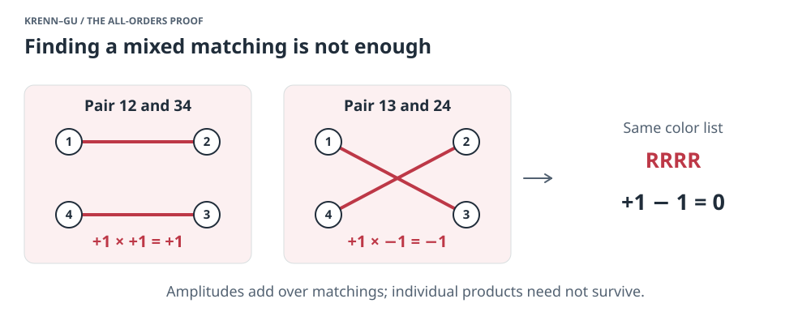
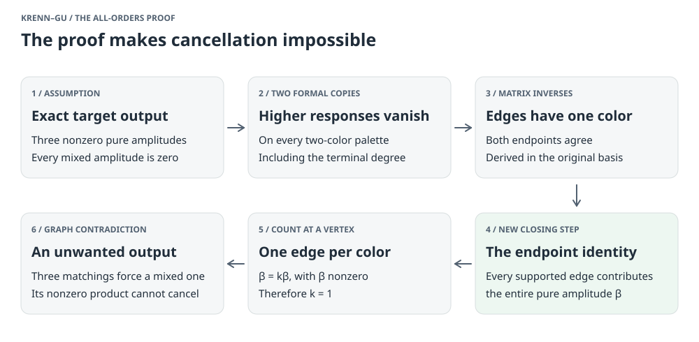
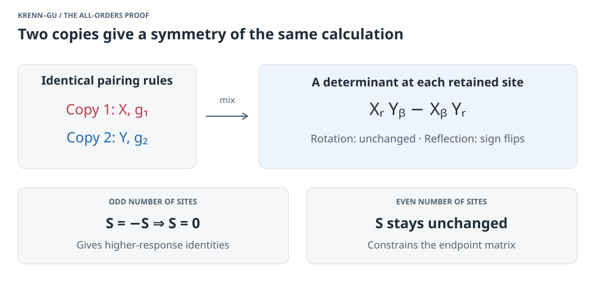
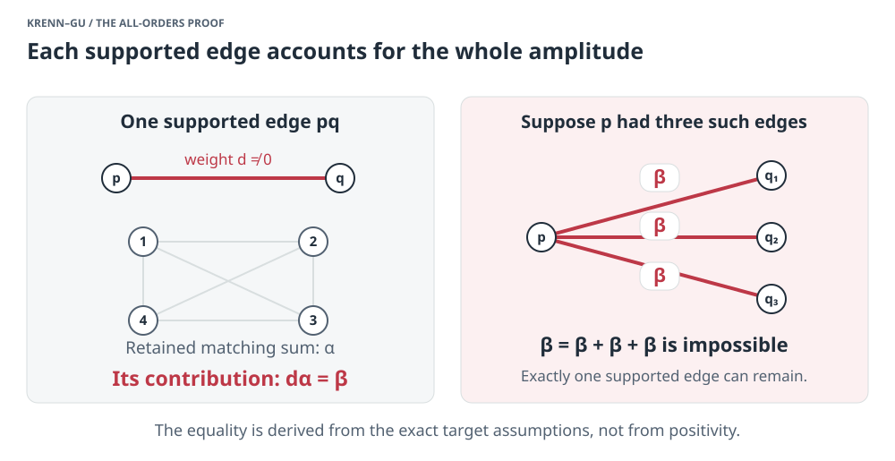
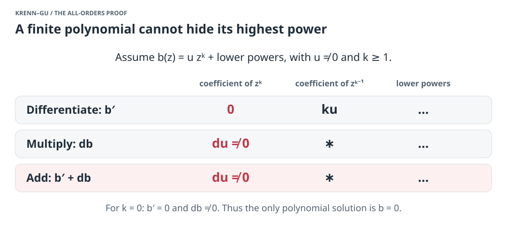
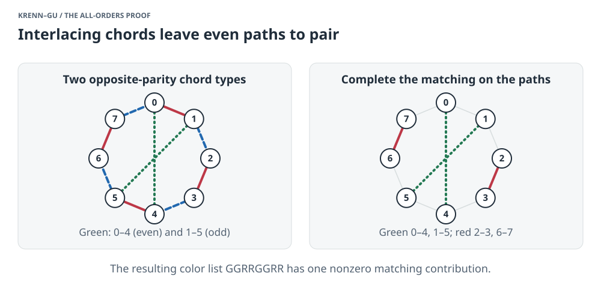
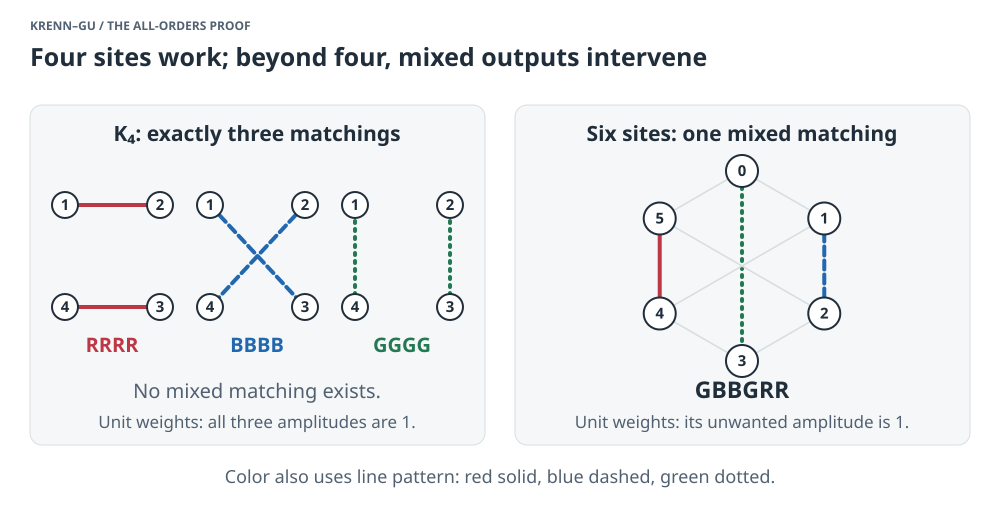

# How the all-orders Krenn–Gu proof works

**An illustrated guide at undergraduate math level · September 26, 2026**

[Browser edition](ALL-ORDERS-PROOF.html) · [All explainers](README.md) · [Full proof](../proofs/krenn-gu-all-orders-two-replica-proof.md) · [Review record](../notes/all-orders-two-replica-review-2026-09-26.md)

The proof turns a problem about complicated cancellations into a very rigid
graph problem. It first shows that a hypothetical solution must have exactly
one edge of each color at every vertex. Three such colored matchings then
force an unwanted output whenever the number of vertices is greater than four.

The difficult part is proving that rigidity while allowing arbitrary complex
weights. The decisive new identity does this at every size at once.

**Status.** The written proof has passed two independent internal research-agent
audits. External peer review and complete Lean verification remain outstanding.
This guide explains that proof; it is not an additional certification. The
acceptance record supplies the later review outcome for the frozen proof file,
whose original candidate-review header is retained.

## 1. What is being ruled out?

Think of vertices as output sites. An edge joins two sites and carries a complex
weight. Initially, the colors at its two ends may differ. A **perfect matching**
is a choice of edges that uses every vertex exactly once.

Each matching produces a color at every site. Multiply its edge weights to get
its contribution. Then add the contributions of all matchings producing that
same color list. This sum is the list's **amplitude**.

For example, a six-site matching might produce `RRGBBG`. A pure list has just
one color, such as `RRRRRR`; a mixed list uses at least two colors. The desired
output has the form

<!-- math: target -->
$$
H = \tau_R R^V + \tau_B B^V + \tau_G G^V,
\qquad \tau_R\tau_B\tau_G\ne 0.
$$

Here `R^V` means red at every site in the vertex set `V`, and similarly for
blue and green. Every mixed-list amplitude must be zero. The three pure
amplitudes can be different nonzero complex numbers.

The theorem says this is impossible for every even number of sites greater
than four. More than three target colors are also excluded: retain any three
colors, and a hypothetical larger-color solution would give a three-color one.
The model permits arbitrary edge density and endpoint colors. Parallel edges
with the same endpoints and endpoint colors combine by adding their weights.

Why is this hard? A mixed matching need not cause a mixed output: its
contribution might cancel with another matching. Complex weights allow both
sign and phase cancellation.

*Figure 1. A cancellation example, not a solution of the conjecture. A proof
must control sums of matching contributions, not just find an unwanted matching.*

## 2. The route through the proof

*Figure 2. The higher-response and diagonal-reduction arguments supply the
foundations. The endpoint identity is the new step that closes all sizes.*

There are three distinct tasks:

- **Control cancellation algebraically.** Use the exact output conditions and
  two formal copies of the same source to derive polynomial identities.
- **Force a simple graph.** First, both ends of each supported edge must have
  the same color. Then, each vertex must have exactly one edge of each color.
- **Finish with graph theory.** In this rigid graph, an unwanted matching has
  no second contribution that could cancel it.

The last task is a known graph obstruction, reproduced in the full proof.
The new work gets the arbitrary complex-weighted problem into that setting.

## 3. Why two copies reveal constraints that one copy hides

Delete one vertex, called the **root**. An odd number of vertices remains.
To complete a matching, the deleted root must connect to one remaining vertex.
Its possible connections form a vector, or **row**, of edge weights.

For each root color, this row has an especially simple response: it produces
only the matching pure-color list on the remaining vertices. This follows
directly from the assumed exact output. The three actual root rows therefore
give three independent pure responses.

The proof also studies **higher responses**: insert three, five, or more root
rows and pair all remaining sites internally. These are auxiliary polynomials,
not physical matchings with a root used several times. They package useful
identities among the original edge weights.

The key device is to take two identical, independent formal copies of the
pairing calculation. At each site, compare their two selected colors using
the expression

<!-- math: alternating -->
$$
X_RY_B-X_BY_R.
$$

This is a two-by-two determinant. Rotating the two copies together preserves
it; reflecting them changes its sign. The underlying formal pairing rules are
also preserved by these orthogonal transformations. No positive probability
distribution is needed: a formal pairing calculation is simply a sum over
pairings with prescribed weights.

*Figure 3. These transformations act on bookkeeping copies. They do not change
the edge weights or assume that a family of physical solutions exists.*

For this calculation, the reflection is chosen to fix the auxiliary root-row
factor. The odd number of local determinants then changes the total sign.
An expression equal to its own negative must be zero. Extracting coefficients
gives relations between the ordinary response and all higher odd responses.

Those relations imply that, on any chosen two-color palette, mixed higher
responses vanish, while all pure higher responses have a common polynomial
factor. Collect these factors into one finite, even polynomial `g`, with
constant term one. A 45-degree rotation of the two copies gives

<!-- math: scaling -->
$$
g(L/\sqrt{2})^2=g(L).
$$

If `g` had degree `k > 0`, the left side would have degree `2k`, while the
right side would have degree `k`. That is impossible for a nonzero polynomial.
Thus `g = 1`: every higher odd response on a two-color palette vanishes.

Two qualifications matter. This includes the **highest possible odd degree**,
where there are no internal pairs left. And it concerns every two-color
projection; it does not assert that all three-color higher responses vanish.
The third active color is nevertheless essential to deriving these identities.

## 4. How the earlier identities force same-color edges

Delete a second vertex. A related two-copy argument on the even number of
remaining sites turns the higher-response identities into matrix equations.
Here is what those equations mean.

Fix one color `h`. Form a matrix `Cₕ` whose entry at distinct vertices
`r,q` is the total all-`h` matching amplitude after deleting `r,q`. Its
diagonal entries are zero. These are actual smaller matching sums, often
called **hafnian cofactors**.

Let `Bᵢₕ` collect edge weights with color `i` at the first endpoint and
color `h` at the second. The identities say

<!-- math: inverse -->
$$
B_{hh}C_h=\tau_h I,
\qquad B_{ih}C_h=0\quad(i\ne h).
$$

Since `τₕ ≠ 0`, the first equation makes `Cₕ` invertible. Multiply
the second equation by its inverse: `Bᵢₕ = 0` for `i ≠ h`.

So every supported edge has the same color at both ends, in the original
target coordinates. The proof has derived this from the general model.
The harder input here is the even-omission identity that establishes the
matrix equations; the final inverse-matrix deduction is ordinary linear algebra.

## 5. The new identity: every supported edge accounts for the whole amplitude

Choose a color and call its symmetric weight matrix `B`. In the rest of
this section, `B` names a matrix, not necessarily the color blue. Its
**hafnian**, written `haf`B``, is the sum of the products of
weights over all perfect matchings. For four vertices, for example,

<!-- math: hafnian -->
$$
\operatorname{haf}(B)=B_{12}B_{34}+B_{13}B_{24}+B_{14}B_{23}.
$$

Write `β = haf`B``. Every matching pairs a fixed vertex
`p` with some partner `q`. Grouping matchings by that partner gives the
ordinary expansion

<!-- math: expansion -->
$$
\beta=\sum_{q\ne p}B_{pq}\operatorname{haf}(B[V\setminus\{p,q\}]).
$$

The bracketed matrix is what remains after deleting `p,q`. Each summand
is the total contribution from matchings that use edge `pq`.

The breakthrough is much stronger than this sum formula. For **every edge
with nonzero weight**, the proof establishes

<!-- math: endpoint -->
$$
\boxed{B_{pq}\operatorname{haf}(B[V\setminus\{p,q\}])=\beta.}
$$

Thus each supported edge at `p` accounts for the entire amplitude `β`.
If there are `k` such edges, the ordinary expansion becomes

<!-- math: degree -->
$$
\beta=k\beta.
$$

The target amplitude is nonzero, so `k = 1`. This applies at every vertex
and in every color. Each color's edges therefore form a perfect matching.

*Figure 4. The argument counts supported edges only after proving that every
contribution is exactly the same nonzero complex number. Positivity is not assumed.*

## 6. Where the endpoint identity comes from

This is the central algebraic step. Fix the supported edge `pq`, with
weight `d ≠ 0`, in the color represented by `B`. Choose a second active
color, whose full matching amplitude is `η ≠ 0`. Let
`α = haf(B[V ∖ {p,q}])`. The goal is
`β = dα`.

Keep the original graph on the remaining even number of sites. Its **finite
response polynomial** collects all ways to use some inserted row entries
and pair the other vertices internally. It is finite because there are only
finitely many vertices; no vertex can be used twice.

Take two formal copies of this polynomial. At each retained site use the
alternating pairing from Section 3, and multiply over the sites. This gives
a scalar polynomial in the inserted rows. Now an even number of local signs
means that reflections, as well as rotations, preserve the scalar polynomial.

Introduce two independent two-component parameter vectors `P,Q`. They specify
how much of the two actual `B`-colored root rows is inserted into each copy.
Differentiate with respect to analogous parameters for the second color.
The resulting two-by-two matrix, with a direct-edge correction, is called `T`.

Two ingredients constrain `T`:

- Mixing the copies by an orthogonal matrix transforms `T` in the same way
  as an ordinary matrix acting on those two copies.
- The original root identities force specific off-diagonal factors. Together
  with that transformation rule, they give the special form below. Symmetry
  alone would not be enough.

<!-- math: matrix -->
$$
T=aI+bPQ^{\mathsf T},
\qquad a,b\in\mathbb C[\sigma,\rho,z],
\qquad \sigma=P\cdot P,\ \rho=Q\cdot Q,\ z=P\cdot Q.
$$

The dot products are bilinear sums, with no complex conjugation. The three
scalar quantities describe the polynomial information about `P,Q` unchanged
by simultaneous orthogonal transformations. The coefficients `a,b` are
finite polynomials in them. The full proof establishes their polynomiality,
including parameter values where intermediate geometric arguments degenerate.

The complete higher-response identities at both original roots now give

<!-- math: ode -->
$$
\frac{\partial b}{\partial z}+db=0,
\qquad \frac{\partial a}{\partial z}+da=\beta\eta.
$$

These derivatives are in auxiliary parameters. The source weights remain
fixed. In deriving these equations, one must differentiate the full expression
before setting a parameter to zero. The terminal odd response from Section 3
is needed here too.

The useful observation is elementary: **a derivative lowers polynomial
degree; multiplication by a nonzero constant does not.**

Suppose the highest term of `b`, as a polynomial in `z`, were `u zᵏ`,
where `u ≠ 0` can depend on `σ, ρ`. Then `db` has highest
term `duzᵏ`, and the derivative has no term of that degree to cancel it.
Even a nonzero constant fails the equation. So `b = 0`.

Apply the same argument to `a − βη/d`. It follows that

<!-- math: forced -->
$$
b=0,\qquad a=\frac{\beta\eta}{d}.
$$

*Figure 5. Finiteness is decisive. The function exp(−dz) solves the homogeneous
differential equation, but it is not a polynomial when `d ≠ 0`. It is not an
allowed response of a fixed finite graph.*

Finally set all the auxiliary parameters to zero. Directly evaluating the
pairing gives `a(0) = ηα`. Comparing this with the forced constant
value of `a` gives

<!-- math: finish -->
$$
\eta\alpha=\frac{\beta\eta}{d}
\quad\Longrightarrow\quad \beta=d\alpha.
$$

We may cancel `η` because the second pure output is nonzero. This proves
the endpoint identity. No assumption that the smaller hafnian `α`
is nonzero was needed; the identity implies it afterward.

The full proof's Section 4 supplies the root boundary equations, the matrix
lemma, and the parameter differentiations summarized here. The guide spells
out the degree argument and final deduction, but does not replace those
coefficient calculations.

## 7. Why three perfect matchings cannot work beyond four sites

Call the three color matchings `F,G,H`. First, two colors cannot share the
same pair of vertices. If they did, choose that pair in one color and every
other edge of the second color's matching. This gives a mixed list with a
nonzero amplitude.

More generally, a color list now has **at most one compatible matching**:
each vertex has only one edge of the color it requests. Any compatible
matching has a product of nonzero weights, so there is nothing to cancel.
It remains to find a mixed matching in the union of `F,G,H`.

**Start with two colors.** The union of `F,G` consists of alternating even
cycles. If there is more than one cycle, use `F` on one and `G` on the
others. That is already a mixed perfect matching. So the only possible
escape is a single cycle through all vertices.

**Add the third matching as chords.** Number the cycle vertices
`0,1,…,n−1`. If an `H`-chord joins an even vertex to an odd one,
delete its endpoints. The two remaining paths each have an even number of
vertices. Pair consecutive vertices on those paths and add the chord.
This is a mixed perfect matching.

Thus every `H`-chord would have to join equal parities. In particular, both
parity classes would have to have even size. This already rules out the escape
when `n` is twice an odd number, including six sites.

**Two crossing chords also produce a matching.** If an even-even chord and
an odd-odd chord interlace around the cycle, deleting their four endpoints
leaves four paths of even size, possibly empty. Match those paths and put
back the two chords. When `n > 4`, at least one cycle edge is used, making
the result mixed.

*Figure 6. “Crossing” means that the endpoints alternate around the cycle;
it does not depend on a physical crossing of optical paths. The eight-site
drawing illustrates the general even-path argument.*

**Avoiding those crossings is impossible.** Choose a chord and a side of
that chord containing as few interior cycle vertices as possible, among
all chords and both sides. Its endpoints have equal parity, so there is
an interior vertex of the opposite parity. That vertex's `H`-partner
must also be inside: a partner outside would give the forbidden interlacing
pair. But its interior chord cuts off a still smaller arc. This contradicts
the choice of the smallest one.

Every possibility therefore supplies a mixed perfect matching, which has a
nonzero amplitude. This contradicts the assumed exact output.

## 8. Why four sites survive

There are exactly three perfect matchings on four vertices. Color them red,
blue, and green and give every edge weight one. They produce exactly the
three desired pure lists. There is no fourth matching to cause trouble.

*Figure 7. The four-site construction works. The six-site drawing shows how a
mixed output can arise after rigidity is established; the general argument
in Section 7, not this single example, excludes every larger even size.*

Precisely where does the graph argument stop at four? Two interlacing
third-color chords already use every vertex. They form the pure third
matching, without any leftover cycle edge. The step that demanded a mixed
matching therefore does not apply. The algebraic endpoint identity itself
remains valid at four sites.

At two sites, parallel edges with different colors can give arbitrarily many
pure outputs. An odd number of sites has no perfect matching in this model.

## 9. What has been learned, and what remains separate?

The structural conclusion is stronger than a collection of unsuccessful
searches. Under the exact target conditions, the original edge blocks must
be diagonal, and each color must have degree one at every vertex. These
facts remove the freedom that complex cancellation initially seemed to offer.

The distinctive new step is the supported-edge endpoint identity. A finite
polynomial and its orthogonal symmetry impose it uniformly in the number
of vertices. The proof does not check a few graph sizes and extrapolate.
The final three-matching obstruction is prior graph theory, not a new result
claimed by this workspace.

This completes the workspace's written proof of **exact impossibility** in
the stated model. It does not determine how quickly the success rate of an
approximate construction must fall as its fidelity approaches one.
Combined with standard polynomial algebra, the exact exclusion guarantees
some power-law bound at each fixed size. The separate
[quantitative follow-up](QUANTITATIVE-PROOF.md) gives an explicit global
rate bound for diagonal complex sources, with exponent 4/(3n+2). The subsequent
[full-model rate argument](GENERAL-RATE-BOUND.md), strengthened by the
[parity follow-up](RATE-FOLLOWUPS.md), gives exponent 16/[n(3n+22)]
for arbitrary complex endpoint colors, including 1/15 at six sites. These
quantitative deductions await independent audit; the unrestricted sharp
square-root rate remains open. The exact
statement also does not automatically cover extra ancillary sites,
heralding protocols, or other changes to the matching model.

For the evidence behind the current status, see the [review record](../notes/all-orders-two-replica-review-2026-09-26.md).
It links both full-chain internal audits and the exact supporting checker.
The checker tests covariance, boundary identities, the allowed four-site
source, and a negative control missing the required third-color premise.
Those checks support the algebra and scope; the argument for all sizes is
the written analytic proof.

The older [main explainer](EXPLAINER.md) and [six-site guide](SIX-SITE-PROOF.md)
preserve the preceding research snapshot. This guide describes the subsequent
all-orders closure. The [full proof](../proofs/krenn-gu-all-orders-two-replica-proof.md)
contains every algebraic step, and its Section 6 gives the provenance of the
graph lemma.
