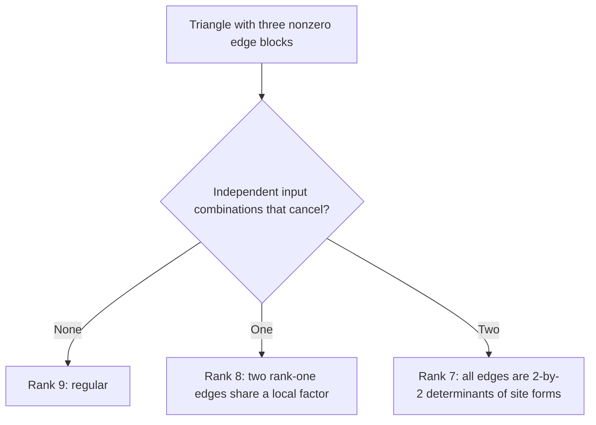
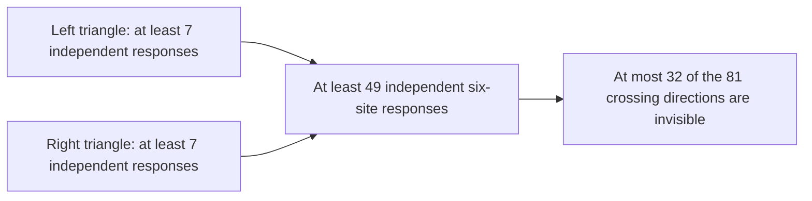
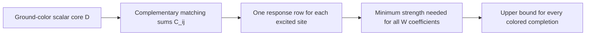
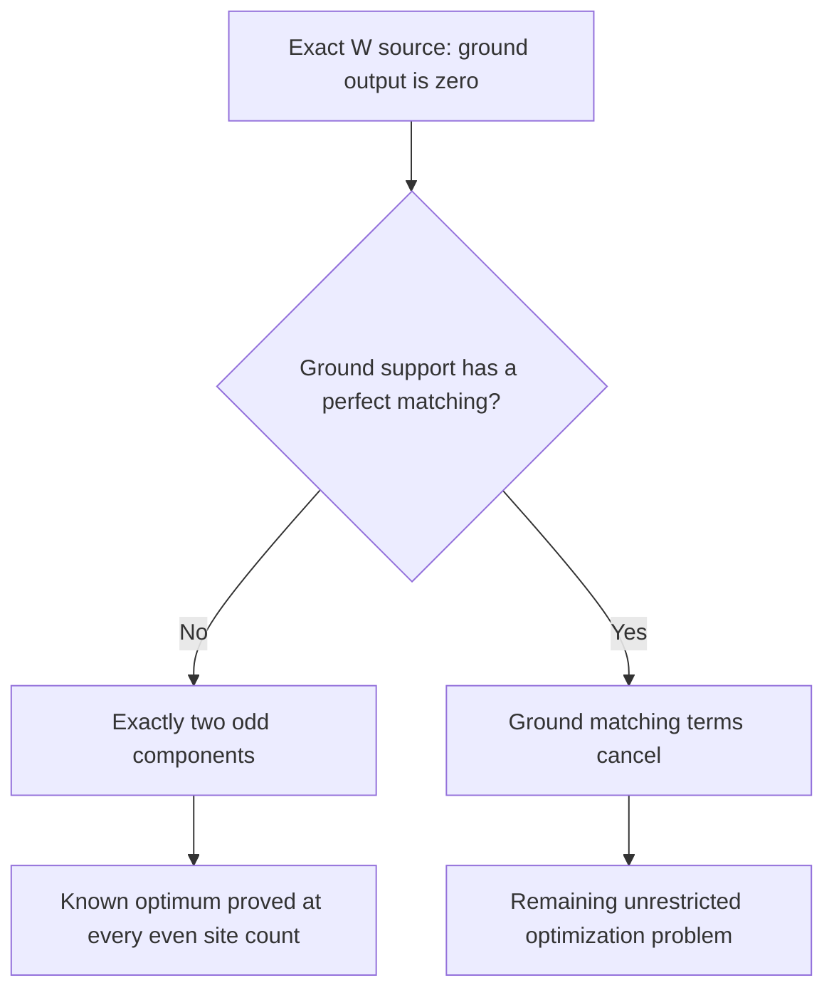

# What remains after balancing: two sharper research targets

September 27, 2026. **Written proofs with exact supporting checks;
independent audit pending.**

[All guides](README.md) · [Why balance the source?](SITE-BALANCING.md) ·
[Exact replay](../computations/balanced-frontier-2026-09-27/README.md)

Balancing lets us study sources with equal total strength at every site.
The next results make the remaining GHZ obstruction more explicit and give
a W-state bound that applies even to fully colored cores.

## 1. Triangle rank loss has only two forms

A triangle response has nine inputs: choose one of three unmatched sites
and one of its three colors. Each input fills the other two sites using
their edge. Rank loss means some combination of these nine inputs cancels.

Provided all three edges are nonzero, we can now classify every such
cancellation. The response loses at most two dimensions.

For the last case, choose two linear expressions $x_i,y_i$ at each site.
The three edges have the form

$$
 x_2y_3-x_3y_2,\qquad x_3y_1-x_1y_3,\qquad x_1y_2-x_2y_1.
$$

Multiplying these by $x_1,x_2,x_3$ and adding makes all terms cancel.
The same happens with $y_1,y_2,y_3$. The proof shows these two cancellations
exhaust the kernel. A one-dimensional kernel occurs when only two sites
participate and the remaining edge prevents this determinant construction.

## 2. This gives a strong rank bound at triangle limits

For two disconnected triangles, the six-site first response combines one
triangle response with the other. Their ranks multiply. Thus even if both
lose two dimensions, the derivative has rank $7\times7=49$.

This is stronger than merely knowing that some response survives. But rank
alone does not tell us whether the desired GHZ direction is accessible.
At a singular triangle limit, it is absent from the first response. A
near-perfect GHZ signal must therefore be at least quadratic in the distance
from that limit. Comparing its unwanted output with the cube of its signal
remains the hard step.

There is also a distinct obstruction. We constructed a balanced source with
all fifteen edges nonzero, zero output by complex cancellation, and derivative
rank only 25. It cannot be treated as two disconnected triangles. Its ground
cofactor graph is a four-cycle with two isolated vertices.

[Complete classification, onset bound, and rank-25 construction](../notes/triangle-response-rank-classification-2026-09-27.md).

## 3. A W bound for every colored architecture

A W output has exactly one excited site. To produce its coefficient at
site $i$, a matching uses one edge that excites $i$, while every other
edge emits the ground color. This separates the calculation:

Let $a_0$ be ground-core strength and $r_i^2=\sum_j|C_{ij}|^2$ the squared
size of response row $i$. Producing coefficient $\lambda$ at site $i$
costs at least $\lvert\lambda\rvert^2/r_i^2$ in excitation-edge strength.
These costs add because the source entries are distinct.

At six sites this yields

$$
                   R\le\frac{8}{9a_0^2\sum_i1/r_i^2}.
$$

Unlike the previous architecture optimum, this inequality applies to
arbitrary colored cores. A known subhafnian inequality gives the universal
upper bound $4/135$. The existing construction attains $1/65$, so there
is still a gap.

The sharper scalar statement

$$
 \operatorname{haf}(D)=0
 \quad\Longrightarrow\quad
 a_0^2\sum_i\frac1{r_i^2}\ge\frac{520}{9}
$$

for nonzero response rows would close that gap and prove the unrestricted
six-site W optimum. **This statement is open.** The known construction
attains equality, and numerical searches have not found a violation.
The numerical evidence cannot certify a global minimum.

There is a concrete caution against assuming the analogous statement at
every size: a four-site scalar core violates the threshold needed to obtain
the two-root value $1/10$ by this method alone. Its minimum-strength response
also produces unwanted two-excitation words. This is not a better exact W
design; it shows that the remaining cancellation equations can matter.

[Unrestricted bound, scalar proof target, and cancellation equations](../notes/w-state-unrestricted-response-bound-2026-09-27.md).

## 4. Where the next work belongs

There is now an all-even W optimality theorem for a broader class. If the
ground-color graph has no perfect matching, the known rate is optimal even
when every edge may have additional complex colored entries. The response
condition forces the ground graph to split into exactly two odd components.
Comparing their response bounds proves that one isolated ground-color site
and a complete odd core attain the best rate.

This is a condition on ground-color support, not a restriction to one or
two colored roots. A better unrestricted design must use destructive
interference between ground-color perfect matchings.

[All-even theorem and proof](../notes/w-state-no-ground-matching-optimum-2026-09-27.md).

| Path | Newly established | Remaining task |
|---|---|---|
| GHZ | Complete triangle rank classification; derivative rank at least 49 there; explicit balanced rank-25 cancellation family | Control higher-order target and error terms in these concrete classes |
| W | Unrestricted response bounds; all-even optimum whenever ground support has no perfect matching | Control ground matching cancellation, through the scalar inequality or higher-excitation costs |

Both paths remain open globally. The reductions identify precise equations
to work on, while the counterexamples prevent extending a theorem beyond
the assumptions that make it true.
