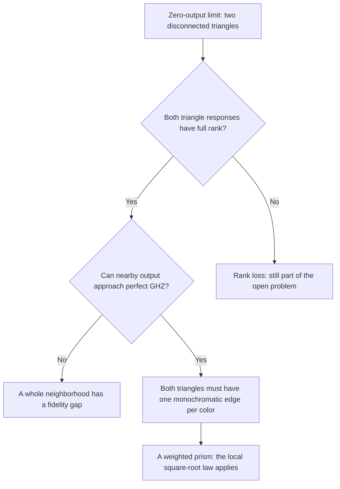
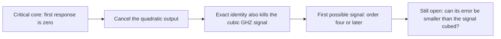
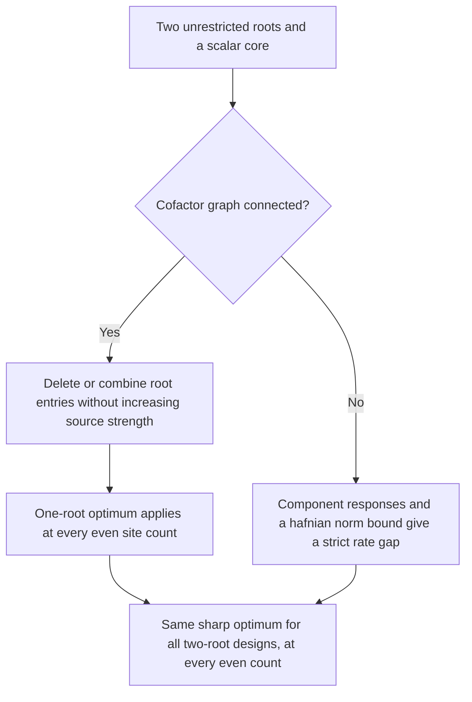

# Two research paths, and the structures that now separate them

September 26, 2026. **Written research with exact supporting calculations;
independent audit is pending.**

[All guides](README.md) · [Previous methods guide](METHOD-UTILITY.md) ·
[First replay](../computations/boundary-structure-2026-09-26/README.md) ·
[Higher-order replay](../computations/higher-order-2026-09-26/README.md) ·
[W optimum replay](../computations/w-state-two-root-2026-09-26/README.md)

We are pursuing two questions: the sharp GHZ fidelity--rate law for arbitrary
complex sources, and W-state optimality beyond the original one-root design.
The new results remove whole classes of possibilities from both questions.
Neither unrestricted question is settled.

**Later reduction:** the [site-balancing guide](SITE-BALANCING.md) shows that
global rate bounds may be proved on balanced sources, where the entire
first derivative cannot vanish. The isolated critical core below remains
an exact higher-order case study, but cannot be a balanced counterexample
limit. The current global frontier is partial rank loss and cancellation
at balanced limits.

## 1. Regular triangle limits are now understood

To approach perfect GHZ fidelity, the normalized source must tend toward a
configuration with zero output. One way this happens is to split the source
into two disconnected triangles: each triangle has an odd number of sites,
so the whole source has no perfect matching.

Inside either triangle, a response map describes what happens when one site
is left available for a crossing edge. There are nine independent input
coordinates. If all nine remain distinguishable in the output, the response
has full rank; call that triangle regular.

The classification allows arbitrary complex internal blocks and perturbations
in all 135 source entries. It follows by relating a triangle response to an
exact four-site GHZ construction. The existing proof identities force that
four-site construction to be the familiar three distinct colored matchings.

Unequal prism weights cause no new obstruction: invertible local rescalings
make them equal while preserving each pure GHZ amplitude. The earlier local
rate bound then applies, with constants depending on those rescalings.

This does not cover zero-output sources that have no disconnected-triangle
split, or triangles whose response loses rank.

[Precise theorem and proof](../notes/regular-triangle-rate-classification-2026-09-26.md).

## 2. Higher-order freedom cannot erase the prism's cubic error

Write a source path as

\[
 A(t)=A_0+tA_1+t^2A_2+t^3A_3+\cdots.
\]

At the prism, suppose the first output is a nonzero GHZ signal. One might try
to tune the second and third terms to cancel all unwanted output. The new
symbolic calculation leaves **all 135 entries of both terms free** and shows
that this cannot remove the cubic error after quadratic error has vanished.

It produces an exact identity linking one third-order unwanted output to six
second-order unwanted outputs and the first-order signal. The identity is
checked coefficient by coefficient in 325 formal variables, rather than by
trying a few numerical paths. It provides a model for the elimination
certificates we want at harder singular limits.

## 3. A graph test can work even when the derivative tells us nothing

For a diagonal source, look at the edges carrying one chosen color. If we
can assign weights to these edges so that every perfect matching receives
total weight one, an exact identity reconstructs either other pure amplitude
from unwanted mixed outputs. That forces a strict fidelity gap.

There is a complete graph test for this particular kind of certificate:
look at the *missing* edges. The certificate exists exactly when they contain
a connected bipartite component with unequal part sizes. Bipartite means
the vertices split into two groups and every edge joins different groups.

Of all 32,768 possible six-site supports for one color, 6,510 admit the
certificate. This is a count of support patterns, not of all possible sources.

One important example uses complex cube-root phases on a five-site core.
Every four-site matching sum cancels, so the entire six-site first derivative
is zero. All previous single-root rank filters pass it. The new graph
identity nevertheless proves that every diagonal source within distance
0.01 has GHZ fidelity below 0.334.

Off-diagonal perturbations introduce extra mixed-output terms. The same
exclusion has **not** been proved for them, making this a concrete remaining
test for the unrestricted rate law.

[Graph criterion, identity, and exact singular example](../notes/diagonal-support-rate-exclusions-2026-09-26.md).

### Keeping the off-diagonal terms reveals a fourth-order constraint

We can now keep those extra terms explicitly. The identity shows that, near
this core, the size of a near-perfect GHZ signal is at most a constant times
the **fourth power of the distance** from the core. For example, along an
analytic path moving a distance of order \(t\), GHZ output cannot first
appear at order \(t^2\) or \(t^3\). It must wait until at least \(t^4\).

The checker leaves all four source jets free: 540 formal variables. It also
gives an explicit formula for the possible fourth-order signal in terms of
the first direction, once the earlier output orders vanish.

Every fixed straight ray from this base has limiting fidelity at most one
third. Curved approaches can behave differently, and are the remaining
challenge. A small signal by itself does not prove a rate law: we still need
to compare that signal with its unwanted output.

[Full-complex onset bound and higher-order identities](../notes/critical-core-higher-jets-2026-09-26.md).

### A candidate must pass the next cancellation equation

An exact example now shows why the order of these tests matters. One direction
cancels every quadratic output and makes the formal fourth-order expression
nonzero. Yet it cannot cancel its cubic error: a sum of four unwanted outputs
is always \(2\omega\), regardless of all 135 entries of the next source term.

That rules out the direction before it can produce a leading GHZ signal.
It also rules out the shortcut of claiming that the quartic expression always
vanishes just from the quadratic equations. The next search must solve the
cubic extension equation as well.

[Exact example and four-output obstruction](../notes/critical-cone-extension-obstruction-2026-09-26.md) ·
[Replay](../computations/critical-cone-2026-09-26/README.md).

The next exact result covers a family rather than one direction. When a
selected first-order root row reaches at most two ground-color core sites
and has no first-order excitation cell in that binary palette, quadratic
cancellation leaves very little excitation support. In the exceptional
two-edge case, the fourth-order pure signal is a multiple of a cubic error:

\[
                 (H_4)_{b^6}=D_{34}(H_3)_{bbbaab}
\]

in one representative labeling. Cancelling that error also kills the signal.
The checker covers all 30 exceptional labelings and the 15 simpler cases,
with every higher source jet free. GHZ onset in this family is therefore
**fifth order or later**. Denser rows and later orders remain unresolved.

[Sparse-row theorem and exact identities](../notes/critical-core-fifth-order-branch-2026-09-26.md).

## 4. The full two-root W optimum is now determined at every even count

Previously we optimized sources with one unrestricted site and a scalar
ground-color core. Now allow two unrestricted sites, with arbitrary complex
edge blocks touching either one.

On the remaining sites, connect two vertices when their complementary
matching sum is nonzero. This is the cofactor graph.

The earlier proof handled graphs containing an odd cycle. Cancellation makes
certain ratios change sign across every edge, which is impossible around an
odd cycle unless one root stops exciting the core.

The new step handles bipartite graphs, where alternating signs are possible.
The two root vectors can be combined into one effective vector. An exact
sum-of-squares identity proves that this keeps every target amplitude and
never increases source strength. This also works when the cofactor matrix
is singular; no inverse is needed in the proof.

The remaining disconnected cases now have a uniform argument at every size.
Each component must supply the same target amplitude at all its sites. Its
response strength limits how efficiently it can do that. A published bound
on the combined cofactor norms shows that disconnected components always
fall strictly below the one-root optimum.

Writing \(n=2m\), the resulting sharp rate for the entire two-root class is

\[
 R_* = \frac{n B_n}{(n-1)^2+1},\qquad
 B_n=\frac{((n-1)!!)^2}{\binom{n}{2}^{m}}.
\]

For example, this is \(1/10\) at four sites, \(1/65\) at six, and
\(9/3136\) at eight. The earlier complete-core construction attains each
value. At six sites the stronger disconnected upper bound remains \(1/144\).

This completes the two-root architecture at every even count. Cores with
arbitrary colored edges remain outside the theorem, so the optimum over
every possible W-state source is still open.

[All-even optimum and quantitative disconnected gap](../notes/w-state-two-root-optimum-2026-09-26.md).

### Allowing every colored edge still gives no nearby improvement

At six sites, the same rate-\(1/65\) design is now proved **locally optimal
among unrestricted complex sources**. This permits colored-core changes
outside the two-root architecture.

The proof examines every direction that preserves the target to first order.
An exact calculation shows that the second-order cost is positive in every
direction except five harmless vertex-phase changes. Those phases leave
both the output and source strength unchanged. Fixing them gives a strict
local minimum of source strength, and therefore a local maximum of rate.

The calculation uses all 60 complex binary source entries, with no root
restriction. Discarding extra colors preserves the W target and reduces
source strength, so the conclusion also covers all 135 ternary entries.
The theorem gives no numerical radius and does not settle the global
unrestricted optimum.

[Unrestricted local proof and exact certificate](../notes/w-state-unrestricted-local-optimum-2026-09-26.md).

## 5. The remaining work is now more specific

| Main question | Progress | Next unresolved class |
|---|---|---|
| Universal GHZ square-root law | Regular triangle limits have local bounds; critical-core onset is at least fourth order, and at least fifth order for sparse first rows | Denser first rows, higher-order curved approaches, and other zero-output structures |
| Broader W-state optimality | Sharp all-even two-root theorem, plus unrestricted local optimality at six sites | The global optimum over arbitrary colored cores, including distant designs requiring more roots |

The new certificates narrow the search and provide reusable identities. They
are written research awaiting audit, separate from the Lean-verified exact
Krenn--Gu theorem.
