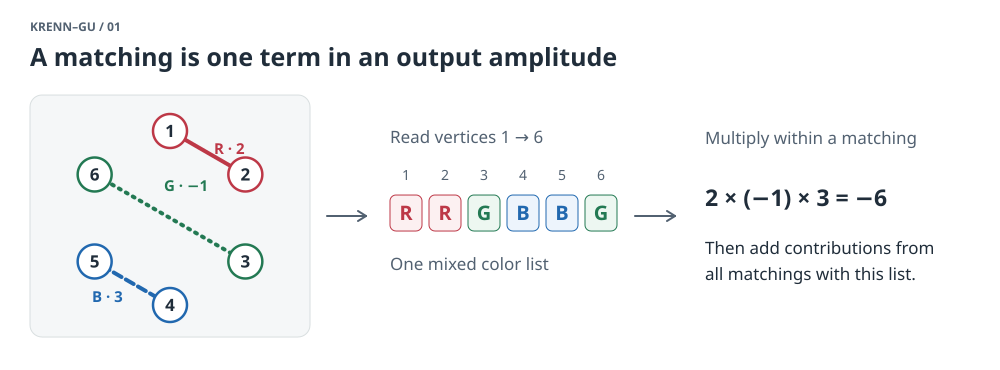
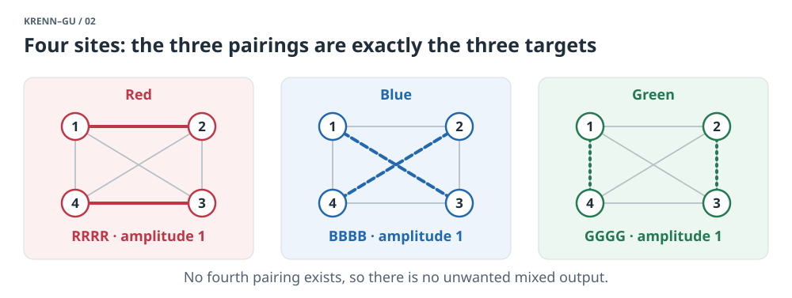
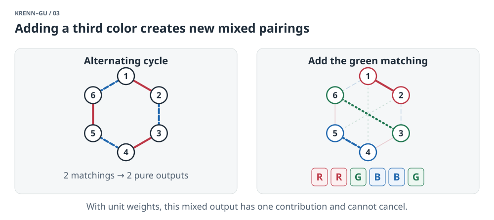
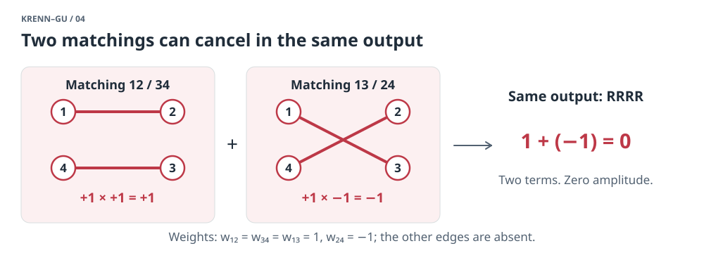
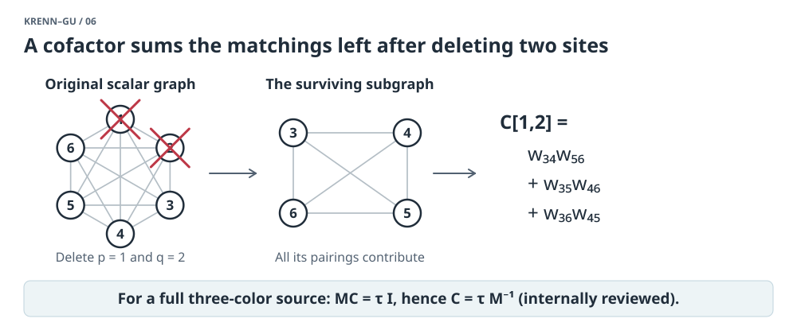
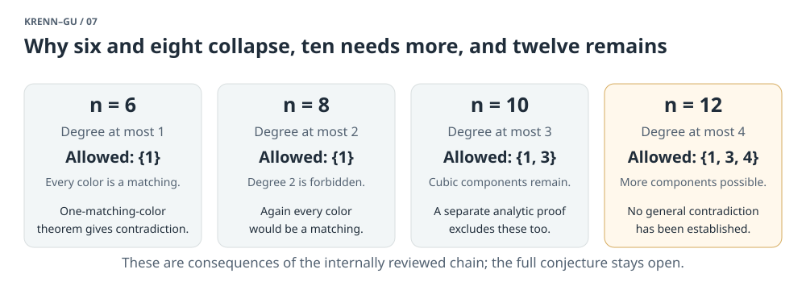

# Krenn–Gu: what the conjecture asks, and what we have learned

> **Historical snapshot (September 25):** the exact conjecture was subsequently proved and Lean-verified. Read the [complete proof guide](ALL-ORDERS-PROOF.md) and [current project status](../README.md). The discussion below preserves the earlier research frontier.

*A reading guide to this workspace, checked on September 25, 2026 (Pacific time). Assumes basic graph theory, complex numbers, and linear algebra; no quantum physics background. [Open the interactive matching examples](EXPLAINER-LAB.html) or the [illustrated six-site proof](SIX-SITE-PROOF.html).*

**The question is whether pairwise sources can produce perfect agreement among many particles in three or more possible states.** Two states are easy. Three states work for four particles. The conjecture says that, in this model, three states become impossible with six or more particles—even if we use complex weights to make unwanted outcomes cancel.

The workspace has learned considerably more than “our searches did not find a solution.” It contains exact exclusions of small cases, a substantial internally reviewed reduction of the general problem, and restrictions on every remaining hypothetical counterexample. **It does not contain a complete resolution.** Its September research chain places the remaining orders at even **n ≥ 12**; the public formal-conjectures registry still lists the general **n = 8** and **n = 10**, three-color cases as open. These are different evidence levels, not interchangeable status reports. [Local synthesis](historical-sources/ALL-ORDER-STATUS-AND-STRATEGY-2026-09-20.md.txt); [public registry](https://github.com/google-deepmind/formal-conjectures/blob/main/FormalConjectures/Paper/MonochromaticQuantumGraph.lean).

**1. Build the problem from pairs.**

Imagine n labeled sites. A source joins two sites, contributes a weight, and assigns a color to each endpoint. A complete event pairs up every site exactly once. Mathematicians call that a **perfect matching**.

The weight of an event is the product of its edge weights. Its output is the list of colors inherited by the vertices. Several different matchings can produce the same color list; their weights **add** to give that output's amplitude. The general model permits parallel sources, different colors on the two ends of an edge, and arbitrary complex weights.

<!-- explainer-figure:01-matching-term:start -->



*Figure 1. Pair first, multiply edge weights, then group by the inherited vertex colors. The displayed −6 is one matching contribution; other matchings could change the total.*

<!-- explainer-figure:01-matching-term:end -->

The target is:

```text
all red    → amplitude 1
all blue   → amplitude 1
all green  → amplitude 1
every mixed color list → amplitude 0
```

For example, `RRRRRR`, `BBBBBB`, and `GGGGGG` should survive, but `RRBBGG` should not. In quantum notation the target is proportional to

\[
|R\cdots R\rangle+|B\cdots B\rangle+|G\cdots G\rangle.
\]

This is a GHZ state: a coherent superposition of the all-equal outcomes, rather than merely a classical choice between them. We omit its overall normalization. The graph model comes from quantum-optical experiments based on pair sources and postselection. The conjecture concerns that resource model; it is not a prohibition on preparing such entangled states by every possible experimental method. [Krenn's problem page](https://mariokrenn.wordpress.com/graph-theory-question/); [Mixon's formulation](https://dustingmixon.wordpress.com/2021/01/18/a-graph-coloring-problem-from-quantum-physics-with-prizes/).

Write d for the number of colors. The proposed maximum is:

| Sites n | Proposed maximum d | A construction attaining it |
|---|---:|---|
| 2 | Unbounded | One parallel edge per color |
| 4 | 3 | The three perfect matchings of the complete graph K₄ |
| Even n ≥ 6 | 2 | An even cycle with alternating red and blue edges |

Odd n cannot be covered by pairs. For the difficult upper bound it suffices to exclude **three** colors: a solution with more colors could be projected onto any three, retaining exactly their three constant outputs.

For a precise formulation, label the sites V = {1,…,n} and the colors {1,…,d}. For u < v, the matrix entry Aᵤᵥ(i,j) is the sum of the weights of all sources assigning color i to u and color j to v. Reverse endpoint order by Aᵥᵤ(j,i) = Aᵤᵥ(i,j); a single block Aᵤᵥ need not itself be symmetric. For a color assignment c: V → {1,…,d}, define

\[
H_A(c)=\sum_{M\in\mathrm{PM}(V)}\prod_{\{u,v\}\in M,\ u<v}
A_{uv}\bigl(c(u),c(v)\bigr).
\]

Here PM(V) is the set of all pairings of V; missing edges have coefficient zero. The equations are Hₐ(c) = 1 when c is constant and Hₐ(c) = 0 otherwise. In tensor notation this is H(A) = ∑ᵢeᵢ⊗⋯⊗eᵢ, but you can read everything as a system of polynomial equations. For d = 3 it has 9·binom(n,2) edge coefficients and 3ⁿ output equations. Merely counting equations and unknowns does not establish inconsistency: many equations are dependent and exceptional cancellations are allowed. [Aggregate formulation](../proofs/six-site-arbitrary-complex-obstruction.md).

**2. Why four sites work, and adding a third color is dangerous.**

On four vertices, give these pairs unit weights:

| Color | Pairs |
|---|---|
| Red | 12 and 34 |
| Blue | 13 and 24 |
| Green | 14 and 23 |

These are all three perfect matchings of K₄. Each produces a constant output. There is no fourth matching to produce an unwanted mixture.

<!-- explainer-figure:02-four-site-exception:start -->



*Figure 2. Faint edges show K₄; bold edges show one complete pairing. Each panel covers every vertex once, and together they exhaust all possibilities.*

<!-- explainer-figure:02-four-site-exception:end -->

On six vertices, the cycle with red pairs `12, 34, 56` and blue pairs `23, 45, 61` has exactly two perfect matchings. Now add green pairs `14, 25, 36`. The green constant output appears—but so does, for example,

```text
12 red + 36 green + 45 blue → R R G B B G.
```

That output has amplitude 1. In this particular graph, it has only one contributing matching, so there is nothing to cancel it. The [interactive examples](EXPLAINER-LAB.html) enumerate all the matchings and let you inspect their outputs.

<!-- explainer-figure:03-third-color-leak:start -->



*Figure 3. The right panel highlights one of the three unwanted mixed matchings. Vertex numbers fix the order of the color list. This construction fails; the example alone is not a general impossibility proof.*

<!-- explainer-figure:03-third-color-leak:end -->

The difficult possibility is that a more elaborate graph might produce every unwanted output in several ways, with amplitudes that add to zero. Positive weights cannot do that; complex weights can. Even the tiny matching sum

\[
w_{12}w_{34}+w_{13}w_{24}+w_{14}w_{23}
\]

can vanish with supported matchings present: choose the three products to be 1, −1, and 0. This is a cancellation example, not a solution of the conjecture. **Finding a mixed matching does not prove that its output amplitude is nonzero.**

<!-- explainer-figure:04-cancellation:start -->



*Figure 4. Cancellation happens between matchings producing the same color list. A positive red contribution and a negative red contribution can sum to zero. Contributions to different lists cannot cancel one another.*

<!-- explainer-figure:04-cancellation:end -->

**3. What prior work actually established.**

The hypotheses matter as much as the numerical bound.

| Work | Established result | What it leaves open |
|---|---|---|
| Bogdanov's observation, developed in Chandran–Gajjala's work | Three distinct monochromatic matching colors on more than four vertices force a mixed matching. This settles the case without destructive interference. The later paper classifies graphs whose perfect matchings are all monochromatic. | Arbitrary complex cancellation. [Paper](https://arxiv.org/html/2202.05562v2) |
| Cervera-Lierta, Krenn, Aspuru-Guzik, 2022 | SAT excludes monochromatic-edge solutions at (n,d) = (6,3) and (8,4); larger d follows by color projection. The necessary Boolean constraints allow possible cancellation. | Bicolored edges, and the three-color eight-site case. [Paper, §3](https://arxiv.org/html/2109.13273) |
| Kevin Mantey's computational work, 2023 | Four sites cannot support four colors; the three-color four-site solution has the K₄ form up to relabeling and rescaling. | Larger orders. [Exact computational repository](https://github.com/bafflingbits/graph_n4_solution) |
| Chandran–Gajjala, Quantum 2024 | Simple experiment graphs with n > 4 cannot reach d ≥ n/√2. Bicolored edges are permitted. | The general parallel-source model and the fixed target d = 3 at larger n. [Paper, §2.4](https://arxiv.org/html/2304.06407v3) |
| Chandran–Gajjala–Illickan, MFCS 2024 | In the full weighted multigraph model, vertex connectivity ≤ 2 and maximum skeleton degree ≤ 3 are excluded for n > 4. A reduction implies that a smallest counterexample must be 4-connected. | More highly connected graphs. [Paper, §1.3](https://arxiv.org/html/2407.00303v1) |
| AlphaProof Nexus / formal-conjectures, 2026 | The general system is impossible for d = n at every even n ≥ 4, hence also for d ≥ n by projection. | The much smaller target d = 3. [Problem author's update](https://mariokrenn.wordpress.com/graph-theory-question/) |
| KitaKen1's Lean development | For every even n ≥ 6, the general system over an integral domain satisfies d ≤ n − 2. | A bound growing with n does not establish d ≤ 2. [Pinned proof repository](https://github.com/KitaKen1/monochromatic-quantum-graph-sharp-bound-lean/tree/6c5340384479dbb36129b2e0084449be2458cce2) |
| algal's independent Lean development | The full complex (6,3) case is excluded. The public registry update was merged September 18, 2026; it links an external Lean proof. | Eight and more sites. [Accepted update and proof link](https://github.com/google-deepmind/formal-conjectures/pull/4610) |

Here a graph's **skeleton** keeps a single adjacency for each pair of sites joined by any edge. A 4-connected graph stays connected after deletion of any three vertices. Thus the published sparse-graph results already show that a smallest counterexample cannot have a simple small separating boundary.

One correction to the workspace's older reference notes is important: **an unsatisfiable support relaxation can prove weighted nonexistence.** The 2022 SAT encoding permits two or more contributions to a forbidden output, since those might cancel, but forbids exactly one. Every weighted solution must pass that test. Therefore UNSAT excludes weighted solutions; SAT alone does not produce one. [The paper's explicit explanation](https://arxiv.org/html/2109.13273).

**4. How to read the evidence in this workspace.**

This guide uses three distinctions:

| Label | Meaning here |
|---|---|
| Published / public formal result | An external primary source or linked formal development establishes the stated result. |
| Repository-certified | The workspace records a mathematical argument, exact checkers or certificates, and independent internal audits in its accepted proof material. This does not automatically mean a completed Lean theorem. |
| Internally reviewed research | A newer source has a recorded independent analytic audit and acceptance, but has not entered the certified dependency record or public formal registry. |

The September audits are reviews recorded by the research agents. They should not be described as journal peer review or as a fresh independent verification performed for this explainer. I read the key statements, proof arguments, audits, and acceptance records; I did not rebuild the entire proof dependency chain or replay all certificates.

The directory name `unaudited-*` is historical in several active lanes: a later companion audit may exist even while the frozen source still says “audit pending.” Conversely, an ambitious old title is not enough to establish a result. The dated [proof sketch](../PROOF-SKETCH.md), [certification ledger](../certification/SUPERSESSIONS.md), and companion reviews determine the scope.

**5. The strongest useful contributions of this workspace.**

“Contribution” below means a result or mechanism developed and recorded here, compared with the external sources checked above. It is not a claim of worldwide priority. In particular, the six-site exclusion has an independent public proof and the elementary constructions and no-cancellation argument belong to prior work.

**A. Concrete finite cases, with exact evidence.** The repository-certified core contains a general complex **six-site obstruction**, organized into nineteen rank-defect graph types. It also contains an **eight-site diagonal obstruction**: three arbitrary weighted color graphs cannot produce the target, even over an arbitrary field, and even if the three constant amplitudes are merely nonzero rather than equal. Its finite argument reduces to 4,096 cases and 87 symmetry classes with checked UNSAT certificates. [Six-site proof](../proofs/six-site-arbitrary-complex-obstruction.md); [eight-site proof](../proofs/eight-site-diagonal-obstruction.md).

The eight-site statement allows parallel same-color sources and arbitrary cancellation within each color. Its improvement over the earlier diagonal (8,4) exclusion is reaching **three colors**. The shipped [Lean status](../formal/n8-diagonal/STATUS.md) records an incomplete formalization; do not call the whole theorem kernel-checked merely because some components compile.

**B. The most significant newer reduction: bicolored aggregate edges disappear.** The September theorem states that every exact full three-color source on even n ≥ 4 has only same-color entries in each aggregate edge matrix, in the original target basis. This is a conclusion from the full equations, not an assumption imposed on the search. [Theorem and proof](../computations/unaudited-codex-higher-common-power-bridge-2026-09-05/UNIFORM-GLOBAL-EDGE-MONOCHROMATICITY-AND-COFACTOR-INVERSE.md); [independent audit](../computations/unaudited-codex-higher-common-power-bridge-2026-09-05/UNIFORM-GLOBAL-EDGE-MONOCHROMATICITY-AND-COFACTOR-INVERSE-AUDIT.md).

To understand the gain, a pair originally has nine possible color coefficients: RR, RB, RG, BR, BB, BG, GR, GB, GG. The reduction forces its six off-diagonal coefficients to vanish. There remain three weighted graphs, one per color. Multiple physical sources with identical endpoint colors have first been added together; the conclusion concerns that aggregate coefficient, not every microscopic parallel source separately.

<!-- explainer-figure:05-diagonal-reduction:start -->


*Figure 5. The left two arrays index endpoint colors; the three resulting matrices index sites. RR, RB, and so on denote aggregate coefficients, not fixed numerical values. The theorem applies to a full exact three-color source and is internally reviewed research.*

<!-- explainer-figure:05-diagonal-reduction:end -->

**Why useful:** it removes an entire type of freedom at every order. The remaining difficulty is cancellation among same-color pairings. It is still a weighted problem, so the old unweighted matching theorem does not finish it. This reduction is **internally reviewed research**, outside the certified dependency record.

**C. A surprising link between an edge graph and all its pair deletions.** The **hafnian**, written haf(M), is the sum of the products of edge weights over all perfect matchings. For a color h, let Mₕ be its symmetric matrix of edge weights. Let Cₕ[p,q] be the total matching weight after deleting p and q, with diagonal entries defined as zero. The same research theorem gives

\[
M_hC_h=\tau_h I,\qquad C_h=\tau_hM_h^{-1},
\]

where τₕ is the nonzero all-h amplitude. This identity is special to the source equations; it is not a general hafnian identity for arbitrary matrices.

<!-- explainer-figure:06-cofactor:start -->



*Figure 6. The cofactor definition is an actual matching sum. The inverse identity in the bottom band is an additional consequence of the full-source equations, not an identity satisfied by every weighted graph drawn above.*

<!-- explainer-figure:06-cofactor:end -->

**Why useful:** the many deletion sums are constrained to be the entries of a single scaled matrix inverse. A matching problem with exponentially many terms acquires strong linear-algebra restrictions. Crucially, Cₕ must contain the **actual** matching sums; substituting a convenient unrelated inverse would lose the content of the theorem.

The proof combines the original one-defect output equations with a separately audited omission identity. Define Bᵢₕ[p,q] = Aₚq(i,h) for distinct sites and zero on the diagonal. Once those equations establish BᵢₕCₕ = δᵢₕτₕI, invertibility immediately kills Bᵢₕ for i ≠ h. That last step is short; the omission identity is a substantive part of the proof, not something to assume from elementary matching expansion. [Detailed derivation](../computations/unaudited-codex-higher-common-power-bridge-2026-09-05/UNIFORM-GLOBAL-EDGE-MONOCHROMATICITY-AND-COFACTOR-INVERSE.md).

A short consequence shows what this buys. Suppose M is symmetric with zero diagonal, τ = haf(M) ≠ 0, and its actual cofactor matrix C satisfies MC = τI. Since both matrices are symmetric, transposing gives CM = τI too. **No row of C can have exactly two nonzero entries.**

To prove this, suppose row p is supported only at q and r, with C[p,q] = a ≠ 0 and C[p,r] = b ≠ 0. The off-diagonal entries of CM give

\[
aM[q,w]+bM[r,w]=0\quad(w\ne p).
\]

In particular M[q,r] = 0. For w outside {p,q,r}, put K_w = haf(M[V∖{p,q,r,w}]). Expand C[p,q] by the partner of the retained vertex r, and C[p,r] by the partner of q:

\[
a=\sum_w M[r,w]K_w,\qquad b=\sum_w M[q,w]K_w.
\]

Multiply the preceding zero equation by K_w and sum. Its left side becomes ab + ba = 2ab, which cannot vanish over ℂ. The contradiction proves the claim. Every K_w is an actual matching sum, so the proof allows cancellation throughout. This is an instructive example of a combinatorial restriction obtained from the inverse identity without pretending that individual matching terms are positive. [Cofactor-row lemma](historical-sources/ACTUAL-COFACTOR-DUAL-DEGREE-AND-FOUR-FAR-SITE-THEOREM-NEW-SOURCE.md.txt).

**D. One uncomplicated color would already be fatal.** At every even n ≥ 6, the internally reviewed chain excludes a full three-color source if **any one** color graph consists entirely of isolated matching edges. Additional identities inherited from the third color force the other colors into matching structure as well, yielding a contradiction. This is stronger than the classical situation where all colors already consist of matchings. [One-matching-color theorem](historical-sources/UNIFORM-ONE-MATCHING-COLOR-EXCLUSION.md.txt).

**Why useful:** proving that some color must be a matching is now a sufficient route to the full conjecture. That forcing step is still missing.

**E. Every remaining candidate has a restrictive local geometry.** For each site p and color h, the newer chain gives

\[
1\leq\deg_h(p)\leq n/2-2.
\]

Degree two is impossible; degree one belongs to an isolated edge. Each color must have a more complicated component, which has minimum degree at least three and no articulation vertex. [Degree bound](../certification/stronger-results-2026-09-26/sources/NB.md); [scalar degree structure](../certification/stronger-results-2026-09-26/sources/SD.md); [component theorem](historical-sources/UNIFORM-SCALAR-EVEN-LOBE-AND-ARTICULATION-EXCLUSION.md.txt).

This explains the small-order progress. At n = 6 the upper bound is one; at n = 8 it is two, but degree two is forbidden. Every color would therefore be a matching, contradicting D. At n = 10 the only remaining nontrivial components are cubic: every vertex has degree three. A separate analytic argument excludes those components, giving an internally reviewed **general ten-site exclusion**. [Ten-site proof and audit link](../certification/stronger-results-2026-09-26/sources/H10.md).

At n = 12, degree four becomes possible. The preceding argument no longer covers every component. This is a concrete reason that closing ten sites does not automatically close the next case.

<!-- explainer-figure:07-degree-frontier:start -->



*Figure 7. The degree bound alone handles neither ten nor twelve sites. Ten requires the additional cubic-component argument. At twelve, both cubic and degree-four behavior remain to be covered by a general proof.*

<!-- explainer-figure:07-degree-frontier:end -->

The September 23–25 results constrain that frontier further. In each color graph, every vertex must have at least two sites farther than two steps away, counting sites in other components as infinitely far. There must be at least four such sites if the vertex belongs to a nonmatching component in either other color. When an actual cofactor row has exactly three nonzero entries, those three sites cannot be adjacent to each other **in any color**. These are local restrictions on a hypothetical source, not an exclusion of all twelve-site sources. [Distance and cofactor theorem](historical-sources/ACTUAL-COFACTOR-DUAL-DEGREE-AND-FOUR-FAR-SITE-THEOREM-NEW-SOURCE.md.txt); [acceptance record](historical-sources/ROOT-MATH-ACCEPTANCE-ACTUAL-COFACTOR-DUAL-DEGREE-AND-FOUR-FAR-SITES.json); [three-neighbor theorem](historical-sources/COFACTOR-SUPPORT-THREE-FORCES-PHYSICAL-INDEPENDENCE-AND-FOUR-FAR-SHELL-NEW-SOURCE.md.txt); [acceptance record](historical-sources/ROOT-MATH-ACCEPTANCE-COFACTOR-TRIPLES-PHYSICAL-INDEPENDENCE-AND-FOUR-FAR-SHELL.json).

**F. We know exactly why several tempting shortcuts fail.** This is useful research output, even though it is not a new solved order:

- **Deleting vertices need not preserve the target.** The repository-certified clean-pair theorem supplies an exact reduction by two sites only when a specified higher-order correction vanishes and the needed amplitudes remain nonzero. Finding such a pair in every source remains open. [Descent proof](../proofs/clean-pair-cap-exact-descent.md).
- **Many correct local equations need not imply the full target.** Explicit families pass the listed inverse and local-response identities and every mixed-output test within any fixed defect radius of a constant word, yet fail a longer mixed word. Such examples refute those checks as a sufficient criterion; they are not counterexamples to Krenn–Gu. [Bounded-defect construction](historical-sources/SCOPE-AFFINE-HADAMARD-BOUNDED-DEFECT-CHECKS.md.txt).
- **An actual cofactor matrix cannot automatically be treated as a new source matrix.** An exact scalar example satisfies the inverse identity once and fails it after taking cofactors again. An iteration argument therefore needs additional justification. [Explicit example](historical-sources/ACTUAL-COFACTOR-ITERATION-FAILS-SCALAR-SCOPE-GUARD-NEW-SOURCE.md.txt).

**6. The remaining mathematical task, in one formula.**

The **hafnian** of a weighted matrix is just its perfect-matching sum. Write haf(M[S]) for that sum on a subset S; it is 1 for the empty set and 0 for an odd-sized set.

Following the internally reviewed diagonal reduction, split the sites into their output color classes R, B, G. The amplitude factorizes exactly:

\[
\operatorname{amplitude}(R,B,G)
=\operatorname{haf}(M_R[R])\,
 \operatorname{haf}(M_B[B])\,
 \operatorname{haf}(M_G[G]).
\]

Every contributing matching pairs red sites internally, blue sites internally, and green sites internally. Multiplying the three matching sums includes all these possibilities and preserves their cancellations.

<!-- explainer-figure:08-partition-product:start -->


*Figure 8. An illustrative partition with four red, two blue, and two green sites. Only edges within the chosen color classes contribute to this word. The open task is to force some mixed partition whose factors are all nonzero, while allowing cancellation inside each sum.*

<!-- explainer-figure:08-partition-product:end -->

The three full hafnians must be nonzero, but the displayed product must be zero for **every partition using at least two colors**. To finish the conjecture one must show, uniformly for all remaining even orders, that these requirements are incompatible. One way would be to force a partition for which all three factors are nonzero. Another would be to establish a valid descent for every possible source. [Precise closure target](historical-sources/ALL-ORDER-STATUS-AND-STRATEGY-2026-09-20.md.txt).

The gap is substantial: selected matching contributions can cancel, deletion can destroy useful identities, and no theorem yet guarantees a useful partition or reducible configuration in every remaining case.

**7. What we can responsibly say now.**

| Case | Public result checked for this guide | Workspace evidence |
|---|---|---|
| n = 2 | Arbitrarily many colors are achievable | Elementary construction |
| n = 4 | Three colors are optimal in the general model | Preserved as the essential positive example |
| n = 6, d ≥ 3 | General complex case excluded; independent Lean proof linked publicly | Separate repository-certified proof and newer structural derivation |
| n = 8, d = 3 | General registry item remains open | Certified diagonal exclusion; internally reviewed general exclusion via the newer reduction |
| n = 10, d = 3 | General registry item remains open | Internally reviewed analytic general exclusion |
| Even n ≥ 12, d = 3 | No general exclusion established in the sources checked | Open; uniform restrictions and conditional routes remain |

The public statuses above refer to the [registry checked for this guide](https://github.com/google-deepmind/formal-conjectures/blob/main/FormalConjectures/Paper/MonochromaticQuantumGraph.lean), not to every result that might exist elsewhere. Local statuses refer to the linked proof and review records, not to a new certification.

The most valuable learning is that a potential counterexample has become much more specific. Within the newer research chain, it must be a system of three complex weighted same-color graphs, each containing substantial nonmatching structure, satisfying actual inverse-cofactor identities and strong distance restrictions, while coordinating cancellation across **every** mixed partition. That gives both proof work and exact searches concrete necessary conditions to exploit.

For a deeper reading, follow the [global diagonal reduction](../computations/unaudited-codex-higher-common-power-bridge-2026-09-05/UNIFORM-GLOBAL-EDGE-MONOCHROMATICITY-AND-COFACTOR-INVERSE.md), then the [ten-site argument](../certification/stronger-results-2026-09-26/sources/H10.md), and finally the [remaining closure target](historical-sources/ALL-ORDER-STATUS-AND-STRATEGY-2026-09-20.md.txt). Those three documents provide the clearest route from the new structural insight to the problem still requiring a proof.
