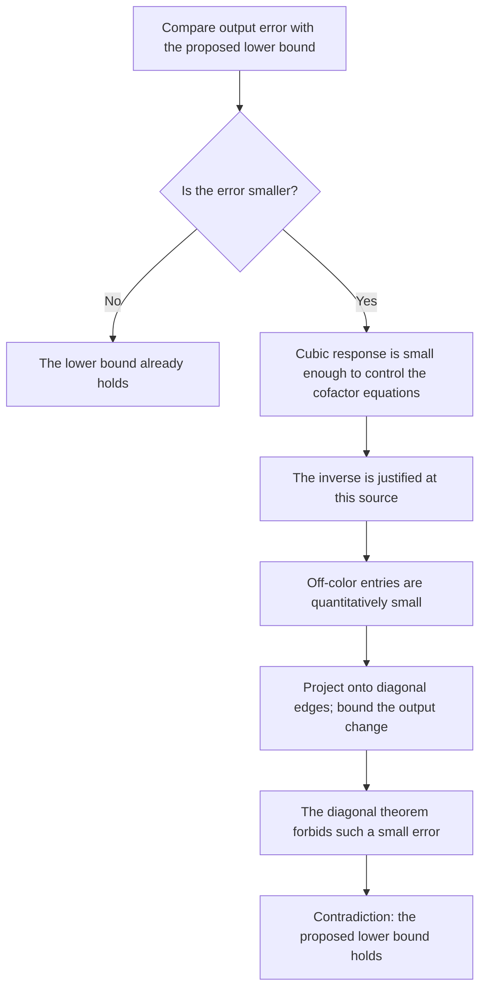

# A rate bound for the full complex model

An undergraduate guide · September 26, 2026.

**Follow-up:** the [latest guide](RATE-FOLLOWUPS.md) improves the full-model
exponent below from 1/24 to 1/15 at six sites, with smaller constants, and
proves a square-root law when cancellation is controlled. This guide preserves
the first full-model argument and its original constants.

[Full argument](../notes/general-complex-rate-bound-2026-09-26.md) · [Exact replay](../computations/general-complex-rate-2026-09-26/README.md) · [Earlier diagonal result](QUANTITATIVE-PROOF.md)

**Status:** a new written proof with exact supporting checks, awaiting
independent audit. This follow-up extends the earlier diagonal result to
arbitrary complex endpoint-color weights. It is not yet part of the certified
proof spine.

## 1. What changed

The previous quantitative result assumed that an edge has the same color at
both ends. The new argument permits different endpoint colors, arbitrary
complex phases, and destructive interference. Its constants depend on the
number of sites and target colors, not on the architecture or its weights.

Let \(F\) measure fidelity to the desired equal GHZ target, and let \(R\)
measure output strength after removing the effect of scaling up every edge.
For a target with \(d\ge3\) colors on even \(n>4\) sites, the written theorem is

\[
 R\le C_{n,d}\frac{(1-F)^{\alpha_n}}{F^{1+\alpha_n}},
 \qquad \boxed{\alpha_n=\frac{8}{n(3n+14)}}.
\]

The constant is explicit. The statement applies whenever \(F>0\).
As fidelity approaches one, normalized generation strength must approach zero.
Converting strength into a success probability requires a specified physical
source model.

| Sites | Full complex model | Stronger bound when the source is diagonal |
|---|---:|---:|
| 6 | \(1/24\) | \(1/5\) |
| 8 | \(1/38\) | \(2/13\) |
| 10 | \(1/55\) | \(1/8\) |

Larger exponents give stronger asymptotic restrictions. Neither column is
claimed optimal. The constants are very conservative: for six sites and three
colors, the full-model constant is about \(7.1\times10^{10}\).
This result supplies explicit mathematical control across all architectures;
it is not a sharp numerical prediction for experiments.

## 2. The difficult step was approximate diagonality

The exact proof shows that a perfect target would force every off-color edge
entry to vanish. An approximate version must explain how much those entries
can remain when the output has a small error.

That is delicate near zero output. A matrix inverse used in the exact proof
can become very large there. Assuming a uniformly bounded inverse would leave
out precisely the difficult limits.

The new argument makes a conditional statement. If the output error is
sufficiently small **relative to the target amplitude**, then the cofactor
matrix is invertible at that source, and the off-color entries have an explicit
upper bound. If the error is larger than that threshold, it already satisfies
the lower bound we are trying to prove.

This is how the proof includes limits where a response loses rank. It does not
assert that every intermediate matrix remains well conditioned along them.

## 3. Why the cubic response is enough

Deleting a root leaves an odd number of sites. The proof studies ways of
placing one, three, five, or more incident rows at those sites, then pairing
the rest. These are auxiliary responses of increasing polynomial degree.

An approximate reflection identity shows that their pure-color components
are close to a common scalar polynomial \(g\) times the ordinary target
response. Orthogonal symmetry then makes \(g\) approximately satisfy

\[
 g(s/\sqrt2)^2=g(s).
\]

The earlier work established a controlled stability estimate for this equation.
We rescale its auxiliary variables so the estimate applies. Recovering every
polynomial degree after that rescaling would lose large powers of the target
amplitude.

The new observation is that we need only the **quadratic part of \(g\)**.
It controls the cubic response. A separate exact identity turns that response
into a bound on the cofactor equations, which are the equations used to remove
off-color edges.

This is a useful general lesson: a quantitative proof can be substantially
stronger if it extracts only the degree needed by the next step.

## 4. Projection preserves the signal exactly

Once the off-color entries are bounded, replace them by zero and call the
resulting source \(A_0\). This projection preserves every pure-color amplitude:
a pure output can only use edges with that color at both ends.

The mixed output does change. We bound that change by expanding each matching
product and changing one edge at a time. The number of matchings is finite,
so the entire change is controlled by the norm of the removed entries.

If the original error were smaller than the proposed lower bound, the projected
source would violate the already written diagonal theorem. That contradiction
gives the full-model rate bound.

## 5. Two further deductions

**More target colors cost no additional exponent.** Average the pure amplitudes
within every three-color subset. Those averages themselves average to the full
target amplitude, so at least one subset has an amplitude at least as large in
magnitude. Projecting onto it cannot increase the best target error. Applying
the three-color theorem proves the result for any number of target colors;
only the constant changes.

**Cancellation cannot improve without limit relative to the target order.**
At six sites, suppose a bounded analytic family has target amplitude of order
\(t^r\) and unwanted output of order \(t^s\). The new inequality requires
\(s\le25r\). The prism example has \(r=1,s=3\), so there is a wide gap, but
arbitrarily high cancellation order at fixed target order is ruled out for
all architectures. At general size the factor is
\((3m^2+7m+2)/2\), where \(n=2m\).

## 6. Evidence and remaining work

The exact replay checks 204 cubic omission identities, 306 cofactor
polarization identities, and nine full polynomial two-copy rotation identities
on selected sources with off-color entries. It also checks coefficient division,
the constant budgets, and the projection identities for larger color palettes.
An allowed four-site example exercises the regime where the cofactor inverse
is actually justified. Dense complex six-site sources test the identities
without assuming near-perfect output.

These checks support the algebra and conventions. The written analytic proof
supplies the conclusion for arbitrary size; finite examples do not prove that
conclusion by themselves.

The outstanding targets are independent audit, sharper exponents, and smaller
constants. In particular, this does not establish the global square-root law
suggested by the prism. Nor does it address auxiliary photons or a different
conditioning protocol, which change the model.
