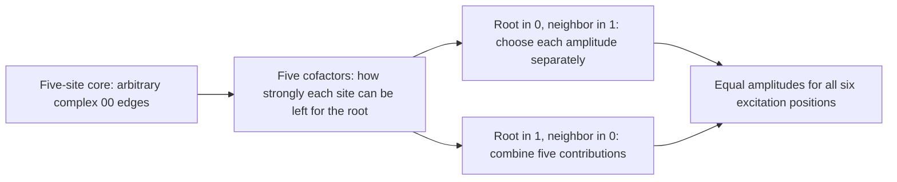
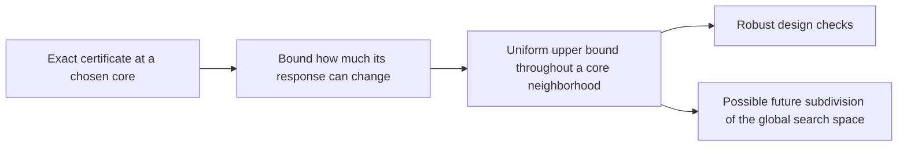

# What the proof machinery can now do beyond the conjecture

September 26, 2026. Undergraduate guide. **These extensions have written
proofs and exact supporting calculations; independent audit is pending.**
The exact Krenn--Gu theorem has its separate Lean verification.

[All guides](README.md) · [Reproducible package](../computations/method-utility-2026-09-26/README.md)

The strongest new application is an optimal W-state construction within the
one-root architecture described below, for every even site count. The same machinery also handles two design
requirements, uncertainty in a core, and more precise searches for the
unresolved sharp GHZ rate bound.

## 1. From an impossibility proof to an optimal W-state construction

A six-site W state is the sum

\[
 |100000\rangle+|010000\rangle+|001000\rangle+
 |000100\rangle+|000010\rangle+|000001\rangle.
\]

Exactly one site is excited, but no site is singled out in the final state.
The symbols 0 and 1 stand for two local colors. This target differs from the
three-color GHZ target in the conjecture, so its exact preparation is compatible
with the impossibility theorem.

Choose one site as a root. Allow every edge among the other five sites to
emit only 00; allow arbitrary complex weights and missing edges there.
The root edges can use all endpoint colors.

A cofactor is simply the matching sum on the four remaining core sites.
If it is small, exciting that site requires a larger incident weight.
This turns exact state preparation into an explicit balancing calculation.

We can optimize both the root edges **and the entire complex core within
this architecture family**. The best normalized rate at six sites is

\[
                         \boxed{R=1/65.}
\]

One optimal recipe is:

1. Give each of the ten core 00 edges weight 1.
2. Give each root-0/neighbor-1 cell weight \(5/\sqrt{26}\).
3. Give each root-1/neighbor-0 cell weight \(1/\sqrt{26}\).

Every desired output amplitude is \(15/\sqrt{26}\); every other output
vanishes. The checker verifies all 729 ternary output coefficients.

The result extends to every even number of sites. Its proof combines the
workspace response calculation with an existing sharp hafnian inequality.
It also supplies an exact formula for preparing nonuniform, complex weighted
W states from any specified core in this class.

This rate is matching strength divided by the appropriate power of source
norm. **It is not a claim of a 1/65 laboratory success probability.**
Other architectures may do better. W states themselves are established;
the application formulas here are new to this workspace, with historical
priority not established.

[Full theorem, proof, and a diagnostic for nearly optimal designs](../notes/w-state-optimal-design-2026-09-26.md).

## 2. Design with two requirements instead of one

Previously the fixed-core optimizer could maximize rate subject to one
fidelity requirement. It can now impose two independent requirements, such as

- fidelity with the desired state at least 99%; and
- the probability of one selected output at most 29%.

The saved example uses exactly these two requirements. Its upper and lower
rate bounds differ by less than 0.01% relative to the lower bound.

The reason this works is linear algebra. Replacing a vector by a positive
matrix makes the optimization convex. With at most two requirements, some
optimal matrix always has rank one, so it represents an actual source design.
This uses classical optimization theory; the response map makes it applicable
to our matching problem and to targets other than GHZ.

There is a real limitation: three independent requirements can have an
optimal matrix that no single source vector can realize. We give an exact
example where the relaxed objective is 3 but the true optimum is 2.

## 3. A result about one core can survive small changes

A fixed-core optimum is useful, but an experimental or numerical design will
rarely match its coefficients perfectly. The new estimate takes a certificate
at one core and enlarges its upper bound enough to cover every complex core
within a specified distance.

This includes changes in cells that were initially zero. The saved example
covers a ball of radius \(10^{-6}\) in the norm of all 90 complex core cells.
It is one neighborhood, not a global covering.

The singular-boundary argument has also been written as a reusable criterion:
if a bilinear kernel contribution cannot cancel, and its enlarged output space
misses the target, a whole neighborhood has a fidelity gap. The criterion
states the hypotheses that must be checked for each new application.

[Optimization, uncertainty, and singular-response proofs](../notes/reusable-response-certificates-2026-09-26.md).

## 4. A clearer route toward the unresolved sharp rate law

For arbitrary complex six-site sources, the sharp square-root GHZ rate law
remains open. The desired statement says that the unwanted output cannot be
too small compared with the cube of the desired amplitude.

We already knew that a simple polynomial identity proving this statement
cannot exist. That obstruction has another consequence: a direct certificate
made from squared absolute values of holomorphic polynomials cannot work either.
This rules out a potentially expensive search strategy.

A broader algebraic certificate, called **integral dependence**, remains
possible. The difference is visible in a two-variable example:

\[
 xy\notin(x^2,y^2),\qquad
 (xy)^2-x^2y^2=0,\qquad
 |xy|\le\tfrac12(|x|^2+|y|^2).
\]

The forbidden simple identity is stronger than the useful inequality. A
higher equation can prove the inequality even when the simple identity fails.
The new checker verifies such equations exactly. It currently has a genuine
toy example and a restricted prism example, not a full-model certificate.

There is also an exact counterexample checker. Feed it a polynomial family
of source weights. If the desired amplitude first appears at order \(t^r\)
and error at order \(t^s\), it computes the corresponding rate exponent.
Finding \(s>3r\) would disprove the square-root law. The saved paths all have
\(s=3r\), including a path with destructive cancellation; none is a disproof.

[Certificate formats, the SOS obstruction, and the precise open problem](../notes/integral-rate-certificates-2026-09-26.md).

## 5. Evidence and next research targets

| Item | What is established in this package | What remains open |
|---|---|---|
| W-state designs | Sharp optimum over the stated core architecture family | Optimum over all colored source architectures |
| Two output requirements | Exact convex formulation and a rational certificate example | No general exactness guarantee for three requirements |
| Core uncertainty | Uniform bound on a specified ball | Covering all relevant cores |
| Sharp GHZ rate | Checkable sufficient certificates, exact path checks, and an excluded SOS route | Unrestricted square-root inequality |

The useful next targets are to enlarge the W architecture theorem, use core
balls to eliminate whole regions in architecture searches, and seek a genuine
full-model integral-dependence certificate or a violating path. Independent
audit of these written extensions remains necessary before treating them as
part of the certified proof spine.
