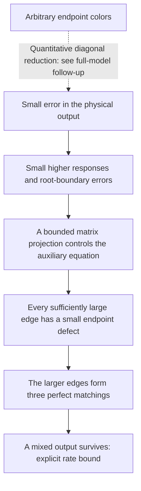

# From impossibility to a rate bound

**Follow-up:** the [latest rate guide](RATE-FOLLOWUPS.md) retains the diagonal
exponent below while reducing its six-site prefactor to 3233.21. It also
improves the unrestricted bound and explains the phase-controlled square-root law.

September 26, 2026 · Undergraduate research follow-up.

[Full proof and constants](../notes/quantitative-proof-identities-2026-09-26.md) · [Exact replay](../computations/quantitative-proof-identities-2026-09-26/README.md) · [The exact proof explained](ALL-ORDERS-PROOF.md)

**Status:** a new written proof with exact supporting checks, awaiting
independent audit. The bound covers all diagonal complex three-color
sources. The subsequent [full-model follow-up](GENERAL-RATE-BOUND.md) covers
arbitrary endpoint colors with a weaker exponent. This guide explains the
stronger diagonal bound and how it was obtained.

The exact Krenn–Gu proof says that the desired perfect output is impossible
beyond four sites. We have now extracted a quantitative consequence:
within a broad class of sources, approaching that output forces the
normalized generation strength to approach zero at a specified rate.

## 1. What the new result says

A **diagonal source** has edges whose two ends carry the same color.
An edge may have a complex weight, so destructive interference is allowed.
The graph can have any shape, and its weights may become arbitrarily small.

Write \(n=2m>4\) for the number of sites. Let \(H\) be its output tensor
and \(S\) the sum of squared magnitudes of its colored edge weights.
Two quantities measure its performance:

- **Fidelity \(F\):** how closely the normalized output matches the equal
  three-color GHZ target. A perfect match would have \(F=1\).
- **Normalized strength \(R=\|H\|^2/S^m\):** output strength after removing
  the effect of simply increasing every edge weight. Converting this into
  an experimental success probability requires a source model.

For \(F\ge12/13\), the written theorem gives

\[
 R\le C_n\frac{(1-F)^{\alpha_n}}{F^{1+\alpha_n}},
 \qquad \boxed{\alpha_n=\frac4{3n+2}}.
\]

The constant \(C_n\) is explicit and depends only on the number of sites.
It does not depend on the graph, its nonzero edge weights, or the rank of
an intermediate response.

| Sites | Proved rate exponent |
|---|---:|
| 6 | \(1/5\) |
| 8 | \(2/13\) |
| 10 | \(1/8\) |

These exponents are not claimed optimal. The constants are very large:
the six-site \(C_6\) is approximately \(1.46\times10^9\).
This is an explicit mathematical obstruction, rather than a sharp estimate
of what an experiment can achieve. The earlier local prism bound has the
stronger exponent \(1/2\), but applies on a smaller domain.

## 2. How output error reaches the decisive identity

The exact proof forces, for every nonzero edge of a color,

\[
 \beta=d\alpha.
\]

Here \(\beta\) is the full amplitude in that color, \(d\) is the edge
weight, and \(\alpha\) is the matching sum after deleting its endpoints.
Thus every nonzero edge would have to account for the entire pure amplitude.
Expanding at one vertex then forces exactly one incident edge of each color.

To turn this into an estimate, we must control the defect
\(|\beta-d\alpha|\) from the error in the actual output. That connection
now has a complete written argument for diagonal sources:

*The solid chain applies to diagonal sources. Each arrow has a written
estimate. The dashed arrow marks the generalization subsequently handled
in the [full-model follow-up](GENERAL-RATE-BOUND.md).*

The first step uses all three colors. The proof's reflection identity
turns physical mixed output into a bound on auxiliary higher responses.
Diagonality separates certain polynomial terms, avoiding a loss of powers
that occurs in the general polynomial problem.

The next step is finite linear algebra. The exact proof constrains a
two-by-two matrix of polynomials to a special form. We construct a bounded
projection onto that form: small violations of the boundary equations
give a controlled correction to the whole matrix. We can then track the
error through the endpoint differential equation.

The replay verifies this projection on every polynomial generator through
ten sites. A general determinant estimate supplies a constant for every
larger even size.

## 3. How the argument handles vanishing edges

The differential equation has an inverse whose norm grows as an edge
weight tends to zero. Ignoring that dependence would invalidate a global
bound. The new argument keeps it and splits the edges at a threshold
chosen from the target amplitude.

Suppose the output were much more accurate than the claimed bound allows.
Every edge above the threshold would satisfy \(\beta\approx d\alpha\).
Expanding at a vertex shows that there must be exactly one such edge of
each color. The three sets of larger edges are therefore perfect matchings.

Beyond four sites, those three matchings also contain a mixed-color
matching. It has a definite minimum amplitude. Moreover, its receiving
color pattern admits only one matching made entirely of larger edges.
Every competitor must use **at least two smaller edges**: changing a
perfect matching cannot change just one of its edges.

That last observation is essential. The competing amplitudes are bounded
by the square of the threshold, making them too small to cancel the mixed
output. This contradicts the assumed accuracy and yields the rate bound.

We do not physically remove the smaller edges or assume that removing them
preserves the target equations. They remain in the calculation, with their
possible cancellation bounded explicitly.

## 4. Reusable mathematical ideas

Three parts of the argument are useful beyond this particular conclusion:

- **An approximate constraint can be handled by a finite projection.**
  The covariance argument becomes a rational matrix computation with an
  explicit error constant. Similar finite symmetry constraints may admit
  the same treatment.
- **A poorly conditioned inverse can still support a global theorem.**
  Treat the larger coefficients with the inverse and the smaller ones by
  combinatorial bounds. This works here because an alternative perfect
  matching needs at least two smaller edges.
- **Counterexamples to optimistic estimates identify the right tools.**
  A truncated exponential nearly satisfies the proof's polynomial scaling
  equation without being equally close to its exact solution. We obtained
  the sharp power for that isolated polynomial problem, then found that
  diagonal sources permit a stronger, direct route.

These are deductions and techniques from this workspace. We do not claim
that polynomial projection, finite differential inversion, or threshold
arguments themselves are historically new, or that their use has already
settled another unrelated open problem.

## 5. The next step and remaining work

For arbitrary endpoint-color matrices, the exact proof forces diagonality.
An approximate version must bound how far a nearly correct source is from
being diagonal, including near zero output. The subsequent
[full-model argument](GENERAL-RATE-BOUND.md) now supplies this reduction,
using only the cubic response, and obtains exponent \(8/[n(3n+14)]\).

The exact all-orders result already implies the existence of some power
law at every fixed size in the general model. This follow-up supplies a
specified exponent for the diagonal model. A sharp global exponent,
smaller constants, and independent audit of these new deductions remain
outstanding.

The [research note](../notes/quantitative-proof-identities-2026-09-26.md)
contains the analytic proof for arbitrary size. The
[replay package](../computations/quantitative-proof-identities-2026-09-26/README.md)
checks exact identities, complete finite projection spaces, and the stated
constants. Passing those checks supports the proof; it does not replace
an independent mathematical review.
