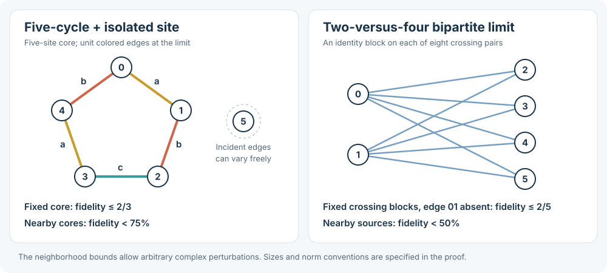

# Which zero-output sources could threaten the rate bound?

We have excluded two kinds of limiting source from approaching perfect GHZ
fidelity. This narrows the search for a universal rate bound, although it does
not finish it. **These are new research deductions with exact checks, awaiting
independent audit.**

The [earlier prism result](../notes/complex-rate-bound-2026-09-26.md) says that
near one particular zero-output source, the best rate has square-root scaling
as fidelity tends to one. The possible loophole is another source shape that
uses complex cancellation more effectively.

## Why look at sources producing no output?

Keep the total source strength fixed. If fidelity tends to one, the existing
six-site impossibility theorem forces the amount of output to tend to zero.
Otherwise a limiting source would produce an exact GHZ state, which is ruled out.

The prism provides one such limiting process: the useful output becomes small,
and its unwanted component becomes smaller still. To prove a universal rate
bound, we must control every possible limiting process of this kind.

But many sources with zero output cannot approach high fidelity at all. Those
sources can be removed from the investigation.

## First test: fix five sites and solve the remaining choices

Every perfect matching uses exactly one edge incident to a chosen site.
After fixing the other five sites, the output therefore depends **linearly**
on the 45 entries incident to that site.

Linear algebra gives the best possible GHZ overlap over all those choices.
There is no need to run an optimizer over them. It also gives a rank test that
every candidate zero-output limit must pass, at each of the six sites.

Apply this to the colored five-cycle in the diagram. Its response has fifteen
independent directions. Two pure-color target directions are available; the
third is absent. With that exact core, fidelity cannot exceed **2/3**. Under
all complex core perturbations of norm at most **1/200**, it remains below
**3/4**, even when the incident edges are unrestricted.

This is more than a calculation along one path: it excludes an entire region.

## Second test: a different split finds an obstruction the first test misses

Now take the two-versus-four bipartite source in the diagram. Each crossing
pair carries equal unit entries for a–a, b–b, and c–c. There are no edges within
either shore at the limit. No perfect matching can cover these unequal shores,
so the output is zero.

This example **passes the first rank test**. We therefore group its matchings
another way. Adding edges within the four-site shore produces a linear response;
pairing the two-site shore together contributes a higher-order correction.

The linear response has 54 independent directions, but its maximum GHZ fidelity
is only **2/5**. In a coefficient ball of radius **1/1000** around this source,
the correction is too small to change that conclusion substantially: every
nonzero output has fidelity below **1/2**. All 135 complex entries can vary.

## What this tells us to investigate next

The remaining candidates must lose enough rank that higher-order changes can
create output directions unavailable at first order. We now have explicit
tests that discard the regular cases, including two distinct examples above.

The prism survives these tests, as it should. Its square-root rate bound is
already controlled locally. The next unresolved cases are singular response
configurations and sources whose zero output comes from cancellation between
nonzero matching contributions.

The diagram's fidelity ceilings apply to the stated sources and neighborhoods.
They are not universal ceilings for all five-cycle or bipartite architectures
with arbitrary source matrices.

[Full proof and exact constants](../notes/rate-boundary-exclusions-2026-09-26.md) ·
[Reproduction package](../computations/rate-boundary-gate-2026-09-26/README.md) ·
[All explainers](README.md)
