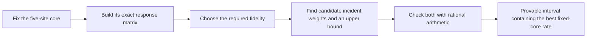
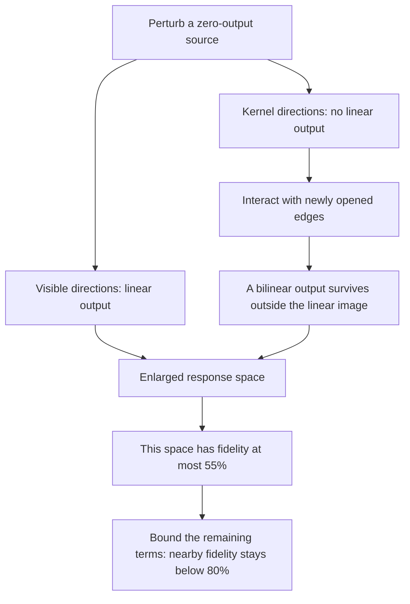

# From rate bounds to optimal designs and singular limits

An undergraduate guide · September 26, 2026.

[Rate and optimizer proofs](../notes/rate-design-frontier-2026-09-26.md) ·
[Prism optimum](../notes/prism-optimal-rate-2026-09-26.md) ·
[Singular-boundary proof](../notes/singular-kernel-rate-exclusion-2026-09-26.md) ·
[Exact replay](../computations/rate-design-frontier-2026-09-26/README.md)

**Status:** new written research with exact supporting certificates, awaiting
independent audit. The unrestricted six-site square-root law remains open.

We continued along all four proposed directions. Two extensions give usable
tools, one settles the leading coefficient within the prism architecture,
and one excludes a previously unhandled singular limit.

| Direction | What we now have | Scope |
|---|---|---|
| Broader cancellation control | A square-root bound using an aggregate margin | Allows individual mixed outputs to cancel completely |
| Design optimization | Exact upper/lower certificates for the best rate at a chosen fidelity | Fix five sites; optimize all 45 remaining complex entries |
| Diagonal complex sources | The optimal leading coefficient for arbitrary weights on the prism support | Other diagonal architectures remain open |
| Singular limits | A fidelity ceiling below 80% near a response with a nine-dimensional kernel | A full neighborhood allowing all 135 complex cells |

## 1. One cancelled output should not invalidate the whole bound

For a mixed output, compare the magnitude of the sum of its matching
contributions with the sum of their individual magnitudes. Their ratio
measures how much cancellation occurred. Our previous theorem used the
smallest ratio across 180 mixed outputs.

That can be unnecessarily restrictive: an extremely weak output might cancel
exactly, even while the larger unwanted outputs barely cancel at all.

The new measure compares the squared totals:

\[
 \kappa_2^2=
 \frac{\sum_w |\text{actual mixed amplitude}_w|^2}
      {\sum_w (\text{sum of contribution magnitudes}_w)^2}.
\]

The same square-root rate bound holds with \(\kappa_2\) in place of the
minimum ratio. This condition is weaker, so the theorem applies more broadly.

We constructed an exact example above 99.99% fidelity with a mixed output
that cancels completely. The old minimum is zero; the aggregate margin is
greater than 0.99. The new test remains useful there.

## 2. A design optimizer with a certificate, not just a numerical answer

Hold the edges among five sites fixed. The output depends linearly on the
45 complex entries joining the sixth site to those five. This linear map is
small enough to build exactly from the matching formulas.

There are two decisions: the direction of those 45 entries, and their total
strength. We can solve the strength decision analytically: the optimal
incident squared norm is **half the fixed core's squared norm**.

The direction problem becomes a matrix optimization with a fidelity constraint.
Its usual positive-matrix formulation is exact here: allowing higher-rank
matrices does not improve the answer. A rank-one solution, corresponding to
actual source entries, always attains the same optimum.

For the saved prism core, a fidelity floor of 99.99% gives a best normalized
strength of approximately **0.00013840053**. Across the saved examples, the
upper and lower certificates differ by less than five parts in one hundred
million. A complex-phase example and an example with a degenerate top
eigenspace are included.

These numbers describe normalized matching strength, not a directly measured
success probability. They optimize the incident edges for the specified core;
another core might perform better.

## 3. The prism's leading coefficient is now optimal within its architecture

Previously, the prism showed that square-root scaling was achievable. We now
also prove that no choice of unequal complex weights on its nine colored
edges can improve the leading coefficient:

\[
 \limsup_{F\to1}\frac{R}{\sqrt{1-F}}
 \le\frac{\sqrt3}{72}\approx0.0240563.
\]

The standard balanced prism attains this value. We also obtain its exact rate
curve when the three pure amplitudes are equal.

For the specified physical model of nine independent two-mode squeezed
sources, the corresponding optimal leading success-probability coefficient is

\[
 \limsup_{F\to1}\frac{P}{\sqrt{1-F}}
 \le\frac{64\sqrt3}{6561}\approx0.0168955.
\]

There is a design consequence: any prism family attaining this physical
optimum must make all six internal edge magnitudes approach \(1/\sqrt3\),
while the three connecting magnitudes approach zero. This follows because
each internal factor \(x(1-x^2)\) has a unique maximum.

This settles a meaningful optimization question for the prism. It does not
establish that the prism is best among every diagonal complex architecture.

## 4. A singular response can still be controlled

The previous boundary exclusion worked when the first response was injective:
every perturbation produced a detectable linear output. A kernel breaks that
argument because some perturbations are invisible at first order.

Our new example has a nine-dimensional kernel. It also passes every earlier
single-site rank filter. The useful observation is that its invisible
directions interact with newly opened edges in a constrained way: the
coefficients are products of two vectors, rather than arbitrary coefficients.

A rational matrix certificate proves that the bilinear contribution cannot
cancel entirely against the linear response. Another certificate proves
that their enlarged output space still misses the target by a fixed amount.
Together with bounds on the remaining terms, this excludes a **full complex
neighborhood**, including perturbations on previously absent edges.

The transferable idea is to preserve the product structure of higher-order
terms when checking positivity. Treating those products as entirely free
coefficients would lose the key lower bound.

## 5. The remaining mathematical targets

The unrestricted exponent remains 1/15 at six sites. A square-root bound for
all diagonal complex sources, and then for all endpoint-color sources,
still requires further work.

We now have a broader cancellation test, a certified way to optimize fixed
cores, an exact benchmark for the prism, and a method that handles one
nontrivial singular kernel. The next boundary cases to investigate are those
where the bilinear product estimate fails or the enlarged response space
can contain the target. Independent audit is still needed for this new package.
