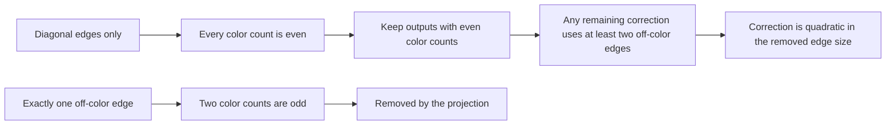
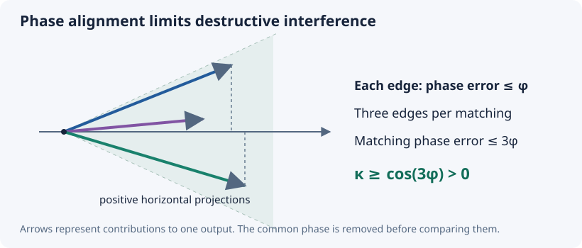
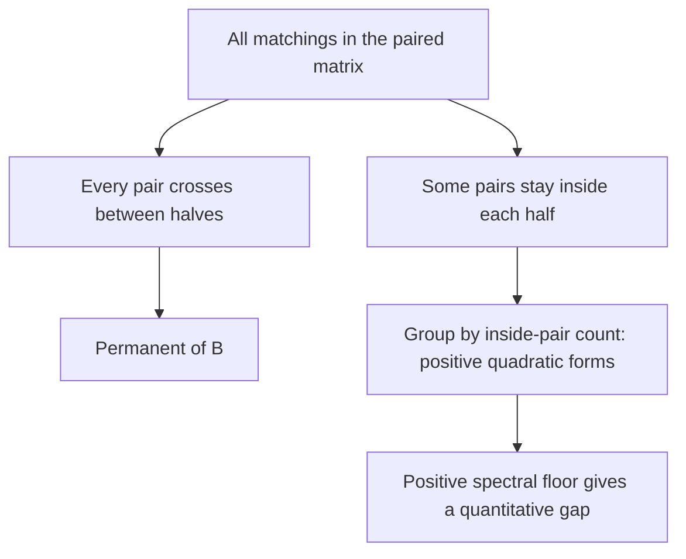

# Three follow-ups: sharper rates, usable constants, and another application

An undergraduate guide · September 26, 2026.

**Further progress:** the [design and rate guide](RATE-DESIGN-FRONTIER.md)
extends the cancellation test, provides certified fixed-core optimization,
proves the prism's optimal leading coefficient, and excludes a singular limit.

[Full rate argument](../notes/rate-sharpness-followup-2026-09-26.md) ·
[Paired-hafnian argument](../notes/paired-hafnian-application-2026-09-26.md) ·
[Reproduce the checks](../computations/rate-sharpness-followup-2026-09-26/README.md)

**Status:** written research with exact supporting checks, awaiting independent
audit. These quantitative follow-ups are separate from the completed Lean
formalization of the exact Krenn–Gu theorem.

We pursued all three proposed directions. There is a stronger unrestricted
rate theorem, a sharp square-root theorem under a cancellation condition,
and a useful stability inequality for a different class of matching sums.
The unrestricted square-root law remains open.

## 1. A stronger bound from counting colors

The exact conjecture asks whether a perfect target is possible. A rate theorem
asks what happens as an imperfect output becomes closer to that target.
Write \(F\) for fidelity and \(R\) for output strength after removing the
effect of scaling every source edge. More precisely, with \(n=2m\) sites,
\(R=\|H\|^2/S^m\), where \(S\) is the sum of squared edge-cell magnitudes.
The bound has the form

\[
 R\le C\frac{(1-F)^\alpha}{F^{1+\alpha}}.
\]

A larger exponent forces the output strength to fall faster near \(F=1\).
For arbitrary complex endpoint-color weights, the new exponent is

\[
 \boxed{\alpha_n=\frac{16}{n(3n+22)}}.
\]

| Number of sites | Previous exponent | New exponent |
|---|---:|---:|
| 6 | 1/24 | **1/15** |
| 8 | 1/38 | **1/23** |
| 10 | 1/55 | **2/65** |

It holds for every even \(n>4\) and every target dimension \(d\ge3\),
with an explicit constant depending on \(n,d\).

The key observation is elementary. An edge with the same color at both ends
adds two copies of that color. An edge with different endpoint colors adds
one copy of each. A matching with exactly one such edge therefore leaves
two color counts odd.

The previous estimate treated the change in output as linear in the removed
edges. The parity rule makes the relevant change quadratic. Keeping that
extra power improves the final exponent. This is a reusable proof technique:
check which error terms symmetry actually permits before estimating them.

It also limits how far a tuning parameter can suppress unwanted output.
At six sites, if the target amplitude starts at order \(t^r\), unwanted
amplitude must appear by order \(t^{16r}\). The previous bound was order
\(t^{25r}\). This applies to bounded analytic source families, including
limits where the response loses rank.

## 2. Smaller constants, and where they become useful

The source has a fixed total squared norm. Its entries cannot all have their
largest individual size simultaneously. Applying that budget throughout the
proof gives the following six-site, three-color constants:

| Source class | Previous prefactor | New prefactor | New exponent |
|---|---:|---:|---:|
| Same color at both ends of every edge | about 1.46 billion | **3233.21** | 1/5 |
| Arbitrary complex endpoint colors | about 71.4 billion | **147338.83** | 1/15 |

These are improvements by more than 400,000 in the prefactors, but the
unrestricted bounds are still too loose for most numerical design decisions.

We obtain a much more useful estimate if cancellations are controlled.
For each relevant mixed output, compare its actual amplitude with the sum
of the magnitudes of its matching contributions. Let \(\kappa\) be the
smallest such ratio across the 180 mixed outputs with even color counts:

\[
 \kappa=\min_w
 \frac{|\text{sum of matching contributions}|}
      {\text{sum of their magnitudes}}.
\]

Ignore words with zero denominator. A ratio of one means that the
contributions reinforce one another. A ratio near zero means almost complete
cancellation. For \(\kappa>0\) and \(F>2/3\), the new bound is

\[
 \boxed{R\le\frac{\sqrt{123/160}}{\kappa}
 \frac{\sqrt{1-F}}{[\sqrt F-\sqrt{2(1-F)}]^3}.}
\]

Thus a fixed lower bound on \(\kappa\) gives the **square-root exponent**.
The prism construction already attains square-root scaling, so this exponent
is optimal on each such class. The displayed constant need not be optimal.

## 3. A phase tolerance that guarantees the condition

Complex contributions can be drawn as arrows in a plane. If all the arrows
stay in a cone of half-angle \(\theta<90^\circ\), each contributes at least
\(\cos\theta\) times its length along the central direction. Their sum
cannot cancel completely.

At six sites a matching uses three edges. If each edge's phase is within
\(\phi<30^\circ\) of a consistent assignment of local endpoint phases,
then every matching for the same output is within \(3\phi\) of a common
direction. Consequently \(\kappa\ge\cos(3\phi)\). Local endpoint phases
do not cause a problem because every matching uses each endpoint once.

For a tolerance of ten degrees, \(\kappa\ge\sqrt3/2\). In the previously
specified zero-displacement Gaussian source model, with exact photon-number
selection and no ancillary modes, this gives conservative bounds:

| Fidelity | Upper bound on success probability |
|---|---:|
| 99.9% | 3.15% |
| 99.99% | 0.904% |
| 99.999% | 0.278% |

These are upper limits, not predicted or achieved rates. The
[calibration table](../computations/rate-sharpness-followup-2026-09-26/calibration.csv)
includes other phase tolerances and the independent norm cap.

This also locates the remaining difficulty. A family that outperforms
square-root scaling must drive \(\kappa\) toward zero: at least one of those
mixed outputs must undergo increasingly complete cancellation. We have a
specific quantity to track when searching for a better construction or a
proof excluding one.

## 4. An application to another matching inequality

A hafnian is a sum over perfect matchings. A permanent is a sum over
one-to-one matchings between two halves. For a paired matrix

\[
 S=\begin{pmatrix}Y&B\\B^T&\overline Y\end{pmatrix},
 \qquad B\succeq bI,\quad b>0,
\]

the permanent of \(B\) counts matchings going entirely between the halves.
The other terms contain pairs inside both halves.

The positivity argument is established prior work of
[Brádler, Friedland, and Israel](https://arxiv.org/html/1811.10342).
It already implies the qualitative answer to a posted hafnian inequality
question. Our application note makes this provenance explicit.

The quantitative consequence recorded here is

\[
 \operatorname{haf}S-\operatorname{per}B
 \ge b^{r-2}\sum_{i<j}|Y_{ij}|^2,
\]

where \(B,Y\) have size \(r\ge2\). The coefficient one is sharp.
If the two matching sums are almost equal, the off-diagonal entries of
\(Y\) must be small, provided \(b\) stays positive. This gives a stability
test for paired matching models. It does not constrain diagonal entries of
\(Y\), and we make no claim that the corollary is previously unpublished.

## 5. What remains

The main unfinished target is the square-root bound for arbitrary complex
sources, including families with increasingly strong cancellation. The new
unrestricted theorem reaches exponent 1/15 at six sites. Closing the gap to
1/2 needs another idea.

Independent audit and possible Lean formalization of these quantitative
results are also separate tasks. The replay checks exact constant budgets,
the finite matching certificate, complex examples, and counterexamples to
overly strong shortcuts. The written arguments carry the universal claims;
finite tests alone do not establish them.
