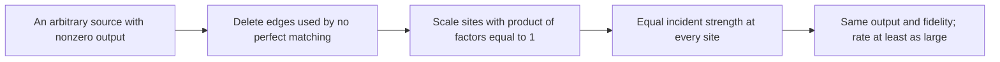
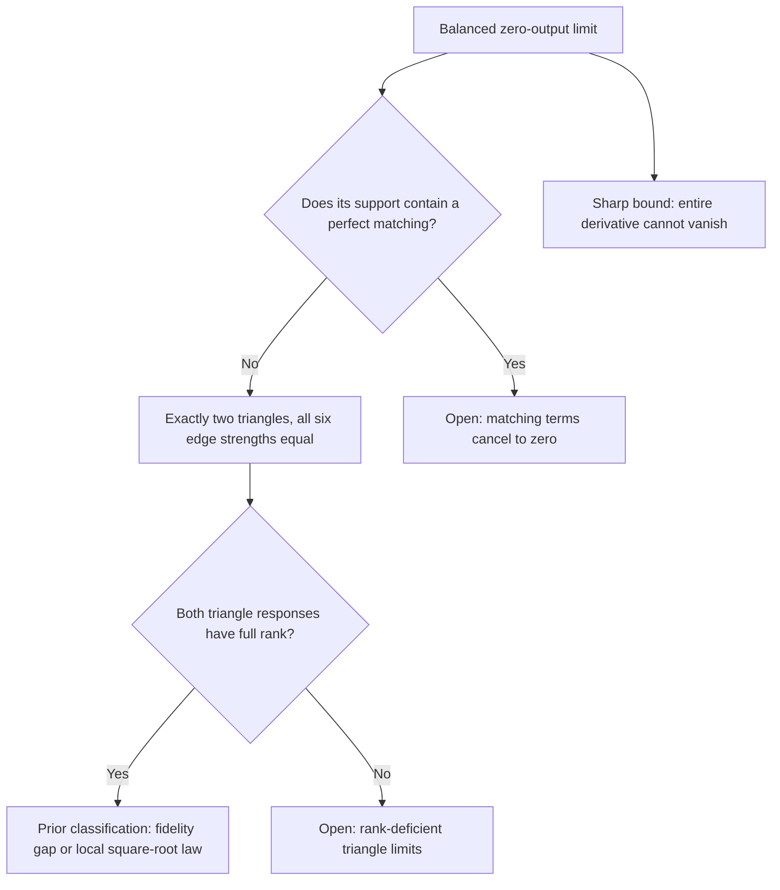

# Balancing the source narrows both open problems

September 26, 2026. **Written research with exact supporting checks;
independent audit pending.**

[All guides](README.md) · [Earlier boundary results](BOUNDARY-STRUCTURE.md) ·
[Exact replay](../computations/site-balancing-2026-09-26/README.md)

The [next guide](BALANCED-FRONTIER.md) classifies the remaining triangle rank
loss and develops a W-rate upper bound for fully colored architectures.

We are pursuing the unrestricted GHZ square-root rate law and optimal
W-state designs. A useful step applies to both: redistribute source strength
between sites while keeping the entire output exactly the same.

## 1. The same output can cost less

Each edge carries a matrix of complex amplitudes. Its strength is the sum
of their squared absolute values. Write $S$ for total edge strength and
$d_i$ for the strength of all edges touching site $i$.

Multiply each site by a positive number $g_i$, with
$\prod_i g_i=1$, and multiply edge $ij$ by $g_i g_j$. Every perfect
matching uses each site exactly once. Its product therefore gains the factor
$g_1\cdots g_n=1$. Every output coefficient stays unchanged, even when
complex matching terms cancel.

The proof shows that the least-strength scaling exists after this deletion.
At its minimum, every site has the same incident strength, $d_i=2S/n$.
We call this **balance**. It equalizes site totals, not necessarily individual
edge strengths.

The rate is $R=\|H\|^2/S^{n/2}$. Keeping $H$ fixed while reducing $S$
increases this rate. Therefore, if any source violates a proposed upper bound,
a balanced source violates it too. We can focus a global proof on balanced
sources without losing a possible counterexample.

## 2. A sharp response bound

At six sites, changing one edge leaves four other sites to be matched.
The four-site matching output is exactly the first-order response to that
edge change, with its two endpoint colors fixed.

Let $T_4$ be the sum of the squared sizes of these four-site outputs over
all fifteen choices of four sites. A new exact identity proves

$$
              \boxed{\text{balanced six-site source:}\quad
                     T_4\ge \frac{S^2}{15}.}
$$

Consequently at least one of the fifteen response sizes is at least $S/15$.
The entire derivative cannot vanish unless the balanced source is zero.
The constant is sharp: a real source with all fifteen edges of size one
and carefully chosen signs attains equality.

There is a useful stronger form. Set

$$
 V_{\rm site}=\sum_i(d_i-S/3)^2,\qquad
 V_{\rm edge}=\sum_{i<j}(w_{ij}-S/15)^2,
$$

where $w_{ij}$ is edge strength. Then

$$
 T_4+\tfrac34V_{\rm site}
   =\frac{S^2}{15}+V_{\rm edge}
        +\text{two explicitly nonnegative matrix terms}.
$$

So very small total response requires a definite imbalance between sites.
The proof expands a quadratic polynomial squared, then separates terms
using four distinct sites from terms that repeat a site. The repeated-site
terms explain exactly where cancellation can reduce the response.

[Full identity, elementary proof, and equality example](../notes/balanced-four-site-response-bound-2026-09-26.md).

## 3. How the remaining GHZ problem changes

Normalize source strength to $S=1$. Sources approaching perfect GHZ fidelity
must approach zero output: a nonzero exact GHZ output is forbidden by the
completed conjecture. Balancing lets us choose a convergent subsequence whose
limit still has site strengths $1/3$.

The completely flat five-site core studied earlier has an isolated sixth
site. It cannot be a balanced limit. Its higher-order identities remain
valid, but it is no longer the central obstacle to the global rate proof.

There is still a crucial distinction: **some response is large** does not
mean **the response we need is large**. A linear map can respond strongly in
one direction and vanish in another. The identity does not bound its smallest
singular value or control the GHZ direction. Partial rank loss and higher-order
cancellation still prevent us from claiming the unrestricted rate law.

An additional support consequence is useful beyond this normalization:
if all four-site matching outputs vanish, the support graph cannot contain
three disjoint nonzero edges. The proof balances a limiting scaling of the
six endpoints and applies the response bound.

## 4. What this contributes to W-state design

The balancing argument works for any target and every even site count.
It restricts the search for a global W-rate optimum to balanced sources,
including designs with fully colored cores.

The known six-site rate-$1/65$ design already passes this test: each edge
block has squared norm (26), giving total strength (390) and strength
(130) at every site. Balance alone does not prove it is globally optimal.

| Research path | Established so far | Remaining central question |
|---|---|---|
| GHZ rate | Universal balancing reduction; sharp total-response bound; local square-root law at regular triangle limits | Control the target direction at balanced limits with partial rank loss or matching cancellation |
| W design | Exact optimum for all two-root scalar-core designs at every even count; unrestricted local optimum at six sites | Bound fully colored designs globally, now restricting to balanced sources |

The two projects share this normalization and exact matching machinery.
Progress on either can sharpen the other, while their remaining proof
obligations are distinct.

[Normalization theorem and six-site support classification](../notes/site-balancing-rate-reduction-2026-09-26.md) ·
[All-even two-root W theorem](../notes/w-state-two-root-optimum-2026-09-26.md) ·
[Unrestricted six-site W local theorem](../notes/w-state-unrestricted-local-optimum-2026-09-26.md).
