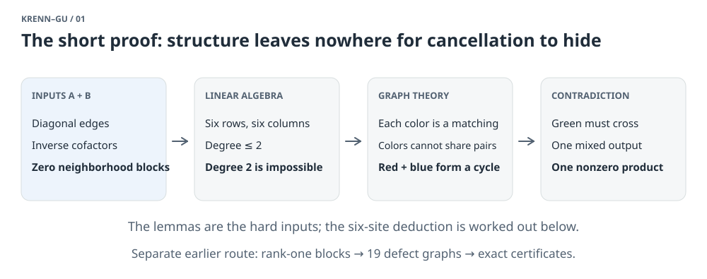
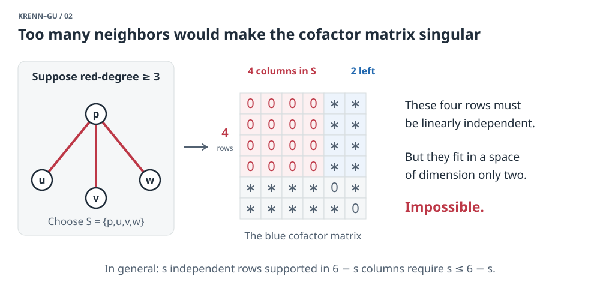
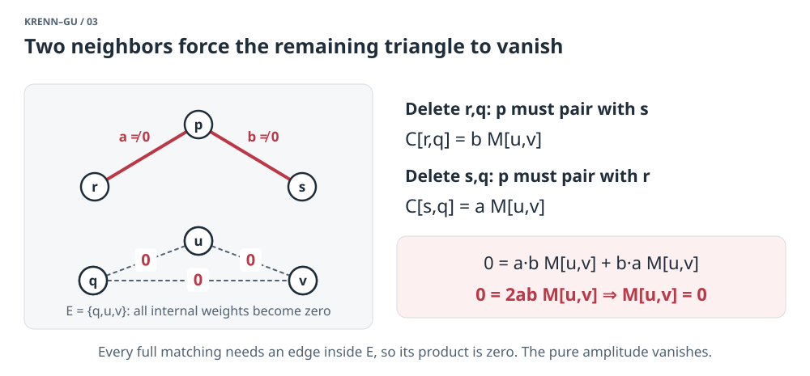
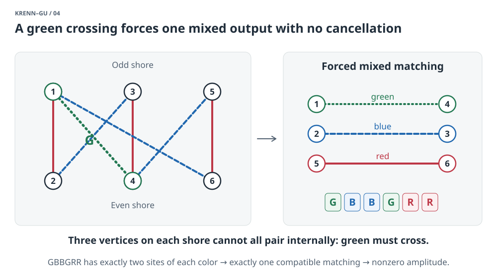
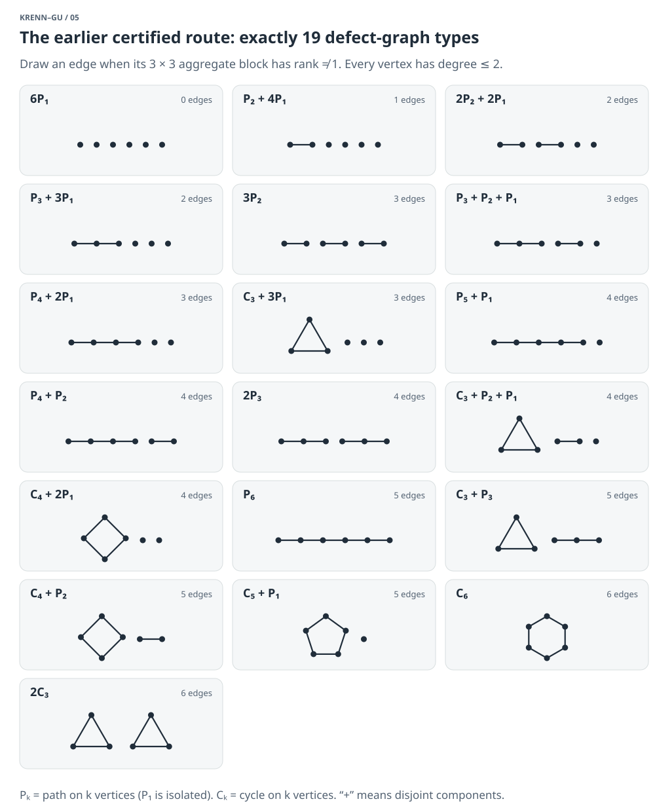

# Why six sites cannot support three colors

*An illustrated proof guide at undergraduate level. September 25, 2026. [Browser edition](SIX-SITE-PROOF.html) · [The larger explainer](EXPLAINER.html) · [Try the matching examples](EXPLAINER-LAB.html).*

**The six-site theorem says that pair sources can produce perfect agreement in at most two colors.** This holds with arbitrary complex weights, different colors at the two ends of a source, and any number of parallel sources. Two colors are achievable, so the bound is exact.

There are two routes to understand here. The workspace's **earlier certified proof** reduces the general problem to 19 graph types and excludes all of them. Its newer **internally reviewed structural results** make a short six-site deduction possible. We will state two substantial inputs from that newer work, then prove the remaining steps in detail. This is a proof exposition using stated lemmas; it is not a self-contained proof of those lemmas or a new formal verification. The theorem also has an independent public Lean proof, discussed at the end.

**1. What would a forbidden construction have to do?**

Label six sites 1 through 6. A complete event pairs every site with one other site: a **perfect matching**, containing three edges. There are 5 × 3 × 1 = **15** possible pairings. Each edge contributes an endpoint color at each site and a complex weight. Multiply the three weights within an event; add the weights of all events producing the same color list.

We want exactly these amplitudes:

```text
RRRRRR → 1       BBBBBB → 1       GGGGGG → 1
every other list of six colors → 0
```

An amplitude is a complex number, so different events can cancel. Seeing an unwanted matching is insufficient to refute a proposed construction: we must show that its contribution cannot be canceled.

For each pair u,v, collect its source weights in a 3 × 3 matrix Aᵤᵥ. The entry Aᵤᵥ(i,j) is the sum of all source weights giving color i at u and color j at v. This aggregation preserves every output amplitude, including cancellation among parallel sources. Use u < v to fix the endpoint order. For an output c = (c₁,…,c₆),

\[
H_A(c)=\sum_{P\in\operatorname{PM}(6)}\prod_{\{u,v\}\in P,\ u<v}A_{uv}(c_u,c_v).
\]

Thus the task is a system of 729 equations in 135 complex coefficients: three output equations equal 1 and 726 equal 0. Counting equations alone proves nothing. The proof must use their structure.

It suffices to exclude three colors. A construction with more would remain a three-color construction after discarding the other colors at every site. Nonzero unequal pure amplitudes can also be rescaled to 1 over the complex numbers. [Exact formulation and reduction](../proofs/six-site-arbitrary-complex-obstruction.md).

<!-- six-figure:01-roadmap:start -->



*Figure 1. The newer route separates two substantial structural inputs from an elementary six-site deduction. The earlier certificate proof has its own dependencies.*

<!-- six-figure:01-roadmap:end -->

**2. The two structural inputs.**

Assume a three-color construction exists, and derive a contradiction. The following inputs apply to the **whole exact three-color system**, including every mixed-output equation. They are stronger than statements about an arbitrary weighted graph.

**Input A: edges become monochromatic, and their cofactors form an inverse.** The newer research chain proves that every aggregate Aᵤᵥ is diagonal in the original target color bases. A surviving aggregate edge therefore gives the same color to both endpoints. This is a derived restriction, not an assumption that the original sources were monochromatic. Off-diagonal sources may cancel in the aggregate.

For each color h, let Mₕ be the symmetric 6 × 6 matrix whose entry Mₕ[u,v] is the h/h weight on pair u,v; diagonal entries are zero. Its **hafnian** is the sum of the products over all perfect matchings. For example, on four vertices,

\[
\operatorname{haf}(M[\{1,2,3,4\}])=M_{12}M_{34}+M_{13}M_{24}+M_{14}M_{23}.
\]

The pure-color amplitude is τₕ = haf(Mₕ), which is nonzero. Define the **hafnian cofactor** Cₕ[u,v] to be the four-site hafnian after deleting u and v, for u ≠ v; set Cₕ[u,u] = 0. This definition uses the actual weights, so cancellations are included inside Cₕ.

The substantive identity is

\[
M_h C_h=\tau_h I_6,\qquad C_h=\tau_h M_h^{-1}.
\]

Here I₆ is the identity matrix. In particular, both Mₕ and Cₕ are invertible. The diagonal entries of the first identity are the usual expansion of the hafnian at a vertex. The vanishing off-diagonal entries require the structural theorem: **this inverse identity is false for a general symmetric matrix.** [Input A: statement and proof](../computations/unaudited-codex-higher-common-power-bridge-2026-09-05/UNIFORM-GLOBAL-EDGE-MONOCHROMATICITY-AND-COFACTOR-INVERSE.md).

**Input B: a color's neighborhood creates a zero block in another color's cofactor.** Join u,v in the color-h graph when Mₕ[u,v] ≠ 0. Let Nₕ(p) be p's neighbors and let S = {p} ∪ Nₕ(p). For either other color k,

\[
C_k[S,S]=0.
\]

In words: every entry of Cₖ whose row and column both lie in this closed neighborhood is zero. Two identities explain the content:

```text
Mₕ[p,u] Cₖ[p,u] = 0
2 Mₕ[p,u] Mₕ[p,v] Cₖ[u,v] = 0    (u ≠ v, both different from p)
```

The first is the original output equation with h at p,u and k everywhere else. The second is a deeper consequence of the workspace's higher-response theorem, which uses three active colors. It is not obtained by forbidding matchings individually. If u and v are h-neighbors, their edge weights are nonzero, so the second identity forces Cₖ[u,v] = 0; the first deals with pairs involving p. [Input B: §2 and its dependencies](../certification/stronger-results-2026-09-26/sources/NB.md).

These are the hard imported facts. The linked sources record internal mathematical audits; they are separate from the earlier certificate chain and the independent Lean proof. The argument below needs only the zero-block statement, not the stronger degree theorem also proved in the Input B source.

**3. Six sites force every color-degree to be at most two.**

Fix a vertex p and a color h. Write s = |S| = 1 + degₕ(p). Choose another color k. By Input A, the six rows of Cₖ are linearly independent. Consequently the s rows indexed by S are independent too.

But Input B says those rows are zero in all s columns indexed by S. They have entries only in the remaining 6 − s columns. No more than 6 − s independent vectors can live there. Therefore

\[
s\leq 6-s,\qquad s\leq3,\qquad \deg_h(p)\leq2.
\]

A vertex cannot have degree zero in a color: then no perfect matching could produce that pure color, contradicting τₕ ≠ 0. Every color-degree is therefore either **one or two**.

<!-- six-figure:02-zero-block:start -->



*Figure 2. The displayed four-vertex subset already gives a contradiction if a vertex has three or more same-color neighbors. An asterisk marks an entry not determined by the highlighted zero block; it may also be zero.*

<!-- six-figure:02-zero-block:end -->

**4. Degree two is impossible: an explicit cofactor calculation.**

Fix one color, and abbreviate its matrices to M and C. Suppose p has exactly two neighbors r,s, with nonzero weights a = M[p,r] and b = M[p,s]. Call the remaining three vertices E.

Pick q in E, and name the other two vertices u,v. In C[r,q], we have deleted r and q. The retained vertex p has only s available, so it must pair with s; the remaining pair is u,v. Similarly, deleting s and q forces p to pair with r. Thus

\[
C[r,q]=bM[u,v],\qquad C[s,q]=aM[u,v].
\]

The p,q entry of MC = τI is zero because p ≠ q. Its only possible terms come from p's two neighbors:

\[
0=(MC)[p,q]=aC[r,q]+bC[s,q]=2abM[u,v].
\]

Over the complex numbers, 2ab is nonzero. Hence M[u,v] = 0. Letting q run through the three choices in E shows that **all three edges within E have weight zero**.

Now try to make any nonzero perfect matching in this color. Vertex p must pair with r or s. The unused neighbor must then pair with one vertex of E. The remaining two E vertices must pair with each other—but that edge has weight zero. Every matching product vanishes, so τ = 0, a contradiction.

Therefore degree two is impossible. Combined with Step 3, **each color graph is a perfect matching: three disjoint edges with nonzero weights.** This calculation is the six-site specialization of the workspace's [scalar degree-two lemma, §5](../certification/stronger-results-2026-09-26/sources/SD.md).

<!-- six-figure:03-degree-two:start -->



*Figure 3. Only the two displayed edges touch p in this color; other edges incident to r and s may exist. The equations force all three E-edges to vanish, destroying every pure-color perfect matching.*

<!-- six-figure:03-degree-two:end -->

**5. Different colors cannot share a pair.**

Suppose red and blue both use pair u,v. Ask for red at u,v and blue at the remaining four sites. The red pair contributes a nonzero weight. The other four vertices are paired by the remaining two edges of the blue perfect matching, also with nonzero weights.

There is exactly one compatible matching: every color graph has degree one. The mixed amplitude is a product of three nonzero numbers, so it cannot be zero. This contradicts the target. The same reasoning applies to any pair of colors.

Thus we have three **pairwise edge-disjoint perfect matchings** on six vertices. We will now show that even this rigid possibility fails.

**6. Three perfect matchings inevitably create an uncancelable mixed output.**

First consider the red and blue matchings. Their union has degree two at every vertex, with colors alternating around every cycle. Every cycle has even length at least four; a two-vertex component would require a shared edge, already excluded. With only six vertices available, their union must be a single six-cycle.

Relabel around that cycle:

```text
red:   12, 34, 56
blue:  23, 45, 61
```

Split the vertices into the odd sites O = {1,3,5} and the even sites T = {2,4,6}. Each set has three vertices. **The green perfect matching must have an edge crossing from O to T.** Otherwise it would have to pair three vertices entirely within each set, which is impossible.

There are nine possible pairs between O and T. Six already belong to red or blue. Since green cannot share those, its crossing edge must be one of

```text
14, 36, 52.
```

Rotating the labels by an even number of steps lets us call that edge 14 while preserving the displayed red/blue pattern. We have now forced the matching

```text
14 green   +   23 blue   +   56 red.
```

Read the colors at sites 1 through 6: **GBBGRR**. There are exactly two sites of each color, and every aggregate edge is monochromatic. Those two sites must therefore pair with each other. There is only one term in this mixed amplitude:

\[
H_A(GBBGRR)=M_G[1,4]M_B[2,3]M_R[5,6]\ne0.
\]

The target requires it to be zero. **Contradiction.** No choice of complex phases or magnitudes can cancel a single nonzero product. This completes the six-site deduction from Inputs A and B.

<!-- six-figure:04-forced-mixed:start -->



*Figure 4. Only one green edge is needed; its other edges are intentionally omitted. The odd-sized shores force some green crossing, and symmetry lets us label it 14. Red is solid, blue dashed, and green dotted.*

<!-- six-figure:04-forced-mixed:end -->

**7. Why two colors work, and why four sites are different.**

For two colors, take just the alternating red/blue six-cycle from Step 6, with unit edge weights. It has exactly two perfect matchings: after choosing either edge at vertex 1, every remaining choice is forced around the cycle. They give RRRRRR and BBBBBB, each with amplitude 1. The upper bound of two is therefore attained.

On four sites, the three perfect matchings of K₄ work in three colors. The final parity argument above has no analogue: the two sides of an alternating four-cycle have two vertices each, so green can pair within both sides. The three pairings exhaust all possible events; there is no mixed one. [Illustrated four-site construction](EXPLAINER.html#figure-02-four-site-exception).

The same argument does not settle every larger order. The row-count step gives degₕ(p) ≤ n/2 − 1, which no longer forces degrees at most two when n ≥ 8. More complicated color graphs must then be addressed. The workspace has additional results for those orders; the present proof deliberately stops at the six-site theorem.

**8. How the earlier certified proof establishes the general case.**

The preceding explanation uses recent structural lemmas. The workspace had already proved the unrestricted six-site theorem by a different route, with exact finite certificates. Its organizing idea is to count how many pair matrices fail to have rank one.

A nonzero rank-one block Aᵤᵥ = xyᵀ separates its two endpoint factors. A prior **forced incident-edge theorem** shows that every site must touch at least three distinct rank-one blocks, one witness for each target color. There are only five other sites available. Thus at most two incident blocks can fail to have rank one. [Forced-edge theorem](../notes/slice-cover.md); [six-site assembly, §3](../proofs/six-site-arbitrary-complex-obstruction.md).

Make a graph F by drawing the pairs whose matrices have rank **different from one**. This includes rank-zero blocks as well as ranks two and three. Every vertex of F has degree at most two. Consequently its components are paths, cycles, and isolated vertices. On six vertices, this gives exactly **19 types**, up to relabeling.

<!-- six-figure:05-census:start -->



*Figure 5. The complete finite census used in the older proof. These are defect graphs, not the red/blue/green support graphs from the short proof. Every box contains six vertices; exact certificate arguments exclude every box.*

<!-- six-figure:05-census:end -->

This reduces infinitely many complex-weighted constructions to a finite list of structural cases. It does not remove the weights by assumption. Within each case, exact reasoning about supports and cancellation is still needed:

- A pure output with amplitude 1 must have at least one nonzero matching term.
- A mixed output with amplitude 0 can have no nonzero terms or several canceling terms; it cannot have exactly one.
- Rank-one blocks have rectangular supports, because a supported entry is a product of a nonzero coordinate of x and a nonzero coordinate of y.
- Rank-at-least-two blocks have a nonzero 2 × 2 minor, while rank-zero blocks must remain allowed as a separate possibility.

These are necessary conditions for a complex solution. Boolean unsatisfiability of such conditions excludes a case, but Boolean satisfiability does not construct valid weights. Some cases need additional exact algebra. For example, a mixed coefficient with exactly two supported terms gives x + y = 0; families of these equations can force a supposedly nonzero minor to vanish. Other arguments compare complete sums of matching terms after multiplying by a common nonzero factor. They preserve cancellations throughout.

The certificates and algebraic arguments close all 19 cases. The [canonical six-site proof, §§4–6](../proofs/six-site-arbitrary-complex-obstruction.md) names the case-specific proof notes, checkers, and audits. This explainer describes that chain; creating it did not replay the full certificate suite.

There is also an independent Lean development of the unrestricted six-site theorem in [algal's certificate repository](https://github.com/algal/krenn-gu-6x3-certificate). Its integration into DeepMind's formal-conjectures project was [merged on September 18, 2026](https://github.com/google-deepmind/formal-conjectures/pull/4610). That proof uses checked SAT certificates and Lean's `native_decide`, whose trust boundary includes Lean's compiler/runtime. It does not formally certify the newer Inputs A and B used in our short exposition. The workspace records its own inspection of the external artifact in [this inspection note](../notes/external-six-site-lean-certificate.md).

**9. What useful things does this proof teach us?**

The obstacle is **unavoidable mixed agreement**: the three desired pure outputs force a mixed output to survive. Complex weights remain fully allowed; the proof succeeds by making one offending coefficient have exactly one nonzero term.

The newer structure explains why searching arbitrary weights can be wasteful. If a full solution existed, its aggregate edges, actual cofactor matrices, and single-color neighborhoods would obey very rigid identities. In six sites those identities leave only three perfect matchings, and a short parity argument finishes the problem. This makes the obstruction understandable beyond the finite certificates.

The earlier proof teaches a complementary method: **use local linear algebra to reduce a continuous problem to a complete finite census**, then retain enough exact algebra to handle cancellation correctly. Both routes prove impossibility for the same general six-site model, with different dependencies and different verification records.

For the broader research story—including which results are prior work, which are workspace contributions, and what remains open—continue with [the larger explainer](EXPLAINER.html).
