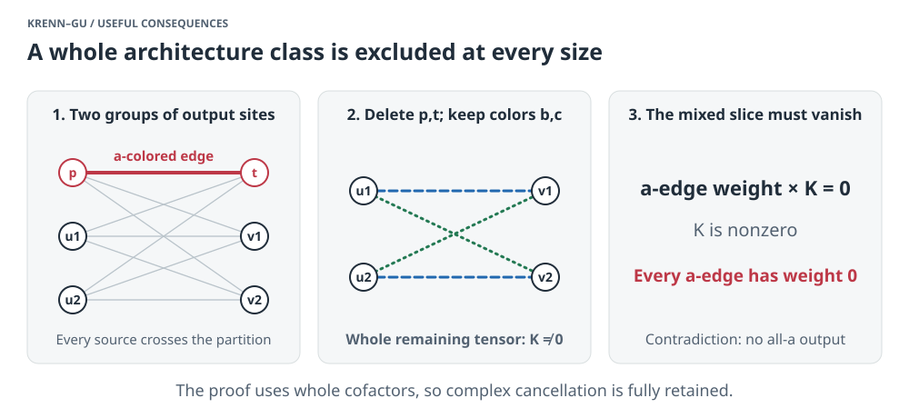
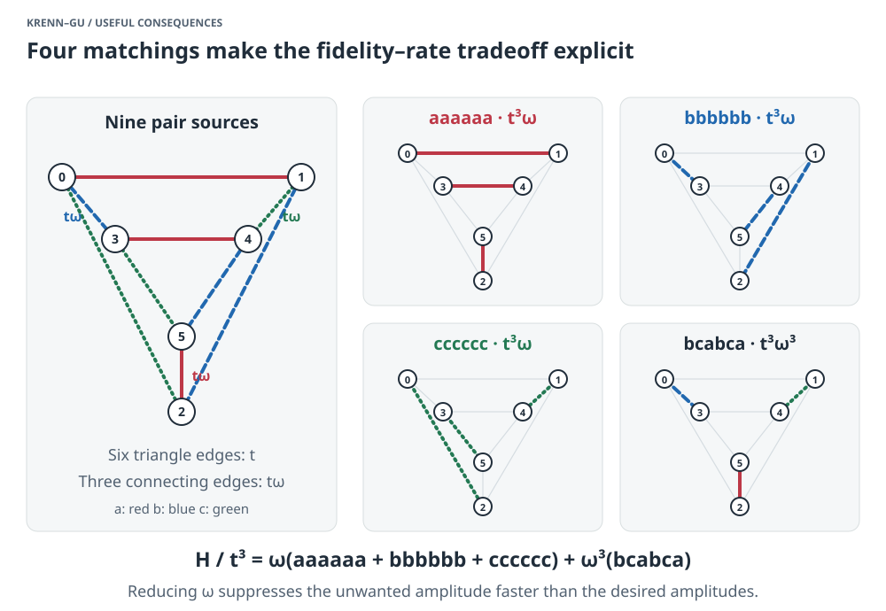

# What we can use the results for

This September 26, 2026 follow-up develops three practical uses: excluding
an entire family of designs, detecting unavoidable unwanted output, and
calculating a concrete fidelity–success tradeoff. The
[interactive browser edition](USEFUL-CONSEQUENCES.html) includes a calculator.

**Evidence status:** these are new written deductions with exact replay checks.
The structural inputs are certified; these assembled consequences have not
yet received their own independent audit or admission. The
[proof note](../notes/useful-consequences-2026-09-26.md) states every assumption.

## 1. A design family we can exclude at every size

An output-pair graph is **bipartite** when the output sites can be divided into
two groups, with every pair source joining opposite groups. Our theorem rules
out an exact three-color GHZ state on every such graph with at least four
sites, including arbitrarily large graphs.



The explanation uses two results we already certified:

1. If the whole output is exactly three-color GHZ, every original pair must
   have the same color at both endpoints.
2. Keep just blue and green. Deleting any two opposite-group sites leaves a
   nonzero blue/green matching tensor.

Now imagine a red edge between those two sites. Multiply its weight by that
nonzero remaining tensor. The result is an unwanted output: red at the two
deleted sites, blue or green everywhere else. There is no alternative way to
pair the two red sites, so this whole slice can vanish only if the red edge
has weight zero. Applying this to every opposite-group pair removes all red
edges, contradicting the required all-red output.

**Use:** an exact-state search can discard this architecture class immediately.
Approximate-state searches still need separate bounds. Also, this theorem
concerns the graph on output sites, not the bipartite incidence diagram used
to describe sources and detectors.

## 2. A diagnostic for unwanted output

For a proposed **diagonal bipartite** design, the same idea becomes an explicit
error bound. “Diagonal” here means that every pair has matching endpoint colors;
we must assume this for an approximate source.

Fix a site p and a color a. For each opposite-group site t, calculate:

* k_pt: the norm of the remaining b/c output after deleting p,t;
* q_pt: the pure-a matching amplitude on those remaining sites.

If every k_pt is positive, form

$$D_p=\sum_t\frac{|q_{pt}|^2}{k_{pt}^2}.$$

If the three pure amplitudes are equal and phase-aligned, then

$$\boxed{F\le\frac{3D_p}{3D_p+1}}.$$

Here F is fidelity to the balanced three-color GHZ state: the squared overlap
with the ideal normalized target. The proof is weighted Cauchy–Schwarz,
combined with the fact that the unwanted slices have disjoint color patterns.

**Use:** this gives a checkable obstruction for a candidate design using
two-color cofactors. A small D_p forces a substantial error. If a denominator
vanishes, this version of the bound does not apply. D_p depends on the source,
so the formula does not supply one fixed fidelity ceiling for every design.

## 3. An explicit benchmark for near-perfect six-site generation

Exact impossibility does not stop a source from approaching the target while
its production rate shrinks. The triangular prism below makes that tradeoff
fully calculable.



There are six triangle edges of amplitude t and three connecting edges of
amplitude t omega. Colors are assigned so that the only four perfect matchings
produce

$$H=t^3\omega(aaaaaa+bbbbbb+cccccc)+t^3\omega^3(bcabca).$$

The three desired amplitudes are proportional to omega; the unwanted amplitude
is proportional to omega cubed. Squaring and normalizing gives

$$F=\frac{3}{3+\omega^4}.$$

Making omega small improves fidelity, but also makes the desired output small.
This asymptotic phenomenon was already identified by
[THESEUS, Figure 3](https://arxiv.org/html/2005.06443). Our contribution here is
an explicit replayable benchmark, its physical normalization under stated
assumptions, and a proof of optimal source strengths within the balanced prism
class. We do not claim priority for the construction or scaling.

### Including the source normalization

Model each edge as its own phase-coherent, two-mode squeezed pair source.
Select exactly one photon at each of the six output sites, preserving the
color superposition. Assume no loss, perfect mode matching, and exact photon
number selection. This is postselection, not heralding an undetected usable
state. The full pair-source convention is stated in
[NIST IR 8486, §2.8.4](https://nvlpubs.nist.gov/nistpubs/ir/2023/NIST.IR.8486.pdf).

Put x=omega squared and s=t squared. The exact probability per trial is

$$P(s,x)=s^3x(3+x^2)(1-s)^6(1-sx)^3.$$

The last two factors are essential: they account for the normalization of
the nine squeezed sources. Keeping only the matching polynomial would
overestimate the physical probability.

For fixed fidelity, the optimal choice is

$$s_* = \frac{2}{3+2x+\sqrt{9-4x+4x^2}},
\qquad x=\sqrt{\frac{3(1-F)}{F}}.$$

This is optimal among **all weights on this colored prism whose three pure
amplitudes are equal and phase-aligned**, under the stated ideal source model.
The proof first uses concavity to equalize the six triangle strengths and
the three connecting strengths, then solves a quadratic for the best pump
setting. It does not optimize other architectures or unbalanced pure amplitudes.

| Target fidelity | Optimal ideal probability per trial | Mean trials per selected event |
|---|---:|---:|
| 90% | 0.347116% | 288 |
| 99% | 0.143898% | 695 |
| 99.9% | 0.050647% | 1,974 |
| 99.99% | 0.016608% | 6,021 |

These rounded values are reproduced in the
[calibration CSV](../computations/useful-consequences-2026-09-26/calibration.csv).
They are probabilities for an idealized model, not experimental count-rate
predictions. Loss and threshold detection can admit unwanted higher-emission
events and require a new calculation.

At very high fidelity, the optimized probability satisfies

$$P_*\sim 0.01690\sqrt{1-F}.$$

Thus, in this class, reducing infidelity by a factor of 100 costs roughly a
factor of 10 in success probability. The
[interactive calculator](USEFUL-CONSEQUENCES.html#calculator) lets you explore
the exact curve and source settings.

## 4. What this establishes, and what remains to do

At six, eight, and ten sites, fix the total squared source-coefficient norm
to one. Our exact exclusions imply that any sequence approaching perfect
GHZ fidelity must have vanishing unnormalized output strength. Otherwise a
convergent subsequence would give an exact forbidden source. This compactness
argument also works at every fixed size in the bipartite class.

That proves a positive fidelity gap at any positive minimum output strength,
but does not calculate the gap. The prism gives an achievable rate. The
cofactor diagnostic bounds individual diagonal bipartite designs. **A universal
quantitative rate bound for all architectures remains a research task.** In
particular, we have not proved the prism's exponent or constant globally optimal.

Fidelity–probability optimization is an active practical target; see
[Ruiz-Gonzalez, Krenn and Gu (2026)](https://arxiv.org/abs/2605.02721). Comparisons
must use the same physical source, detection, and resource assumptions.

## Reproduce and inspect

**Universal-rate follow-up:** [the feasibility assessment and proofs](../notes/universal-rate-bound-feasibility-2026-09-26.md)
show that some power-law bound exists for every complex source at six, eight,
or ten sites. An explicit square-root bound is established at six sites when
all source coefficients are nonnegative; the prism shows that exponent is
optimal in that class. A small exact certificate rules out the simplest
polynomial shortcut for complex cancellation.

**Complex-weight progress:** [the next investigation](../notes/complex-rate-bound-2026-09-26.md)
establishes the square-root rate law in a full neighborhood of the prism's
zero-output limit, allowing all 135 complex source entries. Cancellation cannot
improve the exponent there. The proof separates matchings with one crossing
edge from those with three; the other error coefficients prevent the first group
from cancelling the unavoidable cubic error in the second. A new exact
certificate also excludes the cubic polynomial shortcut even after adding
pure-amplitude balance equations. Other zero-output limits remain to be
controlled before this becomes a universal complex bound. These deductions
have reproducible checks but have not yet had an independent audit.

**Beyond the prism:** the [boundary investigation](RATE-BOUNDARIES.md) now
excludes neighborhoods of two different zero-output limits and supplies rank
tests that every possible high-fidelity limit must pass. The universal rate
bound still needs the remaining singular response cases.

```sh
python3 computations/useful-consequences-2026-09-26/verify.py
```

The checker reconstructs the four matchings, checks 19,683 photon-pair
occupation patterns, verifies exact normalization and derivative identities,
and checks the leakage bound and its limitations on rational examples.
It uses Python's standard library. The all-order proofs require mathematical
review; these finite checks are not a replacement for independent audit.

[Proofs and assumptions](../notes/useful-consequences-2026-09-26.md) ·
[Replay details](../computations/useful-consequences-2026-09-26/README.md) ·
[All explainers](README.md)
