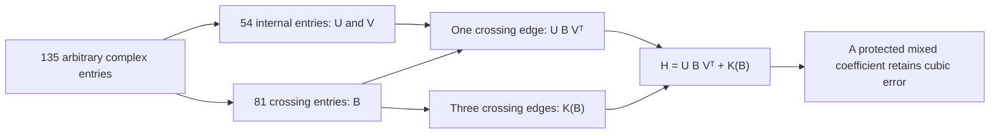

# A complex rate bound near the six-site prism

**Status:** new research with an exact replay, not independently audited or
admitted to the certified proof spine. This is a local theorem for arbitrary
complex sources. A useful bound covering every six-site source is still open.

The [feasibility assessment](universal-rate-bound-feasibility-2026-09-26.md)
established an explicit square-root rate bound for nonnegative coefficients.
Complex coefficients can cancel, so that argument does not extend. Here we
prove that cancellation cannot improve the exponent in a full neighborhood of
the prism's zero-output limit. We also rule out a stronger polynomial shortcut,
including the pure-amplitude balance equations omitted from the earlier test.

## 1. What the new bound says

There are 135 arbitrary complex edge entries: nine endpoint-color choices on
each of the 15 pairs of sites. Let

\[
 H(A)=\sum_{M\in\operatorname{PM}(6)}\prod_{uv\in M}A_{uv},\qquad
 \Delta=a^6+b^6+c^6,
\]

with the products interpreted as tensors on the six sites. Write

\[
 \lambda=\frac{H_{a^6}+H_{b^6}+H_{c^6}}3,\quad
 E=H-\lambda\Delta,\quad e=\|E\|,\quad \ell=|\lambda|.
\]

All norms are Euclidean coefficient norms; matrix operator norms will be
identified explicitly. Put

\[
 S=\|A\|^2,\qquad R=\frac{\|H\|^2}{S^3},\qquad
 F=\frac{3|\lambda|^2}{\|H\|^2},\qquad \delta=1-F.
\]

The six nonzero entries of the base source \(A_0\) are

| Color | Left triangle | Right triangle | Weight |
|---|---|---|---|
| a | 01 | 34 | 1 |
| b | 12 | 45 | 1 |
| c | 02 | 35 | 1 |

All entries not listed are zero. Each triangle has an odd number of sites,
so \(H(A_0)=0\), although \(S(A_0)=6\).

**Local complex stability theorem.** For every complex source satisfying

\[
                         \|A-A_0\|\le 10^{-3},
\]

we have

\[
                         \boxed{e\ge\tfrac12\ell^3.}       \tag{1}
\]

Consequently, for nonzero output and \(F>0\),

\[
 R\le
 \underbrace{\frac{6\sqrt3}{(\sqrt6-10^{-3})^6}}_{C_{\rm loc}}
 \frac{\sqrt{1-F}}{F^{3/2}}.                               \tag{2}
\]

The same shape bound applies whenever **some nonzero complex rescaling of
the source** is in this ball: \(R\) and \(F\) are unchanged by rescaling.
The radius is a conservative explicit choice, not a claimed optimal radius.

This includes off-color entries, destructive interference, unequal pure
amplitudes, and arbitrary approaches to the base point. No analytic-path
assumption is needed. It is stronger than checking one prescribed perturbation.
It does not cover other zero-output source configurations.

For the 18-mode, zero-displacement pure Gaussian model with exact one-photon
selection at each site, the earlier normalization calculation gives

\[
 P\le (243/256)^3 R.
\]

Thus (2) is also a physical success-probability bound, with that extra factor.
Ancillas, displacement, loss, and different detection models are outside this
conversion. See the [precise physical assumptions](universal-rate-bound-feasibility-2026-09-26.md).

## 2. Why this is a cancellation test

Split the sites into two triangles. Every perfect matching has either one or
three edges crossing between the triangles. There are nine matchings of the
first kind and six of the second kind. Therefore the output has the exact form

\[
                       H=U B V^T+K(B),                     \tag{3}
\]

when regarded as a \(27\times27\) matrix across this split.

Here \(B\) is the \(9\times9\) matrix of all 81 cross-triangle entries.
The \(27\times9\) matrix \(U\) takes a choice of an unmatched left site and
its color and fills the other two sites using their internal edge. The right
triangle defines \(V\) in the same way. Finally \(K(B)\) sums the six
matchings having three crossing edges; it is cubic in \(B\).



At the base point the nine columns of \(U_0\) are distinct coordinate vectors:

\[
                  abb,bbb,cbb,\;cac,cbc,ccc,\;aaa,aab,aac.
\]

They include the three pure words. The same statement holds for \(V_0\).
Let \(\mathcal S\) denote these nine row coordinates, and \(\mathcal Q\)
the other eighteen. In the displayed order, \((U_0)_{\mathcal S}=I\),
and likewise for \(V_0\). Let \(P_0\) be the \(9\times9\) diagonal
matrix selecting the three pure coordinates. It has norm \(\sqrt3\).

The word \(q=bca\) is in \(\mathcal Q\). At the prism crossing matrix
\(B_0=P_0\), the coefficient \(K_{q,q}(B_0)\) is exactly 1: the only
contributing matching uses \(03\) in color b, \(14\) in color c, and
\(25\) in color a.

The proof uses the other output coefficients to control how much the linear
term in (3) could cancel this cubic coefficient.

## 3. Elementary norm estimates

Write \(b=\|B\|\) and \(\eta=10^{-3}\). Closeness to the base gives

\[
 b\le\eta,\qquad
 \|U-U_0\|_{\rm op},\|V-V_0\|_{\rm op}\le\sqrt3\eta\le2\eta.
                                                               \tag{4}
\]

For example, each changed internal edge entry appears in precisely three
entries of \(U\), so its squared Frobenius norm is tripled. The operator
norm is at most the Frobenius norm.

For the cubic part,

\[
 \|K(B)\|\le2b^3,\qquad
 \|K(B)-K(C)\|\le4\max(\|B\|,\|C\|)^2\|B-C\|.             \tag{5}
\]

To check the constants, each of the six matching tensors has norm equal to
the product of its three edge-block norms. The arithmetic–geometric mean
inequality bounds this by \(b^3/(3\sqrt3)\). For its derivative in a direction
\(D\), Cauchy–Schwarz bounds the sum of three products by
\(b^2\|D\|/\sqrt3\). Sum over six matchings, use
\(2/\sqrt3<2\) and \(2\sqrt3<4\), then integrate along the straight segment
from \(B\) to \(C\).

Set

\[
 M=U_{\mathcal S},\quad N=V_{\mathcal S},\quad
 X=U_{\mathcal Q}M^{-1},\quad Y=V_{\mathcal Q}N^{-1}.
\]

The inverses exist by (4). Convenient rational upper bounds are

\[
 \|M^{-1}\|_{\rm op},\|N^{-1}\|_{\rm op}\le101/100,\quad
 \|M^{-1}-I\|_{\rm op},\|N^{-1}-I\|_{\rm op}\le1/400,
 \quad \|X\|_{\rm op},\|Y\|_{\rm op}\le1/400.               \tag{6}
\]

Indeed the sharper inverse deviation and graph bounds are \(1/499\).
The transpose in (3) is a transpose, not a complex conjugate; all these
operator-norm inequalities remain valid over the complex numbers.

## 4. Proof of the local theorem

If \(\ell=0\), (1) is automatic. Otherwise suppose, for a contradiction, that

\[
                             e\le\tfrac12\ell^3.           \tag{7}
\]

First, orthogonal projection onto the GHZ line and (3)–(5) give

\[
 \ell\le\|H\|\le(501/500)^2 b+2b^3<2b\le1/500.           \tag{8}
\]

The \(\mathcal S\mathcal S\) block of (3) gives

\[
 B=M^{-1}(\lambda P_0+E_{\mathcal S\mathcal S}
                         -K_{\mathcal S\mathcal S})N^{-T}.
                                                               \tag{9}
\]

Using (5)–(8), \(\sqrt3<7/4\), and \((101/100)^2<11/10\),

\[
 b\le\tfrac{11}{10}(\tfrac74\ell+\tfrac12\ell^3+2b^3)
 \quad\Longrightarrow\quad b<2\ell.                        \tag{10}
\]

Subtract \(\lambda P_0\) in (9). Bounds (6) and (10) imply

\[
 \begin{aligned}
 \|B-\lambda P_0\|
 &\le \frac74\frac1{400}\frac{201}{100}\ell
        +\frac{11}{10}\frac{33}{2}\ell^3\\
 &<\frac{\ell}{100}.                                      \tag{11}
 \end{aligned}
\]

The last inequality uses \(\ell\le1/500\). Equations (5), (10), and (11),
together with \(K_{q,q}(P_0)=1\), now yield

\[
                      |K_{q,q}(B)|\ge\frac{21}{25}\ell^3. \tag{12}
\]

It remains to bound the possible cancellation by \(UBV^T\). In the
\(\mathcal Q\mathcal S\) block, the GHZ target is zero, so (9) gives

\[
 \lambda XP_0
 =E_{\mathcal Q\mathcal S}-X E_{\mathcal S\mathcal S}
                       +X K_{\mathcal S\mathcal S}-K_{\mathcal Q\mathcal S}.
\]

Consequently

\[
                 \|XP_0\|,\|YP_0\|
                 \le(401/400)(33/2)\ell^2<17\ell^2.        \tag{13}
\]

The \(\mathcal Q\mathcal Q\) block of the linear term is

\[
 (UBV^T)_{\mathcal Q\mathcal Q}
   =\lambda XP_0Y^T+X(E_{\mathcal S\mathcal S}
                                  -K_{\mathcal S\mathcal S})Y^T.
\]

Since \(P_0=P_0^T=P_0^2\), equations (6), (8), and (13) give

\[
 \|(UBV^T)_{\mathcal Q\mathcal Q}\|
 \le289\ell^5+\frac{33}{320000}\ell^3
 <\frac1{500}\ell^3.                                     \tag{14}
\]

For the mixed word \(qq=bcabca\), (12)–(14) imply

\[
 |E_{q,q}|=|H_{q,q}|>
          (21/25-1/500)\ell^3>\tfrac12\ell^3,
\]

contradicting (7). This proves (1); in fact the proof gives strict inequality
when \(\lambda\ne0\).

Finally, \(e^2=\delta\|H\|^2\),
\(\ell^2=F\|H\|^2/3\), and \(S\ge(\sqrt6-\eta)^2\).
Substituting these into (1) proves (2).

## 5. A second-order check explains the geometry

An exact coefficient calculation gives a shorter, but less general,
description for paths \(A(t)=A_0+tA_1+t^2A_2+\cdots\) with
\(H(A(t))=t\Delta+O(t^2)\).

* The derivative at \(A_0\) sends the 81 crossing entries to 81 distinct output
  coordinates. Its kernel is exactly the 54 internal entries. Thus the crossing
  part of \(A_1\) must equal the prism's three vertical entries.
* If the order-two error vanishes, the 48 output equations outside this
  derivative image force all 48 internal entries differing from the six
  original colored entries to vanish in \(A_1\). Each is a separate linear
  equation; higher-order corrections cannot change it.
* The mixed word \(bcabca\) is incompatible with every original internal edge.
  Its order-three coefficient is therefore 1. Neither \(A_2\) nor \(A_3\)
  can cancel it.

This calculation motivated the proof. The block argument above additionally
covers paths whose first nonzero target coefficient occurs later, and sequences
that are not presented as analytic paths.

For the original prism \(A(t)=A_0+tB_0\), exactly

\[
                H=t\Delta+t^3bcabca,\qquad e=|t|^3.
\]

Hence the square-root exponent in (2) is sharp locally. The displayed constant
is not claimed sharp.

## 6. Even the balanced cubic polynomial shortcut fails

Let \(J\) be the ideal generated by the mixed output coefficients and the
two pure-amplitude differences

\[
                \tau_a-\tau_b,\qquad \tau_a-\tau_c.
\]

These generate the same ideal as all coefficients of \(E\). The new exact
certificate proves

\[
                            \boxed{\lambda^3\notin J.}    \tag{15}
\]

This holds even after restricting to the 45 diagonal edge variables, and
therefore rules out the identity in the full 135-variable source model too.
In particular there cannot be polynomials \(Q_w\) such that
\(\lambda^3=\sum_w Q_w E_w\). Since the generators have degree three,
only the degree-six parts of the multipliers could contribute; higher degrees
cannot rescue this identity.

Here is the finite reduction, including its completeness argument. Give each
variable \(A_{uv}(h,h)\) one degree at each port \((u,h),(v,h)\). Restrict
degree-nine polynomials to the sector in which, for each color, all six sites
have the same degree. Its ten degree patterns are
\(k_a+k_b+k_c=3\). The basis contains 17,355 monomials: three single-color
patterns with 760 each, six patterns of type \((2,1,0)\) with 1,950 each,
and 3,375 in pattern \((1,1,1)\).

Every mixed generator is homogeneous in these port degrees. Multiplication
by a pure-amplitude difference preserves differences of degrees between sites.
Thus projection onto this sector commutes with the relevant ideal calculation:
nonuniform sectors cannot contribute to a uniform-sector target. Exhaustively
enumerating the multiplier monomials in this sector gives

* 16,290 mixed-generator multiples;
* 2,130 multiples of the two pure-amplitude differences.

The stored integer functional has support 1,296. It vanishes on all 18,420
columns and evaluates to 64 on \(\tau_a\tau_b\tau_c\). Modulo the balance
equations, that product equals \(\lambda^3\), proving (15). A finite-field
calculation helped find the functional, but verification uses **exact integer
arithmetic over all columns**, so the conclusion is over the complex numbers.

This rules out a method, not the desired inequality. Polynomial ideal
membership is stronger than a norm estimate: for example \(xy\notin(x^2,y^2)\)
but \(|xy|\le(|x|^2+|y|^2)/2\). Thus a universal square-root bound can still
hold even though (15) does.

Any ordinary Nullstellensatz certificate \(\lambda^k\in J\) must now have
\(k\ge4\), since a certificate with a smaller power could be multiplied by
a power of \(\lambda\). The earlier existence proof survives, but its direct
ideal-membership route cannot deliver the square-root exponent. The local
stability argument avoids that obstacle.

## 7. What is left for a universal result

The remaining task is to control all zero-output limits compatible with
near-GHZ output. This theorem handles the prism neighborhood and its equivalent
site/color relabelings. It does not classify the other limits or show they can
all be transformed into this one with uniformly controlled norms.

A productive next target is another boundary class, or a structural theorem
that classifies such limits. An unrestricted search for a cubic identity is
now a proven dead end. A norm argument allowing products of residuals, or a
higher-power identity with an explicit manageable constant, remains possible.

## Replay

```sh
python3 computations/complex-rate-bound-2026-09-26/verify.py
```

See the [package README](../computations/complex-rate-bound-2026-09-26/README.md).
The replay verifies the matching decomposition, the derivative and second-order
constraints, the protected coefficient, every rational constant in the local
estimate, and the complete integer dual certificate. These are finite checks;
the written all-source norm argument still requires independent mathematical
audit before certification. No claim of historical priority is made here.
