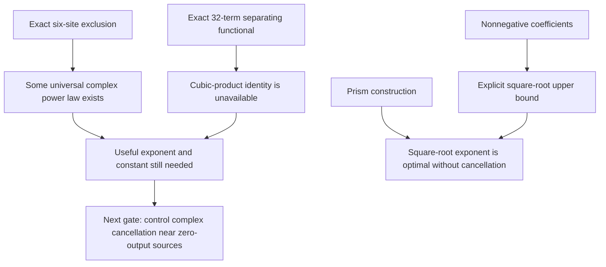

# Universal rate bounds: a feasibility gate

Date: 2026-09-26. **New research deductions and exact finite certificates;
not independently audited or admitted to the certified spine.**

**Follow-up:** [a local complex stability theorem](complex-rate-bound-2026-09-26.md)
now proves the square-root rate bound throughout a full neighborhood of the
prism limit, allowing every complex edge entry. A second certificate also rules
out the balanced cubic identity left untested by this initial gate. A useful
bound covering all complex sources remains open.

## Decision

A universal bound is possible at a fixed size already excluded by the exact
theorems. The six-site exclusion implies a bound of the form
`generation strength <= C * infidelity^alpha`, with alpha>0, for **all complex
source architectures** in the ordinary model. The generic argument does not
give useful constants.

This bounded investigation produced three more concrete findings:

* For **all nonnegative six-site sources**, including off-color cells, an
  explicit square-root bound follows. Its exponent is optimal in this class;
  its constant is not claimed sharp.
* A sparse exact certificate proves that the most direct cubic-product
  polynomial identity fails even in the diagonal complex model. This rules
  out that shortcut, not a square-root inequality.
* Arbitrary higher-order perturbations of the prism's fixed first-order
  degeneration cannot remove its leading mixed output. Improving its exponent
  requires a different first-order degeneration, not simply more correction terms.

**Recommendation:** a focused analysis of complex cancellation is worthwhile.
A large generic elimination or numerical search is not justified by this gate.
The next useful target is a stable amplitude inequality near vanishing-output
sources, or an explicit degeneration disproving its proposed exponent.

The [standard-library replay](../computations/universal-rate-gate-2026-09-26/README.md)
checks 3,375 matching triples, the 6,480 relevant ideal multiples, the separating
functional, and the exact constants. It does not automate the analytic proofs.

## 1. What “universal” means here

Fix n=2m, three orthonormal colors, and an ordinary source A with arbitrary
complex coefficients on the 9 binomial(n,2) endpoint-color cells. No ancillary
photons or additional output modes are allowed. Let

    H=H_n(A)=A^[m],    g=(a^n+b^n+c^n)/sqrt(3),
    S=||A||_edge^2,    R=||H||^2/S^m,
    F=|<g,H>|^2/||H||^2,    delta=1-F.                    (1)

Assume S>0 and H!=0. R is unchanged under an overall nonzero rescaling of A.
It is a normalized generation strength; §3 supplies a physical probability
conversion. “Universal” means independent of the architecture and all its
weights, within a specified source and detection model.

At n=6,8,10 the admitted [six-site](../proofs/six-site-arbitrary-complex-obstruction.md)
and [eight-/ten-site](../certification/stronger-results-2026-09-26/THEOREMS.md)
exclusions apply. An analogous bound at every even
n>=6, tending to zero at F=1, would itself exclude exact GHZ sources at all
those orders and would therefore resolve the outstanding conjecture. The
four-site example precludes including n=4 in such an unrestricted claim.

## 2. A universal power law exists for arbitrary complex sources

Rescale S=1 and write

    lambda=(H_(a^n)+H_(b^n)+H_(c^n))/3,
    E=H-lambda(a^n+b^n+c^n).

E is orthogonal to g, so

    3|lambda|^2=F R,    ||E||^2=delta R.                 (2)

Each coefficient E_w is a homogeneous polynomial of degree m in the source
variables. Its simultaneous vanishing says H=lambda times the GHZ tensor.
The exact exclusion therefore says lambda vanishes wherever all E_w vanish.

The Nullstellensatz converts that implication into a finite polynomial identity:

    lambda^k = sum_w Q_w(A) E_w(A)                      (3)

for some integer k>=1. Since the equations are homogeneous, take Q_w
homogeneous of degree m(k-1). If needed multiply the identity by lambda to
ensure k>=2. On S=1 put B^2=max sum_w |Q_w(A)|^2, which is finite. A computable
upper bound for B is the Euclidean norm of the coefficient-l1 norms of the
Q_w, once a certificate is actually supplied. Cauchy–Schwarz gives

    (F R/3)^k <= B^2 delta R,
    R <= (3^k B^2/F^k)^(1/(k-1)) delta^(1/(k-1)).        (4)

In particular, for any fixed F_0>0 this is R<=C delta^alpha on F>=F_0,
where alpha>0 and C are independent of A. This applies to arbitrary complex
endpoint-color cells, without approximate diagonality or nonzero-cofactor
assumptions. It also works at each fixed bipartite order excluded by the
[previous deduction](useful-consequences-2026-09-26.md#2-bipartite-exclusion-at-every-even-order).

For the effective algebraic input, see [Kollár, *Sharp Effective Nullstellensatz*,
Theorem 1.5 and Corollary 1.7](https://www.math.ucdavis.edu/~deloera/MISC/LA-BIBLIO/trunk/Kollar/kollarnullstellen.pdf).
The generators here have degree m>=3, satisfying its exclusion of degree two.
At six sites there are 135 complex variables of degree three; its generic
estimate permits k as large as 3^135, about 2.58 times 10^64. Thus this route
alone guarantees only an exponent as small as 1/(3^135-1), with B still
uncalculated. This is an existence theorem, not an experimentally useful bound.

The prism has lambda of order omega and E of order omega^3 at a bounded
source limit. Consequently (3) cannot hold at six sites with k<3: its right
side would be O(omega^3) while its left side would vanish more slowly.
This is consistent with, but does not prove, a universal exponent 1/2.

## 3. Convert normalized strength into physical success probability

Specify a pure zero-displacement Gaussian source on exactly d=3n=6m optical
modes, with symmetric pair matrix Z, ||Z||_op<1. Group three modes into each
site and select exactly one photon at every site, without resolving away
the color superposition. Assume ideal lossless photon-number selection.

In creation-operator notation its normalized state is

    det(I-Z Z*)^(1/4) exp[(1/2) sum_ij Z_ij a_i† a_j†]|0>.

Here Z* denotes conjugate transpose. The determinant convention follows
directly from unitary Takagi diagonalization. For one singular value sigma,
the squared norm of exp[(sigma/2)(a†)^2]|0> is
sum_k binomial(2k,k)(sigma^2/4)^k=(1-sigma^2)^(-1/2); multiply over modes.
This is the usual pure Gaussian hafnian probability convention; see the
[Gaussian Fock-amplitude documentation](https://hafnian.readthedocs.io/en/latest/gbs.html).

The cross-site blocks of Z are A. Within-site pair cells do not contribute
to the selected tensor. The exact selection probability is

    P=sqrt(det(I-Z Z*)) ||H(A)||^2.                      (5)

Let T=||Z||_F^2/2, so S<=T<3m. Applying arithmetic–geometric mean to the d
factors 1-sigma_j^2 gives

    sqrt(det(I-Z Z*)) <= (1-T/(3m))^(3m).

Since ||H(A)||^2=S^m R, it follows that

    P <= R max_(0<T<3m) T^m(1-T/(3m))^(3m)
      = (81m/256)^m R.                                 (6)

The maximum is at T=3m/4, by differentiating the logarithm. At six sites,
the factor is

    K_6=(243/256)^3=14348907/16777216≈0.855262.           (7)

Thus every bound in (4) also bounds this physical P, with a finite explicit
normalization factor. This does not cover displacement, ancillas, extra
modes, losses with misleading detection events, or threshold-only selection.
Those changes alter the source or event being bounded.

## 4. An explicit universal six-site bound without cancellation

Now assume **all 135 cross-site coefficients are real and nonnegative** in
the fixed target basis. Off-color cells are allowed; no graph support or
balance assumption is imposed. Let tau_a,tau_b,tau_c be the pure amplitudes
and E_mix the tensor of all mixed words. Then

    tau_a tau_b tau_c <= sqrt(41/1440) S^3 ||E_mix||.      (8)

### Finite matching proof of the constant

Each pure amplitude has 15 matching terms. Their product has 15^3=3,375
terms, indexed by an ordered triple of pure matchings. Such a term is a
product of nine DISTINCT same-color cell variables: every site–color port
appears once. Every triple supports a mixed colored perfect matching.

Choose uniformly among its mixed matchings using all three colors if any
exist, and otherwise uniformly among its mixed two-color matchings. A chosen
mixed matching has monomial M_w and leaves a six-variable squarefree quotient
q. Nonnegativity gives M_w<=H_w(A), including when H_w has additional
off-color contributions. Summing this inequality over all triples yields

    tau_a tau_b tau_c <= sum_w H_w Q_w,                  (9)

where Q_w=sum_q alpha_q q, alpha_q>=0. The quotient's missing site–color
ports uniquely determine w, so a quotient cannot occur in two different Q_w.

The exact enumeration supplies:

| Quantity | Exact value |
|---|---:|
| Mixed two-color words | 90 |
| Sum of alpha_q for each such word | 17 |
| Mixed three-color words | 90 |
| Sum of alpha_q for each such word | 41/2 |
| Distinct six-variable quotients | 5,130 |
| max_q alpha_q times (sum of alpha for its word) | 41/2 |

For each w, weighted Cauchy–Schwarz bounds Q_w^2 by
(sum alpha_q)(sum alpha_q q^2). Therefore

    sum_w Q_w^2 <= (41/2) sum_(used quotients q) q^2
                  <= (41/2) S^6/6! = (41/1440) S^6.      (10)

The second inequality holds because each q uses six distinct cell variables;
the expansion of (sum cell^2)^6 contains each corresponding q^2 with
coefficient 6!, and all remaining terms are nonnegative. Cauchy–Schwarz in
(9) proves (8). The replay exhaustively verifies the coverage and rational
multiplicities, with independent matching enumeration.

### Fidelity and rate consequences

Normalize S=1. For F>2/3, orthogonal projection onto g gives

    tau_h/sqrt(R) >= [sqrt(F)-sqrt(2(1-F))]/sqrt(3).

Indeed the component of a single pure basis vector perpendicular to g has
norm sqrt(2/3). Also ||E_mix||<=sqrt(delta R). Combining these facts with
(8) proves the architecture-independent inequality

    R <= sqrt(123/160) sqrt(1-F)
         / [sqrt(F)-sqrt(2(1-F))]^3.                     (11)

For equal pure amplitudes the stronger expression is

    R <= sqrt(123/160) sqrt(1-F) / F^(3/2).              (12)

Apply (6) to obtain physical probability bounds. As F approaches one, both
give

    P <= [K_6 sqrt(123/160)+o(1)] sqrt(1-F),             (13)

whose leading coefficient is about 0.750. Cap any numerical upper bound at
one. The previously checked nonnegative prism attains
P~(64 sqrt(3)/6561)sqrt(1-F). Thus exponent 1/2 cannot be increased in a
uniform upper bound for this class. The constants differ substantially;
this is an optimal exponent, not a sharp optimal-rate formula.

For a simple exact bound, K_6 sqrt(123/160)<3/4 (checked by rational squares),
so every source in this nonnegative Gaussian class with F>2/3 satisfies

    P <= min{1, (3/4) sqrt(1-F)
                   / [sqrt(F)-sqrt(2(1-F))]^3}.          (14a)

When its pure amplitudes are equal, replace the denominator by F^(3/2).

Negative or complex weights invalidate the step M_w<=H_w. The checker
includes a diagonal mixed coefficient with contributions +1 and -1 that
sum to zero, making that failure explicit.

## 5. The simplest complex certificate is impossible

Consider diagonal six-site sources with 45 independent variables a_e,b_e,c_e.
Let I_mix be the ideal generated by their mixed output polynomials. A natural
attempt at a square-root bound is the exact identity

    haf(M_a) haf(M_b) haf(M_c) = sum_(mixed w) Q_w H_w,    (14)

with degree-six polynomial multipliers Q_w. This identity does **not** exist,
even with arbitrary complex coefficients in the multipliers. Since the ideal
is homogeneous, allowing higher-degree multipliers cannot rescue (14).

Here is the exact finite certificate. Give every variable a_e one degree
at each of its two a-colored endpoint ports, and similarly for b,c. The
target multidegree uses each of the 18 ports once. Its monomial basis is
precisely the 3,375 ordered triples of pure matchings. All ideal multiples
in that degree are exhausted by:

* 90 words of type (2,2,2), each with 27 monomial multipliers: 2,430 one-term columns;
* 90 words of type (2,4,0), each with 45 monomial multipliers: 4,050 three-term columns.

The stored [dual functional](../computations/universal-rate-gate-2026-09-26/dual.json)
has only 32 nonzero values, all +1 or -1. It evaluates to zero on **all 6,480
columns**, but to -16 on the target. Therefore the target is outside their
linear span. Projecting any putative polynomial identity onto this
multidegree would put it in that span, a contradiction. The verifier constructs
all columns directly from the mixed words and complement matchings.

An identity of form (14) for full off-color sources would restrict to such
an identity here, so it fails there too. This does NOT rule out an inequality,
identities involving powers, nonholomorphic estimates, or identities using
the pure-amplitude imbalance as an additional residual. In particular it
does not rule out k=3 in the distinct balanced-target ideal of §2. The
[subsequent balanced certificate](complex-rate-bound-2026-09-26.md#6-even-the-balanced-cubic-polynomial-shortcut-fails)
does rule it out, while leaving the square-root norm inequality possible.

## 6. A local gate: higher-order prism corrections cannot beat its exponent

Let A_0 be the six unit triangle edges of the colored prism and A_1 its three
unit connecting edges. Allow any complex analytic perturbation

    A(t)=A_0+t A_1+t^2 A_2+t^3 A_3+...,

including arbitrary off-color cells in the higher coefficients. Consider
w=bcabca. The three colors on each triangle are distinct, so none of the
six monochromatic A_0 edges is compatible with w. Every compatible matching
therefore uses three edges whose constant coefficients vanish. Its order-t^3
coefficient depends only on A_1, and that coefficient is exactly one:

    H_w(A(t))=t^3+O(t^4).                               (15)

Meanwhile the full leading output is t times the three-color GHZ tensor.
Thus this fixed degeneration cannot suppress all error beyond cubic order
by choosing A_2,A_3,... . Some choices may introduce earlier errors, which
only worsen fidelity. The argument does not fix arbitrary kernel directions
in A_1, and it is not a classification of all zero-output sources.

For the general square-root question, a useful falsification target is a
bounded analytic family with GHZ amplitude of order t^r and orthogonal error
of order t^s with s>3r. It would have R/sqrt(1-F) diverging. Conversely, an
estimate ||E||>=c|lambda|^3 on the normalized source space would prove the
desired bound. Current exact diagonal reduction does not provide such a
stable estimate: exact zero identities and cofactor inverses can become
ill-conditioned near H=0.

This is the appropriate next mathematical gate. The generic exponent from
§2 and the failed shortcut in §5 do not justify a large unstructured solve.
